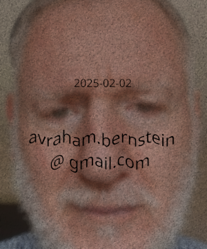

$py(
pdf = 'AvrahamAbeBernstein-CV.pdf'
www = 'https://www.avrahambernstein.com'
html = 'AvrahamAbeBernstein-CV.html'
if is_pdf:
    html = www + '/cv/' + html
)
<address markdown="1">
__Author:__ Avraham "Abe" Bernstein
<br/>__Email:__ Avraham DOT Bernstein AT gmail DOT com
<br/>__Tel/Whatsapp:__ +972.54.641-0955
<br/>__Home Geolocation:__ Jerusalem 9727433 ISRAEL
<br/>__WWW:__ [$(www)]($(www))
<br/>__Copyright__ &copy; Avraham Bernstein 2025, Jerusalem ISRAEL. All rights reserved.
<br/>__License:__ FOSS SPDX BSD-3-Clause: [https://opensource.org/licenses/BSD-3-Clause](https://opensource.org/licenses/BSD-3-Clause)
<br/>__Last Update:__ 2025-02-24
</address>

<table markdown="1">
<hr>
<hd>

</hd>
<hd>

</hd>
</hr>
</table>

__Secure[^secure] photo of the author from 2025__

---

$if(not is_pdf)
## <span class="hilite">Link To Short CV PDF "Shadow Version"</span>

* [$(www)/cv/$(pdf)]($(www)/cv/$(pdf))</span>
$endif

## Introduction

1. I have more than 40 years experience in state-of-the-art software development especially inventing new algorithms.
2. I have many inventions and some __recent patents__ in a wide variety of application domains, e.g.:
    * digital automotive industry
    * Internet TV
    * cybersecurity and anti-[reverse engineering](https://en.wikipedia.org/wiki/Reverse_engineering)
    * [Bioinformatics](https://en.wikipedia.org/wiki/Bioinformatics)
    * accessibility
    * factory automation
    * VLSI chip design
    * etc.
3. In order to jump start my learning process I prefer to find a domain expert to mentor me, and I am also a good mentor myself. 
4. I am an [autodidact](https://en.wikipedia.org/wiki/Autodidacticism) and [polymath](https://en.wikipedia.org/wiki/Polymath). I easily learn and become an expert in new fields.
5. I am a "hands-on" master software engineer. I enjoy programming. I design prototypes and minimum viable products for _CTO_ groups.
6. I know many computer languages which I am able to learn easily due to my [compiler](https://en.wikipedia.org/wiki/Compiler) background; and my compiler background allows me to design [domain specific languages (DSL)](https://en.wikipedia.org/wiki/Domain-specific_language) and to engage in automated [code refactoring](https://en.wikipedia.org/wiki/Code_refactoring).
7. I don't market myself as a programmer any more, but my "go to" _programming_ languages in which I am quite proficient are the following:
    * _C_
    * _Python_ and _BeautifulSoup_
    * [Jinaj2](https://en.wikipedia.org/wiki/Jinja_(template_engine)), the "gold standard" macro and template preprocessor
    * [Pyexpander](https://pyexpander.sourceforge.io/), which is simpler than _Jinja2_ and just as useful except where inheritance is needed, _but_ unfortunately it is _polluted_ by a [GPLv3 license](https://en.wikipedia.org/wiki/GNU_General_Public_License)
    * [bash](https://en.wikipedia.org/wiki/Bash_(Unix_shell)), including [Posix CLI commands](https://en.wikipedia.org/wiki/List_of_POSIX_commands)
8. My "go to" _data_ languages are _HTML_, _Markdown_, [srcML](https://www.srcml.org), _XML_, _YAML_, and _Excel_.
9. I thrive on undertaking new challenging projects. I am quite comfortable engaging in and leading _flexible_ "brain storming" sessions.
10. I provide considerable value added to my clients.

## Work Experience

$py(id="aurora"; task="Automotive Software Updates: researcher in CTO office")
### 2022-25: [Aurora Labs](https://www.AuroraLabs.com) Tel Aviv IL {#$(id)}

$if(is_pdf)
[Details: $(task)]($(html)#$(id))
$else
<details markdown="1"><summary>$(task)</summary>

1. The company's core product relied upon [refactoring](https://en.wikipedia.org/wiki/Code_refactoring) the automotive client [OEM's](https://en.wikipedia.org/wiki/Original_equipment_manufacturer) source code in order to make it much more efficient to generate software updates. Sometimes their product could reduce update times by a factor of 10 compared to the default technique of using [LZMA](https://en.wikipedia.org/wiki/Lempel%E2%80%93Ziv%E2%80%93Markov_chain_algorithm) (i.e. successor to _zip_) compression.

2. I invented an extremely efficient technique to greatly improve the efficiency of their initial refactoring software by combining the [SRCML](https://www.srcml.org/) compiler [AST](https://en.wikipedia.org/wiki/Abstract_syntax_tree) output in [XML](https://en.wikipedia.org/wiki/XML) format with the Python [Beautiful Soup](https://beautiful-soup-4.readthedocs.io/en/latest/) library in order to generate the refactored source code.

3. And I invented a technique (US patent pending) to greatly reduce RAM usage when the embedded software generates [FLASH](https://en.wikipedia.org/wiki/Flash_memory) files by modifying the internals of the ubiquitous _C_ [memcpy](https://www.man7.org/linux/man-pages/man3/memcpy.3.html) function by incorporating [Posix](https://en.wikipedia.org/wiki/POSIX)-like buffered I/O when memcpy is used to sequentially write to FLASH. The RAM savings enables usage of larger "chunks" that enables higher compression ratios for legacy system boards with small amounts of RAM, e.g. less than 256 KB. Sometimes compression ratios could be improved by 25%.

</details>
$endif

$py(id="morphisec"; task="Server Cybersecurity: reverse engineering object code")
### 2021: [Morphisec](https://www.morphisec.com/) Beer Sheva IL {#$(id)}

$if(is_pdf)
[Details: $(task)]($(html)#$(id))
$else
<details markdown="1"><summary>$(task)</summary>

1. I reverse engineered the [X64](https://en.wikipedia.org/wiki/X86-64) [object code](https://en.wikipedia.org/wiki/Object_code) of the _Linux_ kernel module [libc](https://man7.org/linux/man-pages/man7/libc.7.html) in order to modify the internals of the [exec functions](https://www.man7.org/linux/man-pages/man3/exec.3.html), where these functions are used in [stack smashing](https://en.wikipedia.org/wiki/Stack_buffer_overflow) attacks, _but without changing the addresses of any of the libc exports_.

2. Inserting the extra security functionality into these functions necessitated a slight increase in their sizes, therefore it was quite challenging not to change the addresses of any of the other _libc_ functions.

3. I implemented the project in _Python_ using the [Zydis](https://zydis.re) disassembler _Python_ library.

4. Note that every X64 Linux release and [distro](https://en.wikipedia.org/wiki/Linux_distribution) will likely have a slightly different libc object code implementation.

</details>
$endif

$py(id="qedit"; task="Banking Cybersecurity Using WASM: software consultant")
### 2021: consultant to [Qedit](https://qed-it.com/) Tel Aviv IL {#$(id)}

$if(is_pdf)
[Details: $(task)]($(html)#$(id))
$else
<details markdown="1"><summary>$(task)</summary>

1. I implemented _C_ cryptography functions in _Javascript_ web assembly ([WASM](https://webassembly.org/)). _WASM_object code is much faster and much more difficult to debug than _Javascript_. Because this project was intended for the banking industry, in the future we could write a _WASM_ [obfuscator](https://en.wikipedia.org/wiki/Obfuscation) that would greatly increase the difficulty of debugging.

2. I implemented the project by using [Clang's wasm32 target](https://medium.com/@dougschaefer/going-straight-to-clang-for-webassembly-928df1484430).

</details>
$endif

$py(id="argus"; task="Automotive Software Updates: software research")
### 2018-20: [Argus Cyber Security](https://en.wikipedia.org/wiki/Argus_Cyber_Security) Tel Aviv IL (renamed [PlaxidityX](https://plaxidityx.com/) IL, subsidiary of [Elektrobit/Continental](https://www.elektrobit.com/) DE) {#$(id)}

$if(is_pdf)
[Details: $(task)]($(html)#$(id))
$else
<details markdown="1"><summary>$(task)</summary>

1. I architected and implemented a software design for efficient software updates of embedded systems using mini-bsdiff delta encoding.

    * Note that the original bsdiff software is not designed for the size limitations of embedded systems especially for legacy automotive boards.
    * In particular the original bsdiff software incorporates the outdated bz binary compressor that has a 100 KB RAM footprint.
    * Mini-bsdiff is not bundled with any binary compressor at all.
    * Mini-bsdiff can be combined with the modern xz binary compressor designed for embedded systems that only has a 26 KB RAM footprint.
    * It is not computationally feasible to generate an offline mini-bsdiff patch where at least one of the source files is larger than 8MB, in which case it is preferable to use the VCDiff/xdiff algorithm which is commonly used on web sites.
    
2. I invented [EU Patent EP3680773A1](https://worldwide.espacenet.com/patent/search/family/069147491/publication/EP3680773A1?q=20150616.9), a mini-bsdiff patch implementation for small FLASH memory systems where the FLASH is not big enough to temporarily hold both the original version "A" and new version "B" of the object code. Normally bsdiff requires both versions be available when applying the patch.
 
 3. I experimented with Google's Courgette improvement to bsdiff, but it required a relatively large amount of RAM on the target device to support a linker. The large RAM is not typically available on legacy boards used in the automotive industry. I developed an algorithm that dispensed with the need for a linker.

4. I experimented with techniques for using source code patching instead of bsdiff object patching. The Elektrobit management refused to believe that it was commercially feasible to have access to an OEM's source code. I switched jobs to [Aurora Labs](#aurora) above because I believed that source code patching is a better solution.

5. I was the company's [Misra C](https://en.wikipedia.org/wiki/MISRA_C) "enforcer". While I understood the safety rationale and the legal requirements for _Misra C_, I found many of their rules to be unnecessarily pedantic. I developed [Jinja2](https://jinja.palletsprojects.com/en/stable/) preprocessing utilities that worked around these pedantic rules, but that still generated valid _Misra C_ code.
    
</details>
$endif

$py(id="viaccess"; task="Internet TV Cybersecurity: S/W security manager")
### 2014-17: [Viaccess-Orca](https://www.viaccess-orca.com/) Ra'anana IL (subsidiary of [Orange](https://www.orange.com/) FR) {#$(id)}

$if(is_pdf)
[Details: $(task)]($(html)#$(id))
$else
<details markdown="1"><summary>$(task)</summary>

1. I focused on obfuscation, i.e. anti-reverse engineering, of their smartphone (i.e. Android and iPhone) client player, by selecting a C/C++ obfuscating compiler and by building home brew utilities. I selected the WhiteCryption compiler originally built by InterTrust and acquired by Zimperium in 2021 after I left. When I first selected the product WhiteCryption was still in the beta stage. I worked very closely with the WhiteCryption development team - mainly specifying new features and testing existing ones. Previously I worked on an in-house obfuscation compiler at NDS, which I considered far beyond the manpower resources we had at Viaccess-Orca. After I left Viaccess, they switched to the French Quarkslab compiler partially because Viaccess HQ is in France.

2. One of my most important utilities was designing an ELF Dynamic Share Object DSO (i.e. an `so` file) which had no export table which ostensibly eliminates the usefulness of a DSO. I designed a low-level mechanism to load an encrypted export table relying upon ELF's special `init` section which executes before the DSO is activated. The export table is one of the major attack surfaces in a DSO.
 
3. I worked with the 3rd party software supplier of the video codec in order to substantially bolster the security of their product which proved to be a major potential security hole in our system. The challenge was that most of their customers did not require the security that we did, and for practical commercial reasons they were not willing to make a separate build for us. I managed to architect an optional security plugin for them that caused minimal changes to their system, and caused zero interference to their other customers who chose not to use the plugin.

4. Initially the movie studios insisted that smartphones could not be rooted because it made them considerable more difficult to debug, so I developed a fuzzy logic-like mechanism to detect rootedness. The problem was that less expensive Android phones from Asia, that were flooding the market, were rooted by default because it saved the manufacturer a few hours of licensing work from Google who controlled AOSP (the Android Open Source Project). Therefore security had to be moved from the client to the content servers. For example a license that license that played 100 hours of content a week was suspect, or a license that played content simultaneously from different geographic locations was suspect.

</details>
$endif

### 2013-14: _Discretix_ Netanya IL (renamed _Sansa Security_, acquired by [ARM](https://www.arm.com) UK)

The company sold their Internet TV Cybersecurity business unit to [Viaccess-Orca (2014)]($(html)#$(id)) above.

$py(id="telequest"; task="Vehicle Navigation Algorithms: VP R&D")
### 2012: _Telequest_ (defunct) Jerusalem IL {#$(id)}

$if(is_pdf)
[Details: $(task)]($(html)#$(id))
$else
<details markdown="1"><summary>$(task)</summary>

1. The company was a failed competitor to [Waze](https://www.waze.com/apps).

2. I developed algorithms to improve traffic throughput in traffic jams taking advantage of expected traffic trends according to history of the day of the week and expected events. 

3. I designed live experiments using AWS simulations to optimize results. Co-donated work with a mathematical consultant specializing in optimization algorithms for a huge number of variables.

4. Theoretical algorithm experiments were conducted on a simulator of Tokyo traffic.

</details>
$endif

$py(id="syntezza"; task="Novel Bioinformatics PCR Algorithms: software consultant")
### 2011: consultant to [Syntezza Bioscience](https://www.syntezza.com/) Jerusalem IL {#$(id)}

$if(is_pdf)
<span class="hilite">[Details: $(task)]($(html)#$(id))</span>
$else
<details markdown="1"><summary><span class="hilite">$(task)</span></summary>

The company's product was a novel _dry_ test kit for [MRSA](https://www.mayoclinic.org/diseases-conditions/mrsa/symptoms-causes/syc-20375336) using [PCR](https://en.wikipedia.org/wiki/Polymerase_chain_reaction) (a [DNA](https://en.wikipedia.org/wiki/DNA) amplification device).
_MRSA_ is a lethal strain of _staphylococcus_ bacteria which is the major [iatrogenic](https://en.wikipedia.org/wiki/Iatrogenesis) killer in hospitals for immunologically compromised patients.
Therefore it is critically important that hospitals identify carriers among both patients and
hospital staff as soon as they are infected.
Most people who are infected with _MRSA_ carry it in their nasal passages. Most interesting such a person, even an immunologically
compromised one, can still live until 120. However if an immunogically comprised person
touches his nose, and afterwards touches an open wound then he is in danger of death.
Prior to _PCR_ technology it took a laboratory about 48 hours to identify the disease by growing 
a culture in a "gold standard" [Petri dish](https://en.wikipedia.org/wiki/Petri_dish), 
but _PCR_ technology can make the identification within 2 hours.
 
__Before joining the company I had zero background in biology, micro-biology, genetics, or biochemistry.__ 
When I arrived the company was in imminent danger of closing down their _PCR_ business unit
because their initial [FDA](https://en.wikipedia.org/wiki/Food_and_Drug_Administration) trials completely
failed that they had spent about \$500K to prepare by taking 800 samples from a few Israeli hospitals.
The owner was "pulling his hair out" because he felt that his science was 100% correct.
First he hired [Tzachi Bar](https://www.researchgate.net/profile/Tzachi-Bar) to consult, the inventor of PCR mathematical algorithms used in all PCR devices at that
time world wide, but _Bar_ could not help him. I happened to be the owner's neighbor. He knew that
I was a computer scientist, so he took his final chance with me.
__Within 3 months I made a number of discoveries that validated the owner's science and
enabled them to pass the _FDA_ trials.__ 
In spite of my technical success, for commercial reasons beyond the scope of my short article,
they were forced to close down their _PCR_ business unit;
therefore my [threshold  algorithm](https://www.pythonprog.com/thresholding-in-machine-learning/) was never patented.

1. Initially _Bar_ and the company's chief microbiologist gave me a 2 week crash course in the fields of microbiology and genetics that they felt I would need for my work.

2. My first task was to generate amplified graphs of all 800 samples, and to study them. Note that every sample had a _PCR_ result, and an associated "gold standard" _Petri dish_ result.

3. My second task was to carefully read the manual of the _PCR_ device. I noted that the company's junior biochemist who was responsible for administering the hospital tests had used an incorrect protocol for configuring the _PCR_ devices. The 3 control samples that every batch contains were placed in incorrect test tube slots. Therefore all test results were nonsensical!

4. Even though the samples had been thrown away weeks before I arrived, fortunately they had saved the raw data from the _PCR_ devices, that allowed me to reconstruct the _Bar-Tichopad_ algorithm. The new results were better, but still hardly good enough for the _FDA_ that required 80% accuracy.

5. I noted that tests from the pure laboratory colonies of _MRSA_, with extremely high concentrations never to be encountered in a patient sample, all failed. This indicated to me that there was a flaw in the industry standard _Bar-Tichopad_ algorithm.

6. And I noted that many tests with negative _PCR_ results, in spite of the positive Petri results, had random graphs instead of the smooth [bioassay](https://en.wikipedia.org/wiki/Bioassay) sigmoidal shaped curve of the [logistic function](https://en.wikipedia.org/wiki/Logistic_function) that _Bar-Tichopad_ expected. After discussing the matter with _Bar_ and the senior biochemist, this indicated that the graphs were statistically noisy due to [PCR inhibition](https://en.wikipedia.org/wiki/Polymerase_chain_reaction_inhibitors). Therefore the company's preliminary chemistry did not yet filter out nasal impurities that mature chemistry was supposed to do. Maybe we had to "throw in the towel", i.e. to give up?

7. So I put on my "thinking cap", and discovered a completely new algorithm that was much better than the Bar-Tsichopad algorithm.

8. I discovered a much more accurate and simple way to normalize the bioassay curve and to remove systematic noise, by noting that the "systematic" noise and the linear rise in the signal of the negative control sample precisely matched the patient samples (from the same batch). Therefore my simple normalization solution was to subtract the negative control sample from the patient samples.

9. Both _Bar_ and the senior biochemist agreed with me that inhibition never increases the _PCR_ signal. Therefore I used an alternative [AI threshold test](https://www.pythonprog.com/thresholding-in-machine-learning/), instead of the _Bar-Tichopad_ test that was based upon advanced mathematical functional analysis to calculate the [Ct](https://www.thermofisher.com/il/en/home/life-science/pcr/real-time-pcr/real-time-pcr-learning-center/real-time-pcr-basics/real-time-pcr-understanding-ct.html) of the assay. 

10. I split the patient samples in half. For the control half, I used the single maximum signal from each sample. I recorded minimum PCR signal that indicated a positive Petri result. And similarly I recorded the maximum PCR signal indicated a negative Petri result. 

11. __I used the other half of the patient samples to test my new threshold algorithm. My predictions were 95% accurate in spite of the high degree of inhibition found in the preliminary chemistry!__
    
    * The explanation for the minor inaccuracy was some results were in the "gray" region where there was an overlap between the minimum PCR signal to indicate a positive result, and the maximum PCR signal to indicate a negative result.

12. __My threshold algorithm won a MRSA "shoot out" at the world famous UK [St Georges medical school hospital](https://www.stgeorges.nhs.uk/) against competing PCR kits from the huge international pharmaceutical companies!__ 

</details>
$endif

$py(id="NDS"; task="Internet TV Cybersecurity: software researcher")
### 2005-10: _NDS_ Jerusalem IL (eventually acquired by [Synamedia](https://www.synamedia.com/) UK) {#$(id)}

$if(is_pdf)
[Details: $(task)]($(html)#$(id))
$else
<details markdown="1"><summary>$(task)</summary>

1. Most of my work at NDS was doing software security research including occasional code security audits.

2. I was one of the first security researchers in the world to prove that the ubiquitous virtual machine packages, e.g. VMWare and VirtualBox, could break simple DRM protection schemes like date restrictions or replay count.

3. I showed how X64 virtualization hardware could be used together with [QEMU](https://en.wikipedia.org/wiki/QEMU) to break the software random number generator (RNG). This was a very critical attack because the fundamental security assumption was that each client PC had a world wide unique cryptrographic "nonce". But if confederate clients could share their nonces then a single license could be shared by all members of the confederacy. At that time, c. 2007, the cycle counter instruction `RDTSC` was easily subverted by the virtualization technology. After I left the company, since 2012 the CPU has a hardware RNG instruction `RDRAND` which is a much safer instruction from the perspective of security.

4. I invited outside security researchers to give lectures and seminars to in-house developers on state-of-the-art security techniques. Based upon these lectures I developed an obfuscated [FORTH](https://en.wikipedia.org/wiki/Forth_(programming_language))-like compiler that was extremely difficult to reverse engineer.

5. In 2007 NDS was invited by the Chinese government TV system to protect the 2008 Beijing Olympics TV feed. I "almost" won the contract. The Chinese government did not want Microsoft to be involved in the bidding because nearly 100% of servers and client PCs had stolen operating system licenses which could easily be revealed when Microsoft installed the protection software. At time the Olympic TV feed was owned by Microsoft company MSNBC. Eventually Microsoft agreed not to sue China for the stolen operating system licenses, and they offered the protection package for free so they won the contract.

6. The Israeli cable TV operators had their feed stolen by Israeli expats in the US, and more massively in the Palestinian areas. I showed how to it was possible to easily technically stop these thefts. For reasons that are still not clear to me, the operators showed no interest in stopping the thefts.

7. My first job at NDS was as a contractor. I built a tester and simulator for the NDS satellite software. I designed a DSL (domain specific language) in [TCL](https://en.wikipedia.org/wiki/Tcl) to do this task. After my analysis of their software, I concluded that there were critical flaws in the design. I was quite knowledgeable in VAX/VMS O/S internals. The junior VP in charge of the project refused to believe that a mere QA guy could have such knowledge, so I built a graduated test program that blew his (virtual) satellite out of the sky. Afterwards my software was installed on every developer's desktop. Before checking in software into their version control system, it became standard operating procedure to run a 10 minute test prior to check-in.

8. I worked with the QA department to analyze their bug reports, and concluded that nearly 50% of their software effort was bug fixes. And they had more than 1000 software developers! I worked with the QA department in order to implement a program to greatly reduce bugs. I recall that their biggest problem was lazy software builds that often contained tens of thousands of warnings. My most important improvement was insisting on zero warnings, or adding explicit compiler approval of any warning to be explicitly allowed.

</details>
$endif

$py(id="vyyo2004"; task="Broadband Wireless Cable Networking Testing Laboratory: architect")
### 2004: _Vyyo_ (defunct) Jerusalem IL {#$(id)}

$if(is_pdf)
<span class="hilite">[Details: $(task)]($(html)#$(id))</span>
$else
<details markdown="1"><summary><span class="hilite">$(task)</span></summary>

1. I designed an extremely efficient network testing laboratory.

2. By selecting 24-port programmable layer-2 switches for each of the PC's 4x100 MB Ethernet ports, each PC was able to control 96 cable modems during low speed ping tests, whereas previously each PC could only control 4 modems (i.e. one per Ethernet port), which resulted in massive (24x) cost savings through the reduction of PCs and their associated electrical infrastructure, floor space, and air conditioning. 

3. For high speed testing at 8 MB per modem, each PC's Ethernet port could only support 12 modems; but the programmable switches could be dynamically configured to quickly open and close ports.

4. I Implemented automated control of the lab in [TCL](https://en.wikipedia.org/wiki/Tcl).

5. Instead of implementing speed tests with Cisco's network utilities which relied upon a binary search algorithm, initially I wrote a program to implement a [Fibonacci search](https://en.wikipedia.org/wiki/Fibonacci_search_technique) which was a significant improvement. Subsequently I wrote a [steepest descent search](https://en.wikipedia.org/wiki/Method_of_steepest_descent)  which was 10x more efficient!

</details>
$endif

$py(id="virtouch"; task="Blind Accessibility: VP R&D")
### 2002-03: _Virtouch_ (defunct) Jerusalem IL {#$(id)}

$if(is_pdf)
<span class="hilite">[Details: $(task)]($(html)#$(id))</span>
$else
<details markdown="1"><summary><span class="hilite">TBD: $(task)</span></summary>

1. TBD

</details>
$endif

### 2002: _TMT_ (defunct) Jerusalem IL

The company built local wireless cable networking equipment. I did similar tasks for _Vyyo_. See [Vyyo (2004) above]($(html)#vyyo2004) and [Vyyo (2000) below]($(html)#vyyo2000).

$py(id="jolt"; task="Free Space Optics (FSO) Network Utilities: software consultant")
### 2002: consultant to _Jolt_ Jerusalem IL (acquired by _MRV Communications_ IL, and eventually by [Adtran](https://www.adtran.com) US) {#$(id)}

$if(is_pdf)
[Details: $(task)]($(html)#$(id))
$else
<details markdown="1"><summary>$(task)</summary>

1. The company's [FPGA](https://en.wikipedia.org/wiki/Field-programmable_gate_array) hardware was streamlined to handle calibrating/aiming the optical equipment. It had no CPU, and minimal configuration I/O ports.

2. I selected an external board in order to implemented a basic [SNMP agent](https://en.wikipedia.org/wiki/Simple_Network_Management_Protocol).

3. I built a basic HTTP [SNMP NMS](https://en.wikipedia.org/wiki/Simple_Network_Management_Protocol) server.

</details>
$endif

$py(id="vyyo2000"; task="Broadband Wireless Cable Networking: manager offline S/W utilities")
### 2000-02: _Vyyo_ (defunct) Jerusalem IL {#$(id)}

$if(is_pdf)
[Details: $(task)]($(html)#$(id))
$else
<details markdown="1"><summary>TBD: $(task)</summary>

1. TBD

</details>
$endif

### 1999: contractor to _Phasecom_ Jerusalem IL (acquired by _Vyyo_ above)

See the tasks that I did for the successor company [Vyyo (above)]($(html)#$(id)).

$py(id="fourfold"; task="VLSI FORTH-like Stack CPU Novel GCC Compiler Port: S/W architect")
### 1998: consultant to _Fourfold_ (defunct) Jerusalem IL {#$(id)}

$if(is_pdf)
[Details: $(task)]($(html)#$(id))
$else
<details markdown="1"><summary>$(task)</summary>

1. The novelty of this port was that the [GCC](https://en.wikipedia.org/wiki/GNU_Compiler_Collection) model assumes a small finite number of special purpose [registers](https://en.wikipedia.org/wiki/Hardware_register), while this [FORTH](https://en.wikipedia.org/wiki/Forth_(programming_language))-like stack hardware could be considered to contain an infinite number of registers, or alternatively no registers at all.

</details>
$endif

$py(id="optimet"; task="DSL for a conoscopic laser interferometry robot: S/W architect")
### 1996-97: CEO _Pitkha_ (defunct) Jerusalem IL, contractor for _Optimet_ Jerusalem IL, subsidiary of [Ophir Optronics](https://www.ophiropt.com/en/) IL {#$(id)}

$if(is_pdf)
[Details: $(task)]($(html)#$(id))
$else
<details markdown="1"><summary>TBD: $(task)</summary>

1. TBD

</details>
$endif

$py(id="elop"; task="DSL for a mil-spec automated testing laboratory for the _BlackHawk_ helicopter: S/W architect")
### 1996: CEO _Pitkha_ (defunct) Jerusalem IL, contractor for [Elop/Elbit](https://elbitsystems.com/) Rehovot IL {#$(id)}

$if(is_pdf)
<span class="hilite">[Details: $(task)]($(html)#$(id))</span>
$else
<details markdown="1"><summary><span class="hilite">TBD: $(task)</span></summary>

1. TBD

</details>
$endif

$py(id="dspg"; task="DSL for the VLSI _PINE_  CPU software tool chain: S/W architect")
### 1992-95: CEO _Pitkha_ (defunct) Jerusalem IL, contractor for [DSP Group](https://www.dspg.com/) Ramat Gan IL {#$(id)}

$if(is_pdf)
<span class="hilite">[Details: $(task)]($(html)#$(id))</span>
$else
<details markdown="1"><summary><span class="hilite">TBD: $(task)</span></summary>

1. TBD

</details>
$endif

$py(id="iscar"; task="DSL for a shop floor product control system that conducted a completely automated factory: S/W co-architect")
### 1990-91: consultant to [Digital Equipment Corp (DEC)](https://en.wikipedia.org/wiki/Digital_Equipment_Corporation) Herzliya IL (eventually acquired by [Hewlett-Packard](https://www.hp.com/il-he/home.html) IL), contractor for [Iscar Metalworking](https://www.iscar.com/index.aspx/countryid/1/lang/en) {#$(id)}

$if(is_pdf)
<span class="hilite">[Details: $(task)]($(html)#$(id))</span>
$else
<details markdown="1"><summary><span class="hilite">TBD: $(task)</span></summary>

1. TBD

</details>
$endif

$py(id="cubital-printer"; task="Stereo lithography (i.e. 3D printing) device: intermediate programmer")
### 1988-89: consultant to _Cubital_ (defunct) Herzliya IL, subsidiary of _Scitex_ IL (acquired by [Hewlett-Packard](https://www.hp.com/il-he/home.html) IL) {#$(id)}

$if(is_pdf)
[Details: $(task)]($(html)#$(id))
$else
<details markdown="1"><summary>$(task)</summary>

1. The company was a pioneer in the 3D printing industry, originally known as "stereo lithography" or "solid ground curing". Their "Solider" device weighed 4.5 ton and was the size of and was shipped in a half-size container. The parts were made from a polymer that was heated into a liquid, and the holes were filled with liquid wax. When a part cooled it became solid, while the wax melts in hot water and drains away.

2. I developed a _VAX/VMS_  printer driver by considering each layer of the printer output as if it were a separate page.

3. Invented a lightweight source control system by taking advantage of the _VAX/VMS_ _DCL_ file generation and logical file name (i.e. alias) features.

4. I developed a [DSL](https://en.wikipedia.org/wiki/Domain-specific_language) for designing printer subassemblies by taking advantage of a _VAX/VMS_ command line utility for defining command "ensembles".

5. I architected a _Motif_ user interface (_UX_) that manipulated the ensembles.

6. I was the company's _VAX/VMS_ system admin.

</details>
$endif

$py(id="cubital-accessibility"; task="Public domain accessibility project for quadriplegics: S/W architect")
### 1989: consultant to _Cubital_ (defunct) Herzliya IL, subsidiary of _Scitex_ IL (acquired by [Hewlett-Packard](https://www.hp.com/il-he/home.html) IL) {#$(id)}

$if(is_pdf)
<span class="hilite">[Details: $(task)]($(html)#$(id))</span>
$else
<details markdown="1"><summary><span class="hilite">$(task)</span></summary>

1. At that time, 1989, speech-to-text systems were not yet technically feasible or else exorbitantly expensive.

2. Our hardware solution was based upon attaching a telescopically enhanced [light pen](https://en.wikipedia.org/wiki/Light_pen) to a then ubiquitous [CRT](https://www.howtogeek.com/722863/what-is-a-crt-and-why-dont-we-use-them-anymore/) display, where the light pen's select button was replaced with a [sip-and-puff  accessibility switch](https://enablingdevices.com/product/sip-and-puff-switches/). Normally a light pen needed to be ~1 cm from the display, but with our military grade optical enhancement it could be used ~80 cm away. 

3. My initial software invention overlaid half of the display with a [virtual keyboard](https://en.wikipedia.org/wiki/Virtual_keyboard), where the light pen was used to select a key. The final solution used an "expert mode" where a virtual _hidden_ keyboard covered 100% of the display, but a key popped up only when the light pen hovered over an individual key.

4. The first user of the device was _Shulamit Gabai_ who was stricken with polio in all of her limbs by the _Or Akiva_ disaster where sewage leaked into the clean water system. She was able to use the device to type 30 characters per minute, and thus was able to become an editor for a book publisher.

5. For the new learning experience, I wrote the program in _Prolog_.

</details>
$endif

$py(id="orisol"; task="My first DSL for a real-time leather sewing robot: S/W architect")
### 1987: _Orisol_ (defunct) Lod IL {#$(id)}

$if(is_pdf)
<span class="hilite">[Details: $(task)]($(html)#$(id))</span>
$else
<details markdown="1"><summary><span class="hilite">$(task)</span></summary>

1. This [domain specific language (DSL)](https://en.wikipedia.org/wiki/Domain-specific_language) annotates an [Auto-CAD](https://www.autodesk.com/products/autocad/overview?term=1-YEAR&tab=subscription) leather sewing pattern with "road signs". The signs are associated with sewing commands that must be followed in real-time.

2. Since leather is a natural fabric, no pieces are identical with respect to size, thickness, and color. An expert human sewing machine operator will take these differences into account. Therefore the robot has a live video feed.

3. A high speed sewing robot can execute a few thousand stitches per minute. On account of torque it takes a few seconds to change speed. Making mistakes may cause the machine to make hundreds of unnecessary stitches which could seriously damage the (potentially expensive) fabric.

4. Among other things the signs specify minimum and maximum speeds, the sizes of the minimum and maximum overlapping regions, the pattern matching algorithm to be used depending upon the texture and color of the leather, etc.

5. For example speed is a function of the angular changes, and the complexity of the of the matching algorithm.

</details>
$endif

### 1985-86: [John Bryce](https://www.johnbryce.co.il) Jerusalem IL

1. Junior _C_ programmer and technical support for the _Glyph_ Hebrew-English word processor.
2. _VAX/VMS_ system admin. 

### 1983-84: _Decision Systems Israel (DSI)_ (defunct) Ramat Gan IL, contractor for [Elta/IAI](https://www.iai.co.il) Ashod IL

1. Junior embedded programmer for the "Namer" data entry terminal implemented on an Intel _8080_ in _PL/M_.
2. Junior embedded programmer for the "Lavi" fighter plane initially implemented on a Fairchild CPU in _Jovial_, and subsequently on an Intel _80286_ CPU in _C_.

### 1982-83: [Mitre Corporation](https://www.mitre.org/) McLean Virginia:

1. Junior economist and _PL/1_ programmer for geothermal energy extraction project management.
2. Junior _APL_ programmer in their _IBM VM/CMS_ computer center. 

### 1980-81:  _J. W. Wilson & Associates_ Washington DC

1. Junior economist and programmer for electric utility capacity planning models.

$py(id="oeb"; task="Public interest intervenor-economist in the ECAP77 hearings on marginal cost pricing for electricity")
### 1977: [Ontario Energy Board](https://www.oeb.ca) Toronto Ontario {#$(id)}

$if(is_pdf)
<span class="hilite">[Details: $(task)]($(html)#$(id))</span>
$else
<details markdown="1"><summary><span class="hilite">$(task)</span></summary>

1. I was the first public interest [intervenor](https://www.merriam-webster.com/dictionary/intervenor) in the history of the _OEB_ to be awarded costs - at the suggestion of the _OEB_!

2. Due to intense political pressure from the mineral smelting industry who relied upon subsidized electricity prices, the Ontario government forced the  the public electric utility, then called [Ontario Hydro](https://en.wikipedia.org/wiki/Ontario_Hydro), to withdraw their case after the hearings had already begun. I became the primary intervenor at the hearings to present the case for [marginal cost pricing](https://www.britannica.com/money/marginal-cost-pricing).

3. I published a full page op-ed about the hearings in Canada's then newspaper of record [The Globe and Mail](https://www.theglobeandmail.com/).

4. I initially learned about the hearings from a course in my MBA program (1976) when I complained to the Ontario Hydro economic team (beside the Univ campus) about the mediocre _B_ grade my professor gave me on my term paper.

5. I had legal standing because I paid an electric bill of about \$25 a month!

6. This job was a formative learning experience for me that subsequently effected my whole life because I learned that a single individual could effectively stand up to the corruption of large business and government. With perfect hindsight, it was clearly a case of Divine intervention (Hebrew: _Hashgacha Pratit_). Subsequently in Israel I became involved in [community service](#community-service) projects, described below, where I _successfully_ stood my ground against government corruption.

</details>
$endif

$py(id="personal-inventions"; task="Inventions")
## <span class="hilite">Unpatented Personal Inventions</span> {#$(id)}

$if(is_pdf)
[Details: $(task)]($(html)#$(id))
$else
<details markdown="1"><summary>$(task)</summary>

Note the public domain copyright at the beginning of this document.

###  <span class="hilite">1. Crypto: Adler-32 Checksum Redux</span>

Two commonly used _non-cryptographic_ checksum algorithms are [Adler-32](https://en.wikipedia.org/wiki/Adler-32)
and [CRC-32](https://en.wikipedia.org/wiki/Computation_of_cyclic_redundancy_checks#CRC-32_algorithm). 
Adler-32 is trivial and much faster to calculate on account of the simplicity of its main loop.

```c
#include <assert.h>
#include <stdint.h>

__attribute__((__pure__))
uint32_t original_adler32(const int32_t n, const uint8_t *restrict arr)
{
    static const int32_t MAX_N = 5803L; 

    if (n == 0) return 0;
    assert(n > 0 && n <= MAX_N);
    assert(arr != 0);

    uint32_t sum = 0;
    // efficient main loop
    for(int32_t i = 0; i < n; ++i) { sum += arr[i] * (i+1); }
    return sum;
}
``` 

Unlike CRC-32, the major flaw with Adler-32 is its lack of "spread" in the domain of `sum`.
Clearly short messages will have too small a spread, which results in many collisions.
However it is very easy to correct this problem by using a constant  multiplier `k`
which is a function of `n`. We still retain the speed and simplicity of the original algorithm.
This algorithm is quite useful as an extremely fast _non-cryptographic_ [hash function](https://en.wikipedia.org/wiki/Hash_function).

```c
#include <assert.h>
#include <stdint.h>

uint32_t ayb_adler32(const int32_t n, int32_t * k_ptr, const uint8_t *restrict arr)
{
    // constants calculated off-line
    static const int32_t MAX_K = 16843009L;
    static const int32_t MAX_N = 5803L;
    
    if (n == 0) return 0;
    assert(n > 0 && n <= MAX_N);
    assert(arr != 0);

    int32_t k = 0;
    
    if (k_ptr != 0) {
        k = *k_ptr;
        assert(k >= 0 && k <= MAX_K);
    }
    
    if (k == 0) {
        // If the caller does not pass a non-zero value for `k` then dynamically calculate the
        // optimal value for him, and provide him the opportunity that the next time he makes a
        // call with the same message length then he can recall this value, and thus avoid
        // repeating the calculation.
        
        // Calculate the optimal multiplier that gives the maximum spread.
        // Recall that the sum of an arithmetic sequence is: n*(n+1)/2.
        // In the extreme case every element of the array is 255,
        // therefore the largest possible sum is: (n*(n+1)/2)*255*k <= 0xffffffff
        
        k = 0xffffffffUL / ((((uint32_t)n*((uint32_t)n+1UL))/2UL)*255UL);
        
        if (k_ptr != 0) { *k_ptr = k; } // return optimal `k`
    }
    
    uint32_t sum = 0;
    // main loop is exactly the same as the original
    for(int32_t i = 0; i < n; ++i) { sum += arr[i] * (i+1); }
    return sum * k;
}
``` 

The following are 2 major improvements:

1. adler64: use 64-bit arithmetic that allows for a maximum byte array length of ~28K
2. use a wider `uint32_t` array which speeds up the calculation by a factor of 4

### <span class="hilite">2. Crypto: Lightweight Key Wrapper</span>

This algorithm wraps a 32-bit number with a 64-bit key and a pseudo-random 32-bit number;
and where the ALU can process 128-bit numbers then we can wrap a 64-bit number with a 128-bit key
and a pseudo-random 64-bit number.
The random number can be generated on-the-fly in a local random number generator.
The algorithm is extremely fast. It is implemented in a few assembly instructions.
It can be executed `inline`. Therefore it is quite useful for obfuscation.

Here is the _C_ source code:

```c
#include <stdint.h>

inline static
uint64_t ayb_wrap32(uint64_t key, uint32_t x, uint32_t r)
{
    typedef struct {uint32_t rc; uint32_t xr;} package_t;
    union {uint64_t wrapper; package_t package;} un;
  
    un.package.rc = ~r;
    un.package.xr = x ^ r;
    un.wrapper ^= key;
    return un.wrapper; 
}

inline static
uint32_t ayb_unwrap32(uint64_t key, uint64_t wrapper)
{
    typedef struct {uint32_t rc; uint32_t xr;} package_t;
    union {uint64_t wrapper; package_t package;} un;

    un.wrapper = wrapper ^ key;
    uint32_t x = un.package.xr ^ ~un.package.rc;
    return x;
}
```

### <span class="hilite">3. Crypto: _Invertible_ "Cross Hamming Weight" Transformation</span>

Rotating a number by its Hamming weight is a cryptographically weak transformation because
(1) the transformation does not change the original Hamming weight,
and (2) Hamming weights have a binomial distribution where the weight has an extremely high
probability of being in the center of the distribution.

This simple invention improves these flaws. The transformation flattens the distribution by
(1) making the upper and lower half of the number into 2 adjacent `N/2`-bit binomial distributions,
and (2) 75% of the time it changes the original Hamming weight.
And it is possible to apply the transformation twice, where the result is 4 adjacent `N/4`-bit binomial distributions.

The algorithm is implemented as follows:

1. The original number is split in half into its lower bits and upper bits. Both Hamming weights are calculated.

2. The lower bits will be [bit-wise complemented](https://www.geeksforgeeks.org/bitwise-complement-operator-tilde/) when the Hamming weight of the upper bits  is _even_ , while the upper bits will be complemented when the Hamming weight of the lower bits is _odd_. Note that the complement operation is invertible because it does not change parity.

3. The lower bits will be rotated by the original Hamming weight of the upper bits, and _vice versa_. Similarly the rotation operation is invertible.

Most modern CPUs have a Hamming weight (aka `popcount`) instruction, therefore the run-time overhead of using this transformation is negligible.

The transformation is [invertible](https://en.wikipedia.org/wiki/Inverse_function). After applying it to a trivial [LCG PRNG](https://en.wikipedia.org/wiki/Linear_congruential_generator) which is cryptographically very weak, the industry standard [PractRand](https://www.pcg-random.org/posts/how-to-test-with-practrand.html) analysis shows the result to be as good as the highest quality PRNGs commonly used today.
This transformation is much stronger than the [data dependent rotations](https://crypto.stackexchange.com/questions/20325/do-data-dependent-rotations-have-any-advantage-over-fixed-rotations#20332) used in _RC5_ and _RC6_.

Here is the _C_ source code:

```c
#include <assert.h>
#include <stdint.h>

uint32_t rotl32(uint32_t x, int32_t shift) // aka circular shift left
{
    const int32_t INT_BITS = sizeof(typeof(x))*8;
    assert(shift >= 0 && shift <= INT_BITS);
    if (shift && shift < INT_BITS) {
        x = (x << shift) | (x >> (INT_BITS - shift));
    }
    return x;
}

uint32_t rotr32(uint32_t x, int32_t shift) // aka circular shift right
{
    const int32_t INT_BITS = sizeof(typeof(x))*8;
    assert(shift && shift <= INT_BITS);
    if (shift && shift < INT_BITS) {
        x = (x >> shift) | (x << (INT_BITS - shift));
    }
    return x;
}

uint64_t ayb_xhw64(uint64_t x)
{
    const int32_t HALF_INT_BITS = sizeof(typeof(x))*4;

    const uint32_t lo1 = x;
    const uint32_t lo1_hw = __builtin_popcount(lo1);
    
    const uint32_t hi1 = x >> HALF_INT_BITS;
    const uint32_t hi1_hw = __builtin_popcount(hi1);
    
    const uint32_t lo2 = hi1_hw & 1 ? lo1 : ~lo1;
    const uint32_t lo3 = rotr32(lo2, hi1_hw);
    
    const uint32_t hi2 = lo1_hw & 1 ? ~hi1: hi1;
    const uint32_t hi3 = rotl32(hi2, lo1_hw);
    
    return (uint64_t)lo3 | ((uint64_t)hi3 << HALF_INT_BITS);
}

uint64_t ayb_invert_xhw64(uint64_t x)
{
    return 0; // TBD
}
```

### <span class="hilite">4. Crypto: _Non-invertible_ Uniformly Distributed FFT Hamming Weight</span> 

This algorithm calculates a value in the same range as classic Hamming weights, but the distribution is "nearly" uniformly distributed except for minor perturbations. For example a 32-bit number returns a value in the range \[0,32]. The algorithm is highly non-linear, i.e. cryptographically "bent".

1. `WIDTH` is the bit width of the domain of `x`.
2. We successively squeeze `x` by dividing it into 2-bit width groups, 4-bit width groups, 8-bit width groups, etc., where the maximum width is `WIDTH/4`.
3. We calculate the classical Hamming weight of each squeezed `x`.
4. We use their weighted sums, where the weight is the width, modulo `WIDTH+1` to calculate the FFT Hamming weight.

Here is the _C_ source code:

```c
#include <stdint.h>

int32_t ayb_squeeze_hw32(uint32_t x, const int32_t width) 
{
    const typeof(x) MASK = (1UL << width) - 1UL;
    const typeof(x) HALF = 1UL << (width-1L);
    int32_t sum = 0;    
    
    for(; x; x >>= width) {
        const int32_t squeezed_bit = ((x & MASK) >= HALF) ? 1 : 0;
        sum += squeezed_bit; 
    }
    
    return sum;
}

int32_t ayb_fft_hw32(const uint32_t x)
{
    const int32_t WIDTH = sizeof(typeof(x)) * 8;
    const int32_t MAX_WIDTH = WIDTH/4;

    int32_t sum = (WIDTH <= 32) ? __builtin_popcount(x) : \\
        __builtin_popcountll(x);
    
    for (int32_t width = 2; width <= MAX_WIDTH; width *= 2) {
        sum += width * ayb_squeeze_hw32(x, width);
    }

    return sum % (WIDTH+1);
}
```

### <span class="hilite">5. Container: Binary Expandable Hash Table</span>

1. Typically the maximum number of entries in a [hash table](https://en.wikipedia.org/wiki/Hash_table) is a _prime number_, while my algorithm uses `2**N` entries.

2. Typically when expanding the size of a hash table, all entries must be rehashed, while my algorithm does not require any rehashing.

3. Typically hash tables are "sparse", i.e. they contain a lot of empty entries, because the same data structure is used to store both the data associated with the keys, and to search/update keys. My algorithm uses two separate data structures which greatly minimizes sparseness. One structure defines the maximum number of keys, while the second structure defines the maximum number of data entries.

4. Where the operating system supports the _Linux_ `vmalloc` or the _Win32_ `VirtualAlloc` allocators, then it is possible to allocate large memory regions with virtually linear address spaces but are composed of physically non-contiguous pages. My algorithm can take advantage of these allocators to further reduce sparseness, and not to move the data associated with existing keys when the table is expanded.

_C_ source code: TBD.

### <span class="hilite">6. Embedded Systems: Dynamically Loadable FLASH Configuration Files Larger Than RAM</span>

On embedded systems with limited RAM, it is not possible to load large configuration files into RAM, and it is normally a security risk to parse the configuration file when dynamically loading it regardless of its size. My invention allows the use of an off-line _pre-parsed_ configuration file into  object data format _without any executable code_. It can be dynamically loaded into FLASH memory at an address defined at load time where (1) the system architect must have mapped the FLASH memory accordingly, (2) the _C_ structure of object file must be recognized by the control program, and (3) it is extremely difficult (although not impossible) to modify the configuration for the duration of the load.

The format can be designed to support variable sized memory regions in a way that can be legally supported by the [Misra C](https://en.wikipedia.org/wiki/MISRA_C) mandated rules for safe programming design in industries such as automotive, aircraft, and medical equipment, etc. Normally _Misra C_ forbids the use of variable sized data structures. For example, _Misra C_ rules normally force developers to allocate space for sparse arrays, so that an array of file names would require enough space in each array element to support the longest possible file name. However my invention enables the array elements to be stored in a packed heap in FLASH, so that each array element is a pointer into the heap.

I show how the off-line pre-parser can be implemented without any executable _C_ code by taking advantage of the GCC's [designated initializer](https://gcc.gnu.org/onlinedocs/gcc/Designated-Inits.html) feature along with [Jinja2](https://jinja.palletsprojects.com/en/stable/) preprocessing.

_C_ source code: TBD.

### <span class="hilite">7. C: Named Function Arguments via Designated Initializers</span>

[Designated initializers](https://en.cppreference.com/w/cpp/language/aggregate_initialization) is an old GCC extension since C99.
We can take advantage of this feature in order to implement named function arguments.

```c
#include <stdio.h>

#define CALL(F,...)  F((F##_args_t){__VA_ARGS__})
#define P(...)  __VA_ARGS__  // partials, somewhat like python partial functions
#define CALLP(F,WRAPPED_PARTIALS,...) F((F##_args_t) \\
        {P WRAPPED_PARTIALS,##__VA_ARGS__})

typedef struct { int a, b, c; } myfunc_args_t;
int myfunc(myfunc_args_t args) { return args.a + args.b + args.c; }

int main()
{
    // Designated initializer defaults are 0.
    // Where there are duplicate initializers, last one wins.
    // Compiler defines structure of `myfunc_args_t` in RAM,
    // so there is no dynamic allocation of memory.
    
    int retc1 = CALL(myfunc, .c=1, .b=2);
    int retc2 = CALLP(myfunc, (.c=1, .b=2), .a=3);
    
    printf("%d,%d\n",retc1, retc2);
    return 0;
}
```

### <span class="hilite">8. Accessibility: Generic Dyslexic Font</span>

I invented a scheme to modify existing fonts so that a dyslexic can easily read them by mimicking the concept how computer vision programs can decipher [QR codes](https://en.wikipedia.org/wiki/QR_code) regardless of how they are rotated. You should note that in QR codes there are 3 solid black squares in the top-left, top-right, and bottom-left corners, but not in the bottom-right corner. My invention pads the the left and right margins of each character in the font, allowing space for two vertical strips in each margin. Each character will have the same size padding. In the middle of the inner left strip, I add a diacritical dot. Now the dyslexic reader needs to follow a single rule, namely to note that a validly oriented character has a dot in its inner left margin. The margins have to be wide enough, so that the reader can recognize the spacing between a sequence of characters.

<table markdown="1">
<tr>
<th></th>

<th>
</tr>
</table>

</details>
$endif

## Education

1. __1978-79:__ [York Univ Graduate School](https://www.yorku.ca/) Toronto Ontario: __masters degree in economics with a minor in applied mathematics[^york]__

2. __1976-77:__ [Univ Of Toronto Rotman Graduate School Of Management](https://www.rotman.utoronto.ca/) Toronto Ontario: __no degree, applied credits to York Univ (above)__

3. __1973-76:__ [Univ Of Toronto, Undergraduate School Of Arts & Sciences](https://www.utoronto.ca/) Toronto Ontario: __BA economics__

4. __1969-73:__ [Vincent Massey Secondary School](https://www.publicboard.ca/en/massey/index.aspx) Windsor Ontario: __"Honours" (grade 13) high school diploma__

    * I took my first course in computer science in _FORTRAN_ on an [IBM 1130](http://ibm1130.org/) mini-computer with 16 KB RAM. My first serious program was a _perfect_ game of _Qubic_, 3D tic-tac-toe, using 4 levels of boards each of which has 4x4 squares. Subsequently I became "addicted" to programming for life.

$py(id="personal"; task="Personal")
## Personal {#$(id)}

$if(is_pdf)
[Details: $(task)]($(html)#$(id))
$else
<details markdown="1"><summary>$(task)</summary>

1. __Born:__ 1957 Canada.
2. ___Aliyah_ (English: immigration to Israel)__: 1983.
3. __Married:__ 2 boys + 2 girls, all married with many grandchildren. all of whom live in _Eretz Yisrael_ (English: the Land of Israel).
4. __Beliefs:__ God-fearing observant Jew and Zionist.
5. __IDF Reserves:__ 1988-2001 combat infantry sergeant, where I served in the Central Command (Hebrew: _Pikud HaMerkaz_) in the Jordan Valley. Exceptionally I often acted in the role of deputy company commander (Hebrew: _Samap_) even though I was a _Shlav Betnik_ (English: those first drafted over age 26) with only 4 months of basic training. Considering that the IDF intended to send me to a combat infantry unit for the whole period of my 13 years of reserve duty, about half of my basic training was a complete waste of time, e.g. kitchen duty, gardening duty, and guard duty, instead of primarily focusing on combat skills.
6. __Sport:__ I still engage in regular vigorous exercise at a gym for 90 min 3x per week - cardio and heavy weights. When I was younger I engaged in Judo, freestyle wrestling, and Tai Chi.
7. __Mediation:__ Developed my own meditation technique  based upon the principle of sympathetic harmonics. I can almost instantaneously lower my pulse to under 55 bpm. I can quickly teach this technique to others with just a clock that has a sweep second hand, and ideally by using a high speed metronome app that supports 300 beats per min, i.e. 5 Hz the brain's theta wave frequency.
8. __Hobbies:__ Classical guitar (currently rusty). I teach the use of music composition software to my musically inclined children (one of whom is a concert cellist) and grandchildren.
9. __Android Phone & PC Windows and Linux Repairs:__ For family and close friends.

</details>
$endif

$if(not is_pdf)
$py(id="community-service"; task="Community Service")
## <span class="hilite">Community Service: The  Ultimate Purpose in Life</span> {#$(id)}

$if(is_pdf)
[Details: $(task)]($(html)#$(id))
$else
<details markdown="1"><summary>$(task)</summary>

In the _Torah_ in [Gen. 18:19](https://mechon-mamre.org/p/pt/pt0118.htm) (Hebrew: _Parshat Vayeira_), _HaShem_ (English: the Jewish name of God) states that the reason why He chose _Avraham Avinu_ (English: our forefather Abraham) and his descendants to be His vanguard in this world is because "he \[Avraham] will command his children and his household after him to keep the way of the LORD, to do righteousness and justice"[^chosen]. According to [Nechama Leibowitz](https://en.wikipedia.org/wiki/Nechama_Leibowitz), the modern biblical commentator _par excellance_,  this is _HaShem_'s "prime directive" to the Jewish People. I would like to believe that I have attempted to internalize this directive. My attempts will be what my family and friends will remember me for, and hopefully emulate, but hardly my contributions to computer science.

1. 1995-96: I successfully fought the IDF eventually at the Supreme Court over their illegal "Oslo" rules of engagement that would require that IDF soldiers not respond to Palestinian threats at gunpoint, even from known terrorist murderers, until __after__ the Pals first fired at them!
    * <details><summary>Details</summary>In 1995 I initially received these orders at an _impromptu_ visit in the field from then Major General, _Ilan Biran_, where I vigorously argued with him. The sycophantic general also said that he felt Oslo would usher in an era of peace that would reduce the need for any IDF presence along the Jordanian border, at the exact same time that the so-called "suicide" bus bombing campaign was in full swing in Israeli cities! At the time I was a corporal. Afterwards I wrote the general an official letter of complaint to which his bureau responded that I had "wax in my ears" in which they clarified why such an order _would have been_ patently illegal. A year later I received the exact same orders at a meeting of brigade officers under the command of then Major General _Uzi Dyan_, _Biran's_ successor. I anticipated such an order, so I took the letter with me. When the brigade (Hebrew: _Hativa_) commander, a colonel, started spewing his nonsense, I jumped up waving the letter from his predecessor why his orders were patently illegal. His jaw dropped.<p>I had already prepared my petition to the Supreme Court which I instructed my attorney to file that very same day. On the next day the army sent a brigadier general (Hebrew: _Tat Aluf_) to interview me, a corporal, about my objections. The brigadier didn't deal with the substance of my objections. Instead he claimed that I would cause WW III, and according to script he threw me out of the army - for the the rest of my reserve duty that season. From home, I immediately started to give interviews to the media. Soon I received a telephone call from my regiment's (Hebrew: _Gdud_) sergeant major who sternly warned me that soldiers in uniform were not permitted to speak with the media. When I reminded him that the army threw me out, he burst out laughing.</p><p>In court the initial response of the Attorney General and the IDF Adjutant General foolishly claimed that they never issued any such order. (Note that such a bald lie to the court is "normally" a very serious criminal offense). I brought affidavits from other soldiers, and it was obvious that thousands of other soldiers who heard this ridiculous order were seething too. The court agreed that such an order would be illegal, while the court accepted the IDF's lame excuse that it would be inconceivable that such outrageoulsy illegal orders could ever have been issued by these illustrious generals.  Is it surprising that the presiding judge on the panel who accepted this charade was none other than then Chief "Justice" Aharon Barak who presided over this travesty of justice held "behind closed doors" under the rubric of "military security" in order to keep the IDF General Staff's depravity[^depravity] and sycophancy hidden from the general public?</p></details>

2. 2017-20: I successfully fought the Ministry of Social Services at Jerusalem family court over their attempt to force the adoption of the three young children of my wife's cousin, where the Social Services' youth officer and their legal guardian, who the youth officer appointed, were engaged in criminal malfeasance. They argued against giving the father custody because they falsely accused him of sexually molesting one of his daughters, while the mother was mentally unstable. I proved that they had perjured themselves when in fact they were aware that other children had molested the girl on multiple occasions when she was held in locked-down youth facilities administered by Social Services.
    * <details><summary>Details</summary>The key to winning the case was that I instructed the father to secretly record a revealing conversation with the naive junior social worker who was responsible for the daily care of his children in the institution. After receiving a stern warning following a visit from the young girl's grandfather, a retired social worker from the US black ghettos where child molestation was endemic, she felt obligated to install observation carmeras. She admitted to the father that she caught the molester on camera, and that she was aware about the previous molestation incidents in the other institution. And she described how when she brought the then 5 year-old girl to be treated by the institution's psychologist, he started treatment by using the conventional technique of giving a male doll to the little girl in order for her to gently describe what happened. Instead she astounded him by attempting to illustrate by pulling down the zipper of the psychologist! Of course the psychologist, the legal guardian, and their boss - the youth officer, denied everything. Unfortunately the family court judge regularly worked with these professional colleagues; therefore he refused to have them indicted for perjury, but he did eventually order that the children be released to the custody of their father primarily on the basis of the recordings.</details>

3. 2022: I successfully fought the Ministry of Education over their attempt to force an exceptionally bright autistic teenager to attend a school for emotionally retarded teens, or else face truancy charges. They supplied him with a "confederate" aid who sabotaged him while he attended school, and abandoned him during COVID home schooling. I proved my case by having the child evaluated at the world-renowned [Feuerstein Institute](https://feuerstein-institute.org/) who declared that he was indeed exceptionally bright.

4. 2022: My wife and I took in a poor homeless Russian refugee family into our home for 4 months when the husband  escaped from being drafted as cannon fodder into the Russian army's war against Ukraine, months before they were finally recognized by the Israeli Absorption Ministry.

### <span class="hilite">Grass Roots Leader Against The Oslo Accords</span>

<details markdown="1"><summary>Oslo Accords</summary>

_[Where there is no man, strive to be one](https://torahisteaching.com/2019/04/30/where-there-is-no-man-be-a-manpart-1/), a maxim of [Rav Hillel (the Elder)](https://en.wikipedia.org/wiki/Hillel_the_Elder) c. 50 BCE_.

1. 1993-96: In May 1993, 4 months before the declaration of the Oslo Accords on the White House lawn, I helped to establish the leadership of the grass roots anti-Oslo  campaign.
    * <details><summary>Details</summary>On the street in my neighborhood I befriended a leaker (who today still wishes to remain anonymous) who worked in then Deputy Foreign Minister Beilin's office. The leaker complained that he was ashamed of his work. He was preparing the groundwork for the Oslo Accords. I convinced him to share his information with those who may be able to stop the Accords. His legal "ground rules" for sharing were never to reveal any government documents in order to have the cover of "plausible deniability". Therefore all the information that I shared was obtained orally. In spite of lack of documentation, his _bona fides_ soon became clear. I published a [samizdat](https://en.wikipedia.org/wiki/Samizdat), i.e. an underground newsletter as this was before the era of the Internet. My main distribution point was [Moshe Kempinski's](https://shorashimshop.com/blog/author/moshe/) [Shorashim Gift Shop](https://shorashimshop.com/shop/) in the Old City of Jerusalem.<p>I shared his information with [Ruth Matar o.b.m.](https://womeningreen.org/about-us/) founder of _Women In Green_, [Rav Benny Alon o.b.m.](https://en.wikipedia.org/wiki/Binyamin_Elon) co-founder of [Zu Artzenu](https://en.wikipedia.org/wiki/Moshe_Feiglin), and mainly with [Rav Shalom Gold o.b.m.](https://davidmweinberg.com/2023/07/14/tribute-to-rabbi-sholom-gold-of-jerusalem-the-most-passionate-of-zionists/), along with many others. I introduced him to [Steve Rodan](https://blogs.timesofisrael.com/author/steve-rodan/?anchor=about-me) then diplomatic reporter for the [Jerusalem Post](https://www.jpost.com/). After thoroughly investigating the leaker's claims, in December 1993 Rodan wrote an exposé in the _Jerusalem Post_ about the true intentions of the Accords, namely to unconditionally grant Arafat a [Judenrein](https://en.wikipedia.org/wiki/Judenfrei) Palestinian state regardless of the fraudulent obligations that Peres claimed Arafat agreed to undertake. Unfortunately most of Rodan's professional colleagues considered him to be "off of his rocker". He was forced to resign from the _Jerusalem Post_. It took almost 7 years for some to finally issue a [mea culpa](https://jewishworldreview.com/cols/tobin062200.asp).</p><p>I received advice from _Yossi Ben-Aharon_, former Director General of the Prime Minister's Office of _Yitzhak Shamir_, on "spy craft" in order to keep "under the radar". I took on the _nom de guerre_ "Avraham Yehuda", i.e. the full name given to me at my _Brit Milah_. I acted as the leaker's secret spokesman to the press, to opposition _MKs_ (i.e. _Knesset_ members), and to other influential people. Finally the majority of sentient Jewish Israelis can now (2025) recognize that there was a direct line of causality from the insanity and treachery of the Oslo Accords, to the so-called Gaza "Disengagement", to the Shalit prisoner exchange, and finally to the Hamas massacre on Simchat Torah 5784, i.e. on October 7 2023.</p></details>

2. The majority of sentient Jewish Israelis can now (2025) accept my key takeaway from the Oslo Accords, namely the architects of Oslo, Peres and Beilin, _designed it to fail_! 
    * <details><summary>Details</summary> Peres had secretly promised the incorrigible arch-terrorist Arafat a [Judenrein](https://en.wikipedia.org/wiki/Judenfrei) state within a year knowing that he would never adhere to the provisions of the Accords that they proudly presented to the Knesset (comprised of Arabs, communists, and bribed Jewish members that still only gave them a razor thin 61-59 majority) and to the gullible Israeli public (incited by the left wing news media).<p>The _Knesset_ was too slow in delivering Peres' promise, so Arafat began his murderous tantrum to "convince" them to move faster - aka the second Intifada. Initially Arafat attacked the so-called "settlers" who the leftist government abandoned. But they resisted and refused to flee, in spite of the government's expectations to the contrary; so Arafat terrorized Israel's soft underbelly, i.e. inside the "sacred" Green Line, in particular his "suicide" bus bombing campaign. </p><p>The government had arranged the Baruch Goldstein massacre.[^goldstein] Beilin fully expected that it would lead to the expulsion of the Jewish community in Hevron, and thus break the settlers' resistance, but the expulsion never happened because then PM Rabin was afraid of an army revolt, so Arafat went berserk. No one alive at that time can ever forget how Peres referred to the victims of Arafat's bus bombings as "sacrifices for peace" as the streets were literally flowing with their blood, while he hysterically shrieked that "nothing could ever stop the peace process" (because it was his road to amassing a fortune). A bus blew up in Jerusalem in front of my son just before his wedding day. He entered the bus in order to try to save some of the victims. He came home drenched in blood.</p></details>

3. My most successful personal act against Oslo was preventing Arafat's May 1994 attempt to ascend _Har HaBayit_ (English: the Temple Mount). Arafat desperately wanted to triumphantly ascend _Har HaBayit_ just like [Saladin](https://en.wikipedia.org/wiki/Siege_of_Jerusalem_(1187)) did in 1187 CE.
    * <details><summary>Details</summary>Peres agreed, and it was Beilin's job to make it happen. I was in regular contact with _Yaakov Novik_ who organized the anti-Oslo demonstrations. We made sure that the police were aware that Novik intended to stage a massive demonstration of hundreds of thousands to prevent Arafat's ascent. The police were terrified that Jewish demonstrators would enter _East Jerusalem_ and directly confront Arab demonstrators, so the police nixed Beilin's plan.<p> The leaker informed me that Beilin countered that he would schedule the ascent for _Erev Shabbat_ (English: Friday night) in the hope that the mostly religious Jewish demonstrators would not show up. And the leaker said that Beilin secretly __ordered__ former Sephardi Chief Rabbi _Ovadiah Yosef_ to issue a _Halachic_ (English: Jewish legal) decision that it would be _forbidden_ for Jewish demonstrators to show up because it would force the police to mobilize thousands of policemen, many of whom were religious. _Yosef_, who at that time was the spiritual leader of the [Shas](https://en.wikipedia.org/wiki/Shas) political party that was a critical member Peres' coalition government, agreed because many _Shas_ _MKs_ (i.e. _Knesset_ members) were being blackmailed by the so-called "legal system" with criminal indictments if they did not kowtow to government diktats. (Eventually when their usefulness expired, many were indicted anyway including party leader _Aryeh Deri_ who was imprisoned for two years). I immediately informed former Ashkenazi Chief Rabbi _Shlomo Goren_ of what his nemesis _Yosef_ intended to do. _Goren_ went berserk. He issued a counter _Halachic_ decision that it would be _obligatory_ to violate Shabbat to prevent the mass terrorist murderer Arafat from ascending _Har HaBayit_, so Beilin and the police were forced to fold. As a consolation prize, Beilin arranged for Arafat to secretly and ignobly ascend dressed as an old woman!</p></details>

#### Brief History Of The Oslo Accords

The following is my very brief synopsis of the perfidy of the Oslo architects that the majority now (2025) recognize laid the groundwork for the October 7 Hamas massacre. Almost of all of my synopsis is based upon verifiable open source material, but my skepticism was refined by the education that the leaker gave me into the extent of government corruption. Today (2025) many are too young, or not yet born, to remember the sordid details of Oslo, and unfortunately many are afflicted with the "politically correct" reverence for the man who was primarily responsible.

1. Unlike the rest of the modern State of Israel's "founding fathers" who were frustrated Bolsheviks, but at least had their primary education in a "Cheider", i.e. a religious Jewish primary school, while Peres' primary education was in a Jesuit school in Poland. As the visceral antisemite "Saint" Ignatius, the  founder the Jesuit order, boasted "give me a boy until the age of 7, and I will give you the man". Peres, was regularly in league with the Vatican, see [here](https://www.haaretz.com/2003-07-22/ty-article/peres-suggests-holy-sites-in-jlem-be-declared-world-capital/0000017f-e0d3-d38f-a57f-e6d376ac0000) and [here](https://werhit-mathenyahu.blogspot.com/2012/10/shimon-peres-vaticans-president-of.html). 
    * <details><summary>Details</summary>He unsuccessfully secretly attempted to revive the Vatican's 1947 "wet dream", see [here](https://israelbehindthenews.com/1997/09/22/the-vaticans-jerusalem-agenda/) and [here](https://www.redmoonrising.com/chamish/vaticanagenda.htm), to declare the Old City of Jerusalem as a [corpus separatum](https://en.wikipedia.org/wiki/Corpus_separatum_(Jerusalem)). _Pope Paul VI_ made _hollow_ declarations of Jewish reconciliation in his 1965 _Nostra Aetate_ encyclical. Paul _and his successors_ could [never theologically accept the reestablishment of a modern Jewish State](https://www.israelnationalnews.com/news/343072). In spite of the pablum in _Nostra Aetate_, according to two millennia of fundamental Roman Catholic and Eastern Orthodox antisemitic beliefs originating with the New Testament Gospels, the Jews were damned to be a [wandering people](https://en.wikipedia.org/wiki/Wandering_Jew) for refusing to accept Jesus as their messianic savior - aka replacement theology or supersessionism.<p>And it speaks volumes that the second largest _Apostolic_ (i.e. diplomatic) delegation to the Vatican is from Iran who openly declares that it is their God-given duty to annihilate the Jewish State in order to hasten the coming of their false messiah, i.e. the _Machdi_. Iran has a minuscule Christian community, while converting to Christianity carries a death penalty. Can we assume that their theologians have discussions about [how many angels can dance on the head of a pin](https://en.wikipedia.org/wiki/How_many_angels_can_dance_on_the_head_of_a_pin%3F)? As _Stalin_ quipped at _Yalta_ in 1945, the Vatican no longer has any divisions; but they do have world wide "moral legitimacy", while the Iranians have many divisions but no legitimacy. Together they make a lethal antisemitic duo.</p></details>

2. The _Peres Center "For Peace"_ had almost nothing to do with peace. In fact it was a [profiteering operation](https://carolineglick.com/the_peace_profiteers/) that turned Peres into one of the wealthiest men in Israel by skimming funds that enabled the dictatorial and kleptomaniacal Arafat, and his successor Abbas, to become multi-billionaires. Peres used his international "prestige" to [shill](https://www.merriam-webster.com/dictionary/shill) for billions of dollars from international donors and gullible US Jewish donors to fund projects which Arafat simply pocketed and for which the Peres _et al_ received substantial commissions. The _Peres Center_ established Arafat's core monopolies (e.g. mobile communications, and petrol) that Arafat either personally owned or controlled, of course for which the _Peres Center_ received huge commissions.
    * <details><summary>Details</summary>The _Peres Center_ secretly awarded a \$100K prize to Norwegian diplomats [Terje Larson and his wife Mona Juul](https://carolineglick.com/the_peres_center_scandal/) who were highly influential sponsors of Peres' Nobel Prize bid. The ceremony had to be kept secret because Larson had the ignoble fame of being one of the tiny number of Western diplomats to ever be considered [persona non grata](https://en.wikipedia.org/wiki/Persona_non_grata) by the Israeli government. Peres was an equal partner with "birds of a feather" Arafat and Martin Schlaff[^schlaff] (who made his initial fortune [collaborating with the East Germany's _Stassi_ secret police](https://en.wikipedia.org/wiki/Martin_Schlaff)) in the lucrative _Jericho Oasis Casino_. Israel's then Attorney General _Elyakim Rubinstein_ obligingly rezoned the casino out of [Area B](https://blogs.timesofisrael.com/west-bank-areas-a-b-and-c-how-were-they-created/) in order to enable Israelis to "legally" play who were its main clientele.</details>

3. Peres was able to co-opt his opportunistic Israeli supporters by giving them a small piece of the action - either via outright cash bribes, but usually via a "soft bribe" of professional advancement in highly lucrative jobs that were directly or indirectly controlled by the Israeli government.

4. Already in 1993, Peres immediately launched his first major Oslo graft scheme. Then Foreign Minister Peres convinced the government to transfer Israeli tax rebates intended for the PA Treasury directly to Arafat's personal bank account in Tel Aviv. The then future directors of the _Peres Center_ transferred these funds to [Arafat's personal Swiss bank account](https://www.jewishvirtuallibrary.org/former-israeli-peace-envoys-charged-with-money-transfers-to-arafat), of course for a substantial commission.
    * <details><summary>Details</summary>When [Adir Zik](https://en.wikipedia.org/wiki/Adir_Zik) publicized the scheme in his wildly popular "illegal" [Arutz-7](https://en.wikipedia.org/wiki/Arutz_Sheva) radio broadcasts, Peres was forced to respond that Arafat needed a "war chest" to fight Hamas who Peres and Rabin dubbed as "the real enemies of the peace, _along with the Jewish settlers_". It was a bald lie that the gullible public swallowed. Arafat never fought against Hamas. In fact he often hired Hamasniks as "false flag contractors" for the suicide bus bombing campaign that he orchestrated.<p>With US aid, the government openly provided thousands of standard assault rifles to Arafat's forces in order "to fight Hamas". Many of these weapons were ballistically proven to have been used to murder Jews.</p><p>And more sinister, the government invited the CIA to give Arafat's forces sniper training courses "to fight Hamas". Again these weapons were ballistically proven to be used to assassinate influential "settlers". The leaker claims that the government selected the targets and supplied the Pals with the intelligence required to implement the assassinations. Since the Pals pulled the triggers under CIA guidance, then it provided the government with unimpeachable deniability.</p></details>

5. Israeli intelligence was always aware of this deception but refused to publicize it. The IDF and the _Shabak_ electronically intercepted all of Arafat's communications. They had a major military base which overlooked Arafat's Ramallah headquarters. They had spies on the ground. In response to the [2002 Netanya Park Hotel Pesach Massacre](https://en.wikipedia.org/wiki/Passover_massacre) then PM Ariel Sharon _temporarily_ stopped this deception until he was blackmailed[^blackmail] by the so-called "legal system" into advocating the so-called  "Disengagement" from Gaza. In the IDF's subsequent [Defensive Shield](https://en.wikipedia.org/wiki/Operation_Defensive_Shield) campaign, they captured and revealed hundreds of [documents](https://www.gov.il/en/pages/the-involvement-of-arafat-pa-senior-officials-in-terrorism) that proved Arafat micro-managed nearly every single attack since he first signed the Oslo Accords. Yet, until today (2025), in spite of the overwhelming evidence that Oslo was a sham, subsequent Israeli governments refused, or were afraid of US pressure, to declare the Accords null and void just as [Beilin](#beilin) had predicted.

6. While Peres was a minister in successive Israeli governments from 1999-2007, he amassed a fortune in Palestinian investments, while the _Knesset_ "Ethics" committee should have sanctioned him for egregious violations of conflict of interests[^conflict-of-interests], but they incessantly refused. However they did eventually force him to [divest](http://israelvisit.co.il/BehindTheNews/Archives/Apr-22-05.htm) prior to the leftist _Knesset_ electing him to Israel's presidency in 2007, when my friend and colleague [David Bedein](https://israelbehindthenews.com/) loudly publicized the matter.

7. At Peres' funeral in 2014, most Israelis and the leaders of the Western world reverently referred to him as a "prince of peace". Today most sentient Jewish Israelis finally understand that the Oslo Accords and Gaza Disengagement policies that he championed were the root cause of the October 7 Hamas massacre.

8.  <a id="beilin"/>The leaker heard Beilin, who was Peres' Deputy Foreign Minister, brag to his confidants how he designed Oslo to be the perfect diplomatic trap. He compared it to a runaway train. Beilin, with a doctorate in political science, was aware that Western countries, and in particular the United States (at least until the second Trump Administration), would never accept Israel canceling the Accords in spite of the Pals' fundamental egregious breaches. (See the 2012 [Hebrew TV debate](https://www.youtube.com/watch?v=e1XrXXyQX0A) between Beilin and Bennett, just before former PM _Naftali Bennett_ first entered the Knesset, where Beilin lectures Bennett like a sophomore how it would be diplomatically impossible for future Israeli governments to ever cancel the Oslo Accords).  Up until now (2025) Beilin's predictions have been 100% correct for the past 30 years.

9. The results of Oslo from 1993 until the October 7 2023 Hamas massacre and its aftermath has been thousands who have been murdered, maimed, widowed, and orphaned. Those responsible especially MKs who voted for these policies along with senior members of the legal and security establishment who enforced these policies must be made to pay financially for their crimes; and they should be exiled (like in ancient Greece) or be forced to live in internal exile within 10 km of the Gaza or Lebanese borders. A special tribunal should be established with supreme authority. Arguing that they could never have expected these events to happen is a lame excuse.
Arafat and his successors and Hamas have always openly stated what their true murderous intentions were. They chose to ignore them due to the mainly soft bribes of career advancement from Peres and his ilk.

</details>
</details>
$endif
$endif

## Footnotes

[^secure]: __Secure Photo:__ This secure photo was built using [GIMP](https://www.gimp.org/) blurring filters (e.g. Gaussian, clothify, and oilify) along with a prominent distorted visible email address watermark. This digital "camouflage" will defeat almost all face matching algorithms - in spite of the fact that my 3 year old grandson has no problem identifying me from this photo. It protects my privacy in two ways. (1) Harvesting it from the Internet, and adding it to a database of photos that will be digitally compared with CCTV surveillance photos will not work. (2) The photo has built-in [two factor authentication (2FA)](https://en.wikipedia.org/wiki/Multi-factor_authentication). The prominent email address watermark prevents a web site from maliciously displaying my photo while attempting to associate it with any other person besides me. Similarly if a site were to maliciously display my photo without my permission in order to imply my association with them then it would be trivial for anyone who may be suspicious of their claim to challenge the site by asking me for a verification email.

 [^york]: __York Univ:__  Exceptionally I passed my comprehensive examinations before I took any of the required economics courses! Therefore the school allowed me to take any accredited courses from any Canadian university. I had initially wanted to take a graduate degree in engineering from the Univ of Toronto but they refused to accept me as a _regular_ student, but they allowed me to enroll as a _special_ student. In fact most of my courses for the York degree were from the Univ of Toronto graduate school of engineering.

$if(not is_pdf)

 [^chosen]: __Chosen People:__ It is quite telling that that the biggest haters of the Jewish People throughout history derive their hatred from this exact verse. What infuriates them is that Jews are the conscience of the world, who recognize a higher Divine law than _patently immoral_ laws of dictators and kings, and even of elected governments (e.g. Pharaoh, Haman, and Hitler). On the other hand, it is important to remember that throughout history there have existed a few brave non-Jews who [feared God](https://rabbisacks.org/covenant-conversation/shemot/on-not-obeying-immoral-orders/) by defying patently immoral laws of their governments, e.g. the Egyptian midwives Shifra and Puah in [Exodus 1:17](https://mechon-mamre.org/p/pt/pt0201.htm), and modern day [righteous gentiles](https://en.wikipedia.org/wiki/Righteous_Among_the_Nations) who hid Jews from the Nazis at great risk to their own lives.
 
 [^depravity]: __IDF General Staff depravity:__ From the Oslo Accords to this day (2025) it is accurate to describe the IDF General Staff as depraved. Generals who are promoted to the General Staff are selected precisely because their main goal is _no longer_ to unequivocally win wars, or to save as many civilian lives as possible, or to save the lives of their soldiers.  We saw this clearly in their total lack of preparedness for the recent October 7 Hamas massacres. We saw it in their denial that the so-called "Disengagement" would be a future existential disaster. We saw it in their lackluster execution of the Second Lebanese War. They are selected because they internalize the pseudo ethics of their bizarre "purity of arms" philosophy. The IDF is just a stepping stone in their future career path whether in politics or business. By the way the spectacular initial response of the civilian reservists to the October 7 massacres was very much in spite of the hysteria and lack of preparedness of the General Staff. 
 
 [^goldstein]: __Goldstein Massacre:__ The politically correct Israeli narrative is that Goldstein was a mass murderer. There were a large number of discrepancies in the testimony that are too long to discuss here, and that _Justice Shamgar_ admitted he simply chose to ignore. Peres had a huge motive to expel the "settlers" in order to make good on his promise to Arafat that he be given a [Judenrein](https://en.wikipedia.org/wiki/Judenfrei) Palestinian state because the treaty that the _Knesset_ and the people accepted did not call for such expulsions. As my article clearly shows, the Oslo implementation was based on massive government lies - the most egregious being the government's hiding of Arafat's responsibility for years of terrorism that resulted in thousands of deaths. The judicial system rubber stamped all government decisions that tread on "settler's" rights where the most egregious were stripping them of their gun permits, and ten years later the Gush Katif expulsion, and they rubber stamped administrative detention of anti-Oslo activists that "magically" stopped as soon as Bibi was first elected PM in 1996. There is no longer any _prima facie_ reason to believe in the objectivity of the Oslo judiciary.  Therefore, I rely on the leaker's statement that Goldstein was framed.
 
 [^schlaff]: __Martin Schlaff:__ Schlaff's final _Stassi_ act was enabling senior _Stassi_ agents to rifle the East German treasury just before the reunification of East and West Germany in 1990. Rabin's last official meeting a few hours before his assassination in 1995 just happened to be with Schlaff at which time they discussed the Schlaff-Peres casino proposal to which Rabin was vehemently opposed. Rabin's Chief of  Staff Dubi Weisglass just so happened to represent Schlaff's business interests in Israel. Might this have been the true motive for Rabin's assassination? During the casino's first year of operation it had revenue of over \$50M per month.
 
 [^blackmail]: __"Legal" Blackmail:__  The so-called "legal" system under the leadership of then Chief Justice [Aharon Barak](https://en.wikipedia.org/wiki/Aharon_Barak) played a key role in enabling the Oslo Accords and the subsequent so-called "Disengagement". During his tenure Israel became a legal "reign of terror". Selective prosecution was _de rigueur_. Barak revived enforcement of the nebulous laws of [administrative detention of Jews](https://www.jewishpress.com/news/israel/government-israel/dm-katz-revokes-settlers-administrative-detentions-after-reinstating-them/2025/01/17/) which allowed the authorities to simply jail particularly "obnoxious" individuals opposed to the government's leftist policies, just like British Mandatory authorities used to suppress Jewish dissenters. The most egregious subversions of justice by the Barak court were (1) blackmailing then PM Sharon to implement the Disengagement or else face criminal charges for his election campaign financing violations, and (2) the sham prosecution of [Avishai Raviv](https://en.wikipedia.org/wiki/Avishai_Raviv), i.e. the _Shabak_ agent who could directly connect the assassination of then PM Rabin to [Carmi Gilon](https://en.wikipedia.org/wiki/Carmi_Gillon), the then head of the _Shabak_. Even though the new PM Peres was forced, by across-the-board public opinion, to fire the disgraced Gilon, Peres shamelessly immediately rewarded him by appointing him to head a government corporation (_Avner Insurance_), next as CEO of the _Peres Center_, and next as ambassador to Denmark. 
 
 [^conflict-of-interests]: __Conflict of Interests:__ During the time when Peres was a government minister, Israel had a number of shooting episodes with the Pals. Peres used his influence to attempt to ensure his major investments would not be damaged by IDF fire, e.g. _Paltel_ and the casino.

$endif
 
