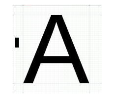

$py(
now = '2025-03-30'
yy = 2025

html = 'AvrahamAbeBernstein-CV.html'
pdf = 'AvrahamAbeBernstein-CV.pdf'
linkedin = 'https://www.linkedin.com/in/avrahambernstein/'
www = 'https://www.avrahambernstein.com'
photo = www + '/AvrahamAbeBernstein-20250202-Watermarked.20pc.png'

RIGHT_POINTING_TRIANGLE = "&#x25B8;"

if is_pdf:
    html = www + '/cv/' + html

def obfus(text):
	return '<span class="hide">' + text + '</span>'

def para(link):
	if is_pdf:
		return ''
	else:
		return '<a href="#' + link + '">&para;</a> {#' + link + '}'

def hdetails(task):
    return '<details markdown="1"><summary>' + task + '</summary>'

def pdetails(id,task):
    return " [" + RIGHT_POINTING_TRIANGLE + " " + task + "](" + html + "#" + id + ")"  
)
<address markdown="1">
__Author:__ Avraham "Abe" Bernstein
<br/>__Email:__ Avraham DOT Bernstein AT gmail$(obfus('bozo@example.com')) DOT com
<br/>__Tel/Whatsapp:__ +$(obfus('bozo@example.com'))972.54.641-0955
<br/>__Home Geolocation:__ Jerusalem 9727433 ISRAEL
<br/>__www:__ [$(www)]($(www))
<br/>__linkedin:__ [$(linkedin)]($(linkedin))
$if(not is_pdf)\
<br/><span class="hilite">__PDF:__ [$(www)/cv/$(pdf)]($(www)/cv/$(pdf))</span> 
<br/>__Copyright__ &copy; Avraham Bernstein 2017-$(yy), Jerusalem ISRAEL. All rights reserved.
<br/>__License:__ FOSS SPDX BSD-3-Clause: [https://opensource.org/licenses/BSD-3-Clause](https://opensource.org/licenses/BSD-3-Clause)
$endif\
<br/>__Last Update:__ $(now)
</address>

$if(not is_pdf)
 "Secure photo of the author from 2025")

__Secure[^secure-photo] photo of the author from 2025__

---

<button onclick="show_all_details()">Click Here To Open All Details<br>(Useful for printing. Required for external linking to "inner-*" local bookmarks. Close by reloading page.)</button>
$endif

## Introduction: Cr8tive Solutions To Hard Problems $(para('intro'))

1. I have more than 40 years experience in state-of-the-art software development:
	* inventing new [algorithms](https://en.wikipedia.org/wiki/Algorithm)
	* inventing [domain specific languages (DSL)](https://en.wikipedia.org/wiki/Domain-specific_language) which can grossly simplify many difficult problem domains, especially for non-programmers
	* using [compiler](https://en.wikipedia.org/wiki/Compiler) tools to automatically [refactor](https://en.wikipedia.org/wiki/Code_refactoring) source code, and for anti-[reverse engineering](https://en.wikipedia.org/wiki/Reverse_engineering) [obfuscation](https://en.wikipedia.org/wiki/Obfuscation_(software))
2. I am a "hands-on" master software engineer. I enjoy programming. I design prototypes and minimum viable products for _CTO_ groups.
3. I have many inventions and some __recent patents__ in a wide variety of application domains, e.g.:
    * digital automotive technology
    * Internet TV
    * cybersecurity
    * bioinformatics
    * accessibility
    * factory automation
    * VLSI CPU design
4. I am an [expert generalist](https://simplicable.com/new/expert-generalist) and an [autodidact](https://en.wikipedia.org/wiki/Autodidacticism) [polymath](https://en.wikipedia.org/wiki/Polymath)[^polymath]. I easily learn and become an expert in new fields.
5. In order to jump start my learning process I prefer to find a domain expert to mentor me, and I am also a good mentor myself. 
6. I know many computer languages which I am able to learn easily due to my [compiler](https://en.wikipedia.org/wiki/Compiler) background.
7. My "go to" _programming_ languages in which I am quite proficient are the following:
    * [C](https://en.wikipedia.org/wiki/C_(programming_language))
    * [Python](https://en.wikipedia.org/wiki/Python_(programming_language)) and [Beautiful Soup](https://beautiful-soup-4.readthedocs.io/en/latest/)
    * [Jinja2](https://en.wikipedia.org/wiki/Jinja_(template_engine)), the "gold standard" macro and template preprocessor
    * [Pyexpander](https://pyexpander.sourceforge.io/), which is much simpler to use than _Jinja2_ and just as useful _except_ where template inheritance is needed, _but_ unfortunately is _polluted_ by a [GPLv3 license](https://en.wikipedia.org/wiki/GNU_General_Public_License)
    * [bash](https://en.wikipedia.org/wiki/Bash_(Unix_shell)), including [Posix CLI commands](https://en.wikipedia.org/wiki/List_of_POSIX_commands)
8. My "go to" _data_ languages are _HTML_, _Markdown_, [pandoc](https://www.pandoc.org), [srcML](https://www.srcml.org), _XML_, _YAML_, and _Excel_.
9. I thrive on undertaking new challenging projects. I am quite comfortable engaging in and leading _flexible_ "brain storming" sessions.
10. I have a long history of providing considerable value added to my employers. Browse the links below (typically preceded by the _right pointing triangle_ symbol "$(RIGHT_POINTING_TRIANGLE)") that describe the details of my career. They will reveal a long history of "home runs". I am especially proud of my inventions in the fields of [bioinformatics]($(html)#syntezza) and [accessibility]($(html)#virtouch) (and [here]($(html)#cubital-accessibility)) even though they are not in the application domains where I usually work.

## Work Experience $(para('work'))

### 2025-present: Independent Commercial S/W Cybersecurity Obfuscation Product Development $(para('obfuscation'))

I am starting (2025-04-01) my own firm to develop commercial [obfuscating](https://en.wikipedia.org/wiki/Obfuscation_(software)) compilers for:

1. _C11/C++2014_
	* implementation via [srcML (commercial license)](https://www.srcml.org) and Python's [Beautiful Soup (MIT license)](https://beautiful-soup-4.readthedocs.io/en/latest/)
2. [web assembly (WASM)](https://webassembly.org/)
	* implementation via the [parsimonious (MIT license)](https://github.com/erikrose/parsimonious) Python PEG parser

And I intend to develop lightweight and inexpensive commercial compiler utilities that refactor _C_ source code, via _srcML_ and _Beautiful Soup_, including:

1. enabling optional and named function call arguments
	* implementation via the [GCC designated initializer](https://gcc.gnu.org/onlinedocs/gcc/Designated-Inits.html) extension
2. obfuscating [name mangler](https://en.wikipedia.org/wiki/Name_mangling)
	* similar to [stunnix cxx-obfus](http://stunnix.com/support/doc/cxxo/cxx-obfus.shtml)
3. compile time _constant_ string encryption that decrypts at startup
4. _static_ variable and function name obfuscation
5. fully functional [ELF dynamic shared object (DSO)](https://amir.rachum.com/shared-libraries/) files that shroud their global export table
6. detection and elimination of duplicate code where variable names are parameterized
	* implementation via the [GCC statement expressions](https://gcc.gnu.org/onlinedocs/gcc/Statement-Exprs.html) extension, and the [clang block extension](https://clang.llvm.org/docs/BlockLanguageSpec.html)

$py(id="aurora"; task="Automotive Software Updates: CTO Group: (a) Invented a patent-pending algorithm to greatly reduce RAM consumption during FLASH updates which improves compression efficiency which is the core KPI of the software update industry. (b) Greatly improved the CPU efficiency and RAM consumption of the company's core product that automatically refactors embedded C source code of their automotive industry clients.")
### 2022-25: [Aurora Labs](https://www.AuroraLabs.com) Tel Aviv IL $(para(id))

$if(is_pdf)
$(pdetails(id,task))
$else
$(hdetails(task))

1. The company's core product relied upon [refactoring](https://en.wikipedia.org/wiki/Code_refactoring) the automotive client [OEM's](https://en.wikipedia.org/wiki/Original_equipment_manufacturer) source code in order to make it much more efficient to generate software updates. Sometimes their product could reduce update times 10x compared to the default technique of using [LZMA](https://en.wikipedia.org/wiki/Lempel%E2%80%93Ziv%E2%80%93Markov_chain_algorithm) (i.e. successor to _zip_) compression.

2. I invented an extremely efficient technique to greatly improve the efficiency of their initial _offline_ refactoring of embedded _C_ software by combining the [srcML](https://www.srcml.org/) compiler [AST](https://en.wikipedia.org/wiki/Abstract_syntax_tree) output in [XML](https://en.wikipedia.org/wiki/XML) format with the Python [Beautiful Soup](https://beautiful-soup-4.readthedocs.io/en/latest/) library in order to generate the refactored source code. I improved their build speed time by 5x (i.e. from 6 hours to 1 hour) and reduced RAM consumption by 2x (from a 64 GB workstation to 32 GB). Admittedly their original refactoring engine was a hand coded _C_ to _AST_ compiler which they implemented in _Python_.

3. I invented an algorithm (US patent pending) for embedded systems to greatly reduce RAM usage when the software generates [FLASH](https://en.wikipedia.org/wiki/Flash_memory) files by modifying the internals of the ubiquitous _C_ [memcpy](https://www.man7.org/linux/man-pages/man3/memcpy.3.html) function by incorporating [Posix](https://en.wikipedia.org/wiki/POSIX)-like buffered I/O when _memcpy_ is used to sequentially write to _FLASH_. The RAM savings enables usage of larger [bsdiff](https://github.com/mendsley/bsdiff) _patch_ "chunks" that enables higher compression ratios for legacy system boards with small amounts of RAM, i.e. 64-256 KB. Sometimes compression ratios could be improved by up to 25% - where the critical [KPI](https://www.forbes.com/advisor/business/what-is-a-kpi-definition-examples/) in the software update business is improving compression ratios.

</details>
$endif

$py(id="jct"; task="Lecturer: Introduction to Cybersecurity")
### 2022 part-time: [Jerusalem College Of Technology (JCT/Machon Lev)](https://www.jct.ac.il/en) Jerusalem IL $(para(id))

$if(is_pdf)
$(pdetails(id,task))
$else
$(hdetails(task))

1. I had mixed reviews from the students.

2. They found I was a superb lecturer because I exhibited mastery of the subject matter and because I showed them how some of the course materials were  regularly used by Cybersecurity professionals in industry, unlike most of the teaching staff who were full-time academics.

3. On the other hand, they rated me very poorly on my tutorials because I refused to "spoon feed" them. Admittedly some of the exercises were very difficult, and required substantial effort to answer them. I argued that it was essential for their understanding of the material that they solve the exercises themselves. I even stayed after class to help them.

4. My takeaway is that if I should teach there again then I will not offer to do tutorials.

</details>
$endif

$py(id="morphisec"; task="Server Cybersecurity: Reverse engineering and refactoring of X64 object code")
### 2021: [Morphisec](https://www.morphisec.com/) Beer Sheva IL $(para(id))

$if(is_pdf)
$(pdetails(id,task))
$else
$(hdetails(task))

1. I reverse engineered the [X64](https://en.wikipedia.org/wiki/X86-64) [object code](https://en.wikipedia.org/wiki/Object_code) of the _Linux_ kernel module [libc](https://man7.org/linux/man-pages/man7/libc.7.html) in order to modify the internals of the [exec functions](https://www.man7.org/linux/man-pages/man3/exec.3.html), where these functions are used in [stack smashing](https://en.wikipedia.org/wiki/Stack_buffer_overflow) attacks, _but without changing the addresses of any of the libc exports_.

2. Inserting the extra security functionality into these functions necessitated a slight increase in their sizes, therefore it was quite challenging not to change the addresses of any of the other _libc_ functions.

3. I implemented the project in _Python_ using the [Zydis](https://zydis.re) disassembler _Python_ library.

4. Note that every X64 Linux release and [distro](https://en.wikipedia.org/wiki/Linux_distribution) will likely have a slightly different libc object code implementation.

</details>
$endif

$py(id="qedit"; task="Banking Cryptographic Algorithms: Securing C algorithms in a web browser using WASM")
### 2021: consultant to [Qedit](https://qed-it.com/) Tel Aviv IL $(para(id))

$if(is_pdf)
$(pdetails(id,task))
$else
$(hdetails(task))

1. I implemented _C_ cryptography functions in _Javascript_ [web assembly (WASM)](https://webassembly.org/). _WASM_ object code is much faster and much more difficult to debug than _Javascript_. Because this project was intended for the banking industry, in the future we could write a _WASM_ [obfuscator](https://en.wikipedia.org/wiki/Obfuscation) that would greatly increase the difficulty of debugging.

2. I implemented the project by using [Clang's wasm32 target](https://medium.com/@dougschaefer/going-straight-to-clang-for-webassembly-928df1484430).

</details>
$endif

$py(id="argus"; task="Automotive Software Updates: (a) Patented an algorithm greatly reducing FLASH memory required to implement mini-bsdiff. (b) Architected and implemented an embedded S/W update driver based upon mini-bsdiff and the xz binary compressor.")
### 2018-20: [Argus Cyber Security](https://en.wikipedia.org/wiki/Argus_Cyber_Security) Tel Aviv IL (restructured as [PlaxidityX](https://plaxidityx.com/) IL, subsidiary of [Elektrobit/Continental](https://www.elektrobit.com/) DE) $(para(id))

$if(is_pdf)
$(pdetails(id,task))
$else
$(hdetails(task))

1. I architected and implemented a software design for efficient software updates of the _object code_ of embedded systems using the _FOSS_ [mini-bsdiff](https://github.com/thoughtpolice/minibsdiff) [delta encoding](https://en.wikipedia.org/wiki/Delta_encoding) combined with the embedded _FOSS_ [xz](https://github.com/tukaani-project/xz-embedded) binary compressor. Note that _delta encoding_ enables significantly smaller, e.g. 10x smaller, software updates compared to _zip_-like updates when the update contains minor differences.

    * The original [bsdiff](https://github.com/mendsley/bsdiff) software is not designed for the size limitations of embedded systems especially for legacy automotive boards.
    * In particular the original _bsdiff_ software incorporates the outdated _bz_ binary compressor that has a 100 KB RAM footprint.
    * _Mini-bsdiff_ is not bundled with any binary compressor at all.
    * The _xz_ binary <u>de</u>compressor designed for embedded systems has only has a 26 KB RAM footprint.
    * During the offline preprocessing of the patch "chunks", we calculated the RAM consumption of the processing stages in order to design dynamic memory overlays per chunk. More efficient use of RAM enabled us to process bigger chunks which compressed better than smaller chunks. Compression efficiency is the core [KPI](https://www.forbes.com/advisor/business/what-is-a-kpi-definition-examples/) of the software update industry.
    * Note it is usually _not_ computationally feasible to generate an offline _mini-bsdiff_ patch where at least one of the source files is larger than 8MB, in which case it is preferable to use the (less efficient) [VCDiff/xdelta](https://en.wikipedia.org/wiki/VCDIFF) algorithm that is commonly used on web sites.
    
2. I invented [EU Patent EP3680773A1](https://worldwide.espacenet.com/patent/search/family/069147491/publication/EP3680773A1?q=20150616.9), a _mini-bsdiff_ patch implementation for small _FLASH_ memory systems where the _FLASH_ is not big enough to temporarily hold both the original version "A" and new version "B" of the object code. Normally the _bsdiff_ (and _mini-bsdiff_) algorithm requires both versions be available when applying the patch. I had discussions with _Colin Percival_ the original inventor of _bsdiff_.
 
 3. I experimented with [Google's Courgette](https://www.chromium.org/developers/design-documents/software-updates-courgette/) improvement to _bsdiff_, but it required a relatively large amount of RAM on the target device in order to support a _linker_. Such large RAM is not typically available on legacy boards used in the automotive industry. I invented an algorithm that dispensed with the need for a linker.

4. I experimented with techniques for using _source code_ patching instead of _bsdiff_ _object code_ patching. The _Elektrobit_ management refused to believe that it was commercially feasible to have access to an OEM's source code. I switched jobs to [Aurora Labs](#aurora) above because I believed that _Aurora Labs'_ source code patching is a better solution.

5. I was the company's [Misra C](https://en.wikipedia.org/wiki/MISRA_C) "enforcer". While I understood the safety rationale and the legal requirements for _Misra C_, I found many of their rules to be unnecessarily pedantic. I developed [Jinja2](https://jinja.palletsprojects.com/en/stable/) preprocessing utilities that worked around these pedantic rules, but that still generated valid _Misra C_ code.
    
</details>
$endif

$py(id="canary-mission"; task='Consultant: SOHO Cybersecurity "Hygiene"')
### 2016 part-time: [Canary Mission](https://canarymission.org/) Jerusalem IL $(para(id))

$if(is_pdf)
$(pdetails(id,task))
$else
$(hdetails(task))

1. The company publicizes and collates social media posts of antisemites, anti-Zionists, and terrorist "wannabes". Their information was used by the Israeli government immigration authorities, and by potential employers who often did social media background checks. Because they were effective at blacklisting (aka "outing") these miscreants, left-wing organizations, including "progressive" Jewish ones, hated them. They were the subject of intensive hostile investigations by professional left-wing media organizations including [Times of Israel](https://www.timesofisrael.com/topic/canary-mission/) and [The Forward](https://forward.com/tag/canary-mission/) - who by the way eventually "outed" them. Therefore the company required cybersecurity "hygiene".

2. The vast majority of their employees did journalist-like tasks. They had garden variety computer skills, and therefore would not be capable of handling sophisticated tasks like using virtual machine clients (e.g. [VirtualBox](https://www.virtualbox.org/)) or using [PGP](https://en.wikipedia.org/wiki/Encryption_software).

3. The following are relatively simple, but effective, cybersecurity defense recommendations:

    a. Use the then most recent Windows 10 Professional O/S on account of its regular security updates and its support of [BitLocker](https://support.microsoft.com/en-us/windows/bitlocker-drive-encryption-76b92ac9-1040-48d6-9f5f-d14b3c5fa178) full disk encryption. PCs are lost and stolen.
    
    b.  Use a random PC login password from a USB security token such as [Yubico](https://www.yubico.com/). _At that time_ the basic capability of the token was to store and emit a permanent manufacturer-configured "random" 16 character password. (More modern keys support additional services such as _TOTP_ authenticator one-time keys with a timeout). By pressing the button on the token it would act as a second keyboard in order to allow the password to be emitted into the PC. In addition to the token password, it was extremely important to add a (memorized) suffix, otherwise if the token were lost or stolen then security could be compromised.

    c. When the PC is unattended close the cover, and use a screen saver with a relatively short timeout, e.g. 10 minutes, Configure so that resumption requires a password. 

    d. Use the _Firefox_ web browser (and especially not _Google Chrome_ !) with _multiple profiles_ in order to defend against [cross-site scripting attacks](https://en.wikipedia.org/wiki/Cross-site_scripting). There is no information leakage between profiles. Also still today ($(yy)) Firefox has the best builtin bookmarking tool. They should at least use the following profiles:

		* personal email and banking
		* personal browsing
		* company email and accessing company data
		* work related browsing

    e. Use email aliases when required to access potentially hostile social media.
    
    f. Use strong random passwords generated and stored in a _local_ [FOSS](https://itsfoss.com/what-is-foss/) password database application such as [KeePass](https://keepassxc.org/), and not a commercial password server in the cloud (which have historically been periodically hacked). And as long as the user used his security token to protect his password database with his permanent password (appended with his memorized suffix), then he could safely store the database on a disk-on-key or a cloud file server such as [Dropbox](https://www.dropbox.com/). 
    
    g. Use [7-zip](https://www.7-zip.org/) for password protection of disk-on-key storage or file transfers. For file transfers, It has the disadvantage of using shared passwords, and therefore not nearly as secure as _PGP_, but definitely far better than in-the-clear transfers.

    h. Make weekly encrypted backups of user data.
    
    i. Assign an employee along with a deputy to be security monitors. They should store backup security tokens and user PC backups off-site. All employees must pass a quick monthly security review from the monitor.
    
</details>
$endif

$py(id="viaccess"; task="Internet TV Infrastructure: Cybersecurity obfuscation manager")
### 2014-17: [Viaccess-Orca](https://www.viaccess-orca.com/) Ra'anana IL (subsidiary of [Orange](https://www.orange.com/) FR) $(para(id))

$if(is_pdf)
$(pdetails(id,task))
$else
$(hdetails(task))

1. I focused on obfuscation, i.e. anti-reverse engineering, of their smartphone (i.e. Android and iPhone) client player, by selecting a C/C++ obfuscating compiler and by building home brew utilities. I selected the _WhiteCryption_ compiler originally built by _InterTrust_ (subsequently acquired by _Zimperium_ in 2021 after I left). When I first selected _WhiteCryption_, it was still in the _beta_ stage. I worked very closely with the _WhiteCryption_ development team - mainly specifying new features and testing existing ones. Previously I worked on an in-house obfuscation compiler at NDS (called _chameleon_), which I considered to be far beyond the manpower resources we had available at _Viaccess-Orca_, therefore I decided to use _WhiteCryption_ as our contractor. After I left _Viaccess_, they switched to the French _Quarkslab_ obfuscating compiler partly because _Viaccess'_ HQ is also in France.

2. One of my most important utilities I invented was an [ELF](https://en.wikipedia.org/wiki/Executable_and_Linkable_Format) [Dynamic Share Object (DSO)](https://www.webopedia.com/definitions/dynamic-shared-object/) (i.e. an `so` file) which had _no export table_ which ostensibly eliminates the usefulness of a _DSO_ (thus making the term into an _oxymoron_). I designed a low level _asynchronous_ mechanism to load an encrypted export table relying upon _ELF's_ special `init` section which executes code in the address space of the caller when the _DSO_ is first loaded. It is an uncommonly used feature of the _DSO_. I designed this mechanism because the export table is one of the major _attack surfaces_ in a _DSO_.
 
3. I worked with the 3rd party software supplier of the video codec in order to substantially bolster the security of their product which proved to be a major potential security hole in our system. The challenge was that most of their customers did not require the security that we did, and for practical commercial reasons they were not willing to make a separate build for us. I managed to architect an optional security plugin for them that caused negligible changes to their system, and caused zero interference to their other customers who chose not to use a plugin.

4. Initially the movie studios insisted that our player client software would not be allowed to play their content unless the client was [rooted](https://www.androidauthority.com/what-is-rooted-phone-3338226/) because it made the client considerably more difficult to debug and to prevent piracy. Therefore I developed an extremely accurate [fuzzy logic](https://en.wikipedia.org/wiki/Fuzzy_logic) algorithm to detect rootedness with almost no "false positives" (because the out of pocket and negative publicity costs of falsely accusing a subscriber of having a rooted phone were horrendous). The problem was that less expensive Android phones from the Far East were flooding the market, were rooted by default because it saved the manufacturer a few hours of licensing work from Google who controlled the [Android Open Source Project (AOSP)](https://source.android.com/). Therefore the studios agreed that security had to be moved from the client to the content servers. For example a subscriber who played 100 hours of content a week was suspect, or a subscriber who played content simultaneously from different geographic locations was suspect.

</details>
$endif

### 2013-14: _Discretix_ Netanya IL (renamed _Sansa Security_, acquired by [ARM](https://www.arm.com) UK) $(para('discretix'))

The company sold their Internet TV business unit to [Viaccess-Orca (2014)]($(html)#$(id)) above.

$py(id="nvt";task="CTO Nigerian Agritech")
### 2013 part-time: _NVT_ (defunct) US $(para(id))

$if(is_pdf)
$(pdetails(id,task))
$else
$(hdetails(task))

1. The company developed [cassava](https://en.wikipedia.org/wiki/Cassava) (aka tapioca flour) processing facilities in rural Nigeria. Before Nigeria joined _OPEC_, cassava was their primary sustenance source of food. Now that their oil reserves are dwindling, and world demand for oil is decreasing, the Nigerian government is preparing for the day when they can no longer afford to import subsidized wheat.

2. My job was to search for technology, primarily from Israel, that would be useful for establishing factories in rural jungle regions where the cassava is grown. For example:

* food storage techniques for hot humid regions that do not require refrigeration
* small gas turbines for electricity generation
* local area cellular telephone network
* portable hospitals, the size of a shipping container
* portable modular housing units that are foldable and can be loaded from a flatbed truck
* protecting the undercarriage of off-road vehicles

</details>
$endif

$py(id="telequest"; task="Vehicle Navigation Algorithms: VP R&D: Traffic jam reduction algorithms")
### 2012: [Telequest](https://www.telequest.co.il) (stealth) Jerusalem IL $(para(id))

$if(is_pdf)
$(pdetails(id,task))
$else
$(hdetails(task))

1. The company was a failed competitor to [Waze](https://www.waze.com/apps).

2. I developed algorithms to improve traffic throughput in traffic jams taking advantage of expected traffic trends according to history of the day of the week and expected events. I developed probabilistic algorithms to prevent generating secondary traffic jams.

3. I designed live experiments using AWS simulations to optimize results. Coordinated work with a mathematical consultant specializing in optimization algorithms for a huge number of variables.

4. Theoretical algorithm experiments were conducted on a simulator of Tokyo traffic.

</details>
$endif

$py(id="syntezza"; task="PCR MRSA Kit: Inventor of bioinformatic PCR algorithms using AI threshold technique, and more accurate bioassay normalization and noise reduction")
### 2011: consultant to [Syntezza Bioscience](https://www.syntezza.com/) Jerusalem IL $(para(id))

$if(is_pdf)
$(pdetails(id,task))
$else
<details markdown="1"><summary>$(task)</span></summary>

The company's product was a novel _dry_ test kit for [MRSA](https://www.mayoclinic.org/diseases-conditions/mrsa/symptoms-causes/syc-20375336) using [PCR](https://en.wikipedia.org/wiki/Polymerase_chain_reaction) (a [DNA](https://en.wikipedia.org/wiki/DNA) amplification device).
_MRSA_ is a lethal strain of _staphylococcus_ bacteria. It thrives in hospitals where it is the major [iatrogenic](https://en.wikipedia.org/wiki/Iatrogenesis) killer of immunologically compromised patients.
Therefore it is critically important that hospitals identify carriers among both patients and
hospital staff as soon as they are infected.
Most people who are infected with _MRSA_ carry it in their nasal passages.
Most interesting such a person, even an immunologically compromised one,
can still live until 120. However if an immunogically comprised person
touches his nose, and afterwards touches an open wound then he is in danger of death.
Prior to _PCR_ technology, it took a laboratory about 48 hours to identify the disease by growing 
a culture in a "gold standard" [Petri dish](https://en.wikipedia.org/wiki/Petri_dish), 
but _PCR_ technology can make the identification within 2 hours.
 
__Before joining the company I had zero university background in [biology](https://www.youtube.com/watch?v=1HoVF6iv7OE), microbiology, genetics, or biochemistry.__ 
When I arrived the company was in imminent danger of closing down their _PCR_ business unit
because their initial [FDA](https://en.wikipedia.org/wiki/Food_and_Drug_Administration) trials completely
failed that they had spent about \$500K to prepare by collecting 800 patient samples from a few Israeli hospitals.
The owner was "pulling his hair out" because he felt that his science was 100% correct.
First he hired [Tzachi Bar](https://www.researchgate.net/profile/Tzachi-Bar) to consult, the inventor of PCR mathematical algorithms used in all PCR devices at that
time world wide, but _Bar_ could not help him. I happened to be the owner's neighbor. He knew that
I was a computer scientist, so he took his final chance with me.
__Within 3 months I made a number of discoveries that validated the owner's science and
enabled them to pass the _FDA_ trials.__ 
In spite of my technical success, for commercial reasons beyond the scope of my short article,
they were forced to close down their _PCR_ business unit;
therefore my [threshold  algorithm](https://www.pythonprog.com/thresholding-in-machine-learning/) was never patented.

1. Initially _Bar_ and the company's chief microbiologist gave me a 2 week crash course in the fields of microbiology and genetics that they felt I would need for my work.

2. My first task was to generate amplified graphs of all 800 samples, and to study them. Note that every sample had a _PCR_ result, and an associated "gold standard" _Petri dish_ result.

3. My second task was to carefully read the manual of the _PCR_ device. I noted that the company's junior microbiologist who was responsible for administering the hospital tests had used an incorrect protocol for configuring the _PCR_ devices. The 3 control samples that every batch contains were placed in incorrect test tube slots. Therefore all test results were nonsensical!

4. Even though the samples had been thrown away weeks before I arrived, fortunately they had saved the raw data from the _PCR_ devices, that allowed me to reconstruct the _Bar-Tichopad_ algorithm. The new results were better, but still hardly good enough for the _FDA_ that required 80% accuracy.

5. I noted that tests from the pure laboratory colonies of _MRSA_, with extremely high concentrations never to be encountered in a patient sample, all failed. This indicated to me that there was a flaw in the industry standard _Bar-Tichopad_ algorithm.

6. Secondly I noted that many tests with negative _PCR_ results, in spite of the positive Petri results, had random graphs instead of the smooth [bioassay](https://en.wikipedia.org/wiki/Bioassay) sigmoidal shaped curve of the [logistic function](https://en.wikipedia.org/wiki/Logistic_function) that _Bar-Tichopad_ expected. After discussing the matter with _Bar_ and the senior microbiologist, this indicated that the graphs were statistically noisy due to [PCR inhibition](https://en.wikipedia.org/wiki/Polymerase_chain_reaction_inhibitors). Therefore the company's preliminary chemistry did not yet filter out nasal impurities that mature chemistry was supposed to do. Maybe we had to "throw in the towel", i.e. to give up?

7. So I put on my "thinking cap", and discovered a completely new algorithm that was much better than the Bar-Tsichopad algorithm.

8. I discovered a much more accurate and simple way to normalize the bioassay curve and to remove systematic noise, by noting that the "systematic" noise and the linear rise in the signal of the negative control sample precisely matched the patient samples (from the same batch). Therefore my simple normalization solution was to subtract the negative control sample from the patient samples.

9. Both _Bar_ and the senior microbiologist agreed with me that inhibition never increases the _PCR_ signal. Therefore I used an alternative [AI threshold test](https://www.pythonprog.com/thresholding-in-machine-learning/), instead of the _Bar-Tichopad_ test that was based upon advanced mathematical functional analysis to calculate the [Ct](https://www.thermofisher.com/il/en/home/life-science/pcr/real-time-pcr/real-time-pcr-learning-center/real-time-pcr-basics/real-time-pcr-understanding-ct.html) of the assay. 

10. I split the patient samples in half. For the control half, I used the single maximum signal from each sample. I recorded minimum PCR signal that indicated a positive Petri result. And similarly I recorded the maximum PCR signal indicated a negative Petri result. 

11. __I used the other half of the patient samples to test my new threshold algorithm. My predictions were 95% accurate in spite of the high degree of inhibition found in the preliminary chemistry!__
    
    * The explanation for the minor inaccuracy was some results were in the "gray" region where there was an overlap between the minimum PCR signal to indicate a positive result, and the maximum PCR signal to indicate a negative result.

12. __My threshold algorithm won a MRSA "shoot out" at the world famous UK [St Georges medical school hospital](https://www.stgeorges.nhs.uk/) against competing PCR kits from the huge international pharmaceutical companies!__ 

</details>
$endif

$py(id="NDS"; task="Internet TV Infrastructure: Cybersecurity researcher")
### 2005-10: _NDS_ Jerusalem IL (acquired by [Synamedia](https://www.synamedia.com/) UK) $(para(id))

$if(is_pdf)
$(pdetails(id,task))
$else
$(hdetails(task))

1. Most of my work at NDS was doing software security research including occasional code security audits.

2. I was one of the first security researchers in the world to prove that the ubiquitous virtual machine packages, e.g. _VMWare_ and _VirtualBox_, could break simple _DRM_ protection schemes like date restrictions or replay count.

3. I showed how _X64_ virtualization hardware could be used together with [QEMU](https://en.wikipedia.org/wiki/QEMU) to break the software random number generator (RNG). This was a very critical attack because the fundamental security assumption was that each client PC had a worldwide unique cryptographic "nonce". But if confederate clients could share their nonces on their own trivial web server then a single license could be shared by all members of the confederacy. At that time, c. 2007, the cycle counter instruction `RDTSC` was easily subverted by the virtualization technology. After I left the company, since 2012 the CPU has a hardware RNG instruction `RDRAND` which is a much safer instruction from the perspective of security.

4. I invited outside security researchers to give lectures and seminars to in-house developers on state-of-the-art security techniques. Based upon these lectures I developed an obfuscated [FORTH](https://en.wikipedia.org/wiki/Forth_(programming_language))-like compiler that was extremely difficult to reverse engineer.

5. In 2007 NDS was invited by the Chinese government CCTV system to protect the 2008 Beijing Olympics TV feed. I "almost" won the contract. The Chinese government did not want Microsoft to be involved in the bidding because nearly 100% of servers and client PCs had stolen operating system licenses which could easily be revealed when Microsoft installed the protection software. At time the Olympic TV feed was owned by a Microsoft company MSNBC. Eventually Microsoft agreed not to sue China for the stolen operating system licenses, and they offered the protection package for free so they won the contract.

6. The Israeli satellite TV operators had their feed stolen by Israeli expats in the US, and more massively in the Palestinian areas. I showed how to it was possible to easily technically stop these thefts. For reasons that are still not clear to me, the operators showed no interest in stopping these thefts.

7. My first job at NDS was as a quality assurance (_QA_) contractor. I built a tester and simulator for the NDS satellite software. I designed a [domain specific language (DSL)](https://en.wikipedia.org/wiki/Domain-specific_language) in [TCL](https://en.wikipedia.org/wiki/Tcl) to do this task. After my analysis of their software, I concluded that there were critical flaws in its design. I was quite knowledgeable in VAX/VMS O/S internals. The junior VP in charge of the project refused to believe that a "mere QA guy" could have such knowledge, so I built a graduated test program that blew his (virtual) satellite out of the sky. Afterwards my software was installed on every developer's desktop. Before checking in software into their version control system, it became standard operating procedure to run a 10 minute test prior to check-in.

8. I worked with NDS' _QA_ department to analyze their bug reports, and concluded that nearly 50% of their software effort was bug fixes. And they had more than 1000 software developers! I worked with the QA department in order to implement a program to greatly reduce bugs. I recall that their biggest problem was lazy software builds that often contained tens of thousands of warnings. My most important improvement was insisting on zero warnings, or adding explicit compiler approval of any warning to be explicitly allowed.

</details>
$endif

$py(id="vyyo2004"; task="Broadband RF Networking: Architect of super-efficient cable modem testing laboratory")
### 2004: _Vyyo_ (defunct) Jerusalem IL $(para(id))

$if(is_pdf)
$(pdetails(id,task))
$else
$(hdetails(task))

1. I designed an extremely efficient network testing laboratory.

2. By selecting 24-port programmable layer-2 switches for each of the PC's 4x100 MB Ethernet ports, each PC was able to control 96 cable modems during low speed ping tests, whereas previously each PC could only control 4 modems (i.e. one per Ethernet port), which resulted in massive (24x) cost savings through the reduction of PCs and their associated electrical infrastructure, floor space, and air conditioning. 

3. For high speed testing at 8 MB per modem, each PC's Ethernet port could only support 12 modems; but the programmable switches could be dynamically configured to quickly open and close ports.

4. I Implemented automated control of the lab in [TCL](https://en.wikipedia.org/wiki/Tcl).

5. Instead of implementing speed tests with Cisco's network utilities which relied upon a binary search algorithm, initially I wrote a program to implement a [Fibonacci search](https://en.wikipedia.org/wiki/Fibonacci_search_technique) which was a significant improvement. Subsequently I wrote a [steepest descent search](https://en.wikipedia.org/wiki/Method_of_steepest_descent)  which was 10x more efficient!

</details>
$endif

$py(id="virtouch"; task="Blind Accessibility Device: VP R&D: Inventor of product that allowed the blind to see/understand images in a PC/smartphone web browser ideally combined with a consumer grade graphics tablet")
### 2002-03: _Virtouch_ (defunct) Jerusalem IL $(para(id))

$if(is_pdf)
$(pdetails(id,task))
$else
$(hdetails(task))

1. I invented a software system that allowed the blind to "see" and to understand computer images, especially maps and mathematical functions, using a 
    a. standard PC or smartphone web browser
    b. the device's builtin speaker
    c. ideally a consumer grade graphics tablet and stylus (e.g. [Wacom Bamboo](https://www.amazon.com/Wacom-Graphic-Drawing-Tablet-Beginners/dp/B07S1RR3FR) ~\$50)
    d. and optionally, but less preferably, with the device's builtin mouse

2. The software heavily relied upon the builtin [standard vector graphics (SVG)](https://en.wikipedia.org/wiki/SVG) capability of all modern web browsers (since 1999).
    a. _SVG_ is an _XML_ variant. 
    b. _SVG_ returns the position and color at the cursor.
    c. Unlike _JPG_ or _PNG_ pixelated images, _SVG_ has the ability to smoothly zoom in or zoom out of vector images.

3. The basic concept can be understood by using an example image of a circle.
    a. Let the display be black, except for the perimeter of the circle which is a few pixels wide and which is colored white.
    b. In the simple case where the user's stylus hovers over a white pixel, a sound is played, but hovering over a black pixel yields no sound.
    c. Blind users prefer a graphics tablet to a mouse because blind users still have hand-eye (or actually mind-eye) coordination, so they can easy navigate around the tablet. Mice have the problem that the cursor gets stuck at the edge of the display when you scroll beyond the edge. It is possible to provide sonic cues to ameliorate this problem, but using a tablet and stylus is much easier.
    d. Divide the screen into a grid of 96x96 rectangles, or equivalently 8x8 12-tone chromatic octaves. Let the horizontal (x) axis be represented by a piano, and the vertical (y) axis be represented by a flute. Instead of playing the same sound for all white pixel positions, play the xy note combination in the grid position where the cursor is located.
    e. If we would use two intersecting circles, say one white and blue, we could use different instrument combinations to represent the colors, and/or we could use the keyboard or click on the stylus to query which circle we are touching, where the application will provide a text-to-speech response.
    
4. Images need to be prepared offline. But in the case of maps, most of which are already designed using _XML_ variants, it is possible to programmatically automate their preparation.

5. I applied for and was awarded a large _matching_ grant from the EU in the field of accessibility for the blind in order to productize my work, where the funds would be administered by the office of Israel's _Chief Scientist_. Unfortunately my employer was having a history of financial problems, so they decided to liquidate.

</details>
$endif

### 2002: _TMT_ (defunct) Jerusalem IL; Local Area RF Networking

I did similar tasks for _Vyyo_. See [Vyyo (2004) above]($(html)#vyyo2004) and [Vyyo (2000) below]($(html)#vyyo2000).

$py(id="jolt"; task="Free Space Optics Networking: Consultant: Designer of SNMP NMS client and agent")
### 2002 part-time: _Jolt_ Jerusalem IL (acquired by _MRV Communications_ IL, and eventually by [Adtran](https://www.adtran.com) US) $(para(id))

$if(is_pdf)
$(pdetails(id,task))
$else
$(hdetails(task))

1. The company's [FPGA](https://en.wikipedia.org/wiki/Field-programmable_gate_array) hardware was streamlined to handle calibrating/aiming the optical equipment. It had no CPU, and minimal configuration I/O ports.

2. I selected an external interface card, with builtin _Java_ support, in order to implement a basic [SNMP agent](https://en.wikipedia.org/wiki/Simple_Network_Management_Protocol).

3. I built a basic HTTP [SNMP NMS](https://en.wikipedia.org/wiki/Simple_Network_Management_Protocol) server.

</details>
$endif

$py(id="vyyo2000"; task="Broadband RF Networking: Manager of S/W utilities group; inventor of cable modem hybrid (RF/dial-up) IP allocation protocol")
### 2000-02: _Vyyo_ (defunct) Jerusalem IL $(para(id))

$if(is_pdf)
$(pdetails(id,task))
$else
$(hdetails(task))

1. I invented a hybrid IP system for the modems where a modem had separate IP addresses for upstream (telephone dial-up) and downstream (RF). The invention took advantage of the fact that cable operator also operated the upstream dial-up network, so all the action took place by dynamically manipulating the edge router's [arp table](https://en.wikipedia.org/wiki/Address_Resolution_Protocol) at modem login.

2. I designed the company's [SNMP NMS](https://en.wikipedia.org/wiki/Simple_Network_Management_Protocol) offline client using a GUI NMS client tool kit with [TCL](https://en.wikipedia.org/wiki/Tcl) macros, and the embedded system _agent_ for the modem and router in _C_.

3. I invented the router's embedded [arp table](https://en.wikipedia.org/wiki/Address_Resolution_Protocol) using an extremely efficient _FIFO_ [hash table](https://en.wikipedia.org/wiki/Hash_table) in _C_ that used no dynamic memory allocation.

4. I designed an embedded remotely accessible and secure debugger for the router in [FORTH](https://en.wikipedia.org/wiki/Forth_(programming_language)) wrapped in _C_.

</details>
$endif

### 1999: contractor to _Phasecom_ Jerusalem IL (acquired by _Vyyo_ above)

Broadband RF Networking: See the tasks that I did for the successor company [Vyyo (above)]($(html)#$(id)).

$py(id="fourfold"; task="Fabless VLSI CPU Design: Novel GCC compiler port for a FORTH-like CPU")
### 1998: contractor to _Fourfold_ (defunct) Jerusalem IL $(para(id))

$if(is_pdf)
$(pdetails(id,task))
$else
$(hdetails(task))

1. The novelty of this port was that the [GCC](https://en.wikipedia.org/wiki/GNU_Compiler_Collection) model assumes a small finite number of special purpose [registers](https://en.wikipedia.org/wiki/Hardware_register), while this [FORTH](https://en.wikipedia.org/wiki/Forth_(programming_language))-like stack hardware could be considered to contain an infinite number of registers, or alternatively no registers at all.

</details>
$endif

$py(id="optimet"; task="Conoscopic Laser Interferometry: S/W architect of a DSL for a 2D measurement  robot")
### 1996-97: CEO _Pitkha_ (defunct) Jerusalem IL, contractor to _Optimet_ Jerusalem IL, subsidiary of [Ophir Optronics](https://www.ophiropt.com/en/) IL $(para(id))

$if(is_pdf)
$(pdetails(id,task))
$else
$(hdetails(task))

1. I designed a [domain specific language (DSL)](https://en.wikipedia.org/wiki/Domain-specific_language) for controlling an interferometer-like device that moved along an XY jig. I implemented the _DSL_ in [TCL](https://en.wikipedia.org/wiki/Tcl) running under Windows NT.

2. The most challenging part of the project was making visual sense of the raw "cloud" output of millions of XYZ points. I used the [OpenGL](https://www.opengl.org/) _C API_ about a year before they had published their own [TCL](https://codeplea.com/opengl-with-c-and-tcl-tk) interface. I developed a tool kit in order to allow the end user to specify what graphics primitives he should use to analyze the different regions of the object being scanned. In my development environment, I used to scan a tooth that I called "Timmy". The end result looked like an alpine environment, where the higher parts were colored white, the middle levels were green, and the lower levels were blue, etc.

</details>
$endif

$py(id="elop"; task="Military Optical Devices: S/W architect of a DSL to implement a mil-spec automated testing laboratory for the BlackHawk helicopter weapons targeting system" )
### 1996: CEO _Pitkha_ (defunct) Jerusalem IL, contractor to [Elop/Elbit](https://elbitsystems.com/) Rehovot IL$(para(id))

$if(is_pdf)
$(pdetails(id,task))
$else
$(hdetails(task))

1. Elop was a primary subcontractor for the _BlackHawk_ helicopter missile fire control system for the US company _LORAL_ who was the main contractor for the helicopter (which was acquired by _Lockheed Martin_). They had an acceptance testing manual that specified over 1000 tests that the  fire control system must pass. There were about 10 _GPIB_ interface hardware devices attached to the software. Unsupervised automated tests would have to run for up to 4 days at a time. Test results would be sent to a log file, and the app had GUI dashboard to show its current status. The underlying system would be implemented in _C_. The laboratory computers would be running MS-DOS.

2. The key to the success of this project was my design of a [domain specific language (DSL)](https://en.wikipedia.org/wiki/Domain-specific_language) to formally specify each of the tests. Also the language would have to be easy enough to use by the _Elop_ system engineer, who was not a professional programmer, and would have to program many _ad hoc_ tests on his own. I designed the _DSL_ to be a lightweight version of _BASIC_ along with plugin drivers for the specialized test hardware, along with the main device under test. I used _lex_ and _yacc_ to design the language.

3. The system worked as planned, unattended for up to 4 days at time with no memory leaks.

</details>
$endif

$py(id="dspg"; task="Fabless DSP CPU  Design Center: Inventor and S/W architect of a DSL to implement the software tool chain for the PINE CPU")
### 1992-95: CEO _Pitkha_ (defunct) Jerusalem IL, contractor to [DSP Group](https://www.dspg.com/) Ramat Gan IL $(para(id))

$if(is_pdf)
$(pdetails(id,task))
$else
$(hdetails(task))

1. _DSPG_ designed CPU micro-controllers that supported DSP functionality. When I joined them they were working on their original _PINE_ chip. They were a VLSI "fabless" design center. After finishing their designs, they had them manufactured by a real physical "fab". At that time it could take up to 6 months for the fab to manufacture the physical chip. Design flaws would be horrendously expensive. And _DSPG_ designed the application software that ran on their chips. At that time they designed the hardware and software internals for consumer telephone answering machines.

2. VLSI software simulations ran extremely slowly because they simulated the low level transistor details of  their circuitry.

3. My job was (1) to design a clock accurate simulator that would run about 100x faster than the VLSI simulator, and (2) to supply an assembler and _C_ compiler that could be used to test software applications months before the fab manufactured the physical chip.

4. At that time the first release of _QEMU_ would be about 15 years away, and the GCC tool chain was not yet mature, i.e. pre 2.95, so I had to design my own assembler, simulator, linker, compiler, and debugger, for an early version of Microsoft Windows.

5. The key to the success of this project was my design of a [domain specific language (DSL)](https://en.wikipedia.org/wiki/Domain-specific_language) to formally describe each one of the CPU's opcodes, and most important to recognize when an instruction sequence would cause the pipeline to "stall". We built the _DSL_ using _lex_ and _yacc_. At that time it was not yet common industry practice that CPU designers could automatically dynamically insert delays into the instruction pipeline. It was the job of the application programmer (or the compiler) to automatically insert these delays. My _DSL_ included an easy to specify language that detected stall conditions. Without this stall detection feature it was impossible for us to develop the assembler in a timely fashion, because in the early stages of the design, the VLSI architects made major changes to the stall conditions almost daily. Therefore our manually coded stall condition analyzer had to constantly be rewritten. But once we implemented this feature, we could generate an updated assembler almost immediately, i.e. within a hour or two.

6. Another very important feature was that when debugging an application we could programmatically simulate access to the _I/O_ ports. Still more than 15 years after the first release of _QEMU_, i.e. $(yy), this is not yet a builtin feature of state-of-the art _QEMU_ simulators.

7. The system worked as planned. Especially important is that application developers were able to supply working debugged applications months before the physical chip became available.

</details>
$endif

$py(id="iscar"; task="Metal Blade Production Factory: Co-inventor and S/W architect of a DSL to implement a shop floor production control system that orchestrated a completely automated factory")
### 1990-91: contractor to [Digital Equipment Corp (DEC)](https://en.wikipedia.org/wiki/Digital_Equipment_Corporation) Herzliya IL (eventually acquired by [Hewlett-Packard](https://www.hp.com/il-he/home.html) IL), contractor to [Iscar Metalworking](https://www.iscar.com/index.aspx/countryid/1/lang/en) $(para(id))

$if(is_pdf)
$(pdetails(id,task))
$else
$(hdetails(task))

1. Iscar's _Matkash_ plant in _Tefen_ in northern Israel was an uber hi-tech factory that manufactured hundreds of different small cutting blades according to different chemical compositions and sizes via a [sintering](https://en.wikipedia.org/wiki/Sintering) process. Typically the blades were bonded to steel materials, e.g. a circular saw.

2. The plant was totally automated. Human intervention was required in the event of maintenance or an accident.

3. The plant included:

    * various types of workstations that had multiple stands where parts and raw materials were placed, and the end product was removed
    * robotic arms automatically inserted parts and raw materials into the station, and removed the end product
    * robotic automatically guided vehicles delivered and removed pallets from the workstations to the correct stand, and moved them to the conveyor system or to the storage area
    * some pallets were transported by conveyor
    * some pallets were placed on stacks
    * pallets were temporarily stored in a storage area made up of hundreds of stands
    * work-in-progress parts that were stored for too long had to oiled in order to prevent rust
    * tools that required maintenance, e.g. cutting tools, recorded their consumption before being sent for repair (e.g. sharpening)

4. My job and that of my partner was to automatically orchestrate the plant via S/W. We had a powerful [VAX/VMS](https://en.wikipedia.org/wiki/OpenVMS) computer at our disposal with a relational database. Our liaison from _DEC_ insisted that the main programming language be _Pascal_.

5. We came to the project with no knowledge of factory automation. So we started with month long mentoring from an industrial engineer who did.

6. Our solution was to design a [domain specific language (DSL)](https://en.wikipedia.org/wiki/Domain-specific_language) that described every single object (i.e. a few hundred 100) in the factory's "object kingdom", and how they interacted with one another. The _DSL_ had to configurable by the factory engineer who was not a software engineer, while the clerical staff required a _GUI_ window into the _DSL_ for making on-the-fly configurations and viewing the status of the factory.

7. It became immediately obvious that the S/W required _object oriented_ techniques to implement. At that time [object oriented programming (OOP)](https://en.wikipedia.org/wiki/Object-oriented_programming) was just being developed in research/university settings. The first version of _C++_ was just released, and [SNOBOL](https://en.wikipedia.org/wiki/SNOBOL) was an _OOP_ research prototype. There was no Internet yet at that time, but literature was available in the Hebrew Univ computer science library. Recall that we had a hard requirement to use the procedural _Pascal_ language,

8. _VAX/VMS_ had a command line utility for designing command "ensembles" which could be executed via callbacks to a compilable language, e.g. _Pascal_. We used these ensembles to define every type of object, along with their attributes, supported by the our _DSL_. Today ($(yy)), 30 years later, I would use XML instead (which had not yet been invented).

9. There were tens of thousands object instances stored in a database on disk - including their configuration and current status. The database regularly stored status updates. The database was constantly scanned in order to implement the next task that our scheduler required. In the event that the main computer shut down, either expectedly or unexpectedly, the database allowed for a smooth restart/recovery.

10. After about a year, we implemented a working factory!

</details>
$endif

$py(id="cubital-printer"; task="One Of The Original 3D Printers: S/W R&D")
### 1988-89: contractor to _Cubital_ (defunct) Herzliya IL, subsidiary of _Scitex_ IL (acquired by [Hewlett-Packard](https://www.hp.com/il-he/home.html) IL) $(para(id))

$if(is_pdf)
$(pdetails(id,task))
$else
$(hdetails(task))

1. The company was a pioneer in the 3D printing industry, originally known as "stereo lithography" or "solid ground curing". Their "Solider" device weighed 4.5 ton and was the size of a half-size shipping container. The parts were made from a polymer that was heated into a liquid, and the holes were filled with liquid wax. When a part cooled it became solid, while the wax melts in hot water and drains away.

2. I developed a _VAX/VMS_  printer driver by considering each layer of the printer output as if it were a separate page.

3. Invented a lightweight source control system by taking advantage of the _VAX/VMS_ _DCL_ file generation and logical file name (i.e. alias) features.

4. I designed a [DSL](https://en.wikipedia.org/wiki/Domain-specific_language) for designing printer subassemblies by taking advantage of a _VAX/VMS_ command line utility for defining command "ensembles".

5. I architected a _Motif_ user interface (_UX_) that manipulated the ensembles.

6. I was the company's _VAX/VMS_ system admin.

</details>
$endif

$py(id="cubital-accessibility"; task="PC Accessibility Device For Quadriplegics: Inventor and S/W architect")
### 1989: contractor to _Cubital_ (defunct) Herzliya IL, subsidiary of _Scitex_ IL (acquired by [Hewlett-Packard](https://www.hp.com/il-he/home.html) IL) $(para(id))

$if(is_pdf)
$(pdetails(id,task))
$else
$(hdetails(task))

1. At that time, 1989, speech-to-text systems were not yet technically feasible or else exorbitantly expensive.

2. Our hardware solution was based upon attaching a telescopically enhanced [light pen](https://en.wikipedia.org/wiki/Light_pen) to a then ubiquitous [CRT](https://www.howtogeek.com/722863/what-is-a-crt-and-why-dont-we-use-them-anymore/) display, where the light pen's select button was replaced with a [sip-and-puff  accessibility switch](https://enablingdevices.com/product/sip-and-puff-switches/). Normally a light pen needed to be ~1 cm. from the display, but with our military grade optical enhancement it could be ~80 cm. away. 

3. My initial software invention overlaid half of the display with a [virtual keyboard](https://en.wikipedia.org/wiki/Virtual_keyboard), where the light pen was used to select a key. The final solution used an "expert mode" where a virtual _hidden_ keyboard covered 100% of the display, but a key popped up only when the light pen hovered over an individual key.

4. The first user of the device was _Shulamit Gabai_ who was stricken with polio in all of her limbs by the _Or Akiva_ municipal disaster where sewage leaked into the clean water system. She was able to use the device to type 30 characters per minute, and thus was able to become an editor for a book publisher.

5. For a new learning experience, I wrote the software in _Prolog_.

</details>
$endif

$py(id="orisol"; task="High Speed Sewing Robot For Leather Goods: S/W architect of a DSL used to control the robot")
### 1987: _Orisol_ (defunct) Lod IL $(para(id))

$if(is_pdf)
$(pdetails(id,task))
$else
$(hdetails(task))

1. I designed a [domain specific language (DSL)](https://en.wikipedia.org/wiki/Domain-specific_language) to annotate an [Auto-CAD](https://www.autodesk.com/products/autocad/overview?term=1-YEAR&tab=subscription) leather sewing pattern with "road signs". These signs were associated with sewing commands that must be followed in real-time.

2. Since leather is a natural fabric, no pieces are identical with respect to size, thickness, and color. An expert human sewing machine operator will take these differences into account. Therefore the robot required a live video feed which had to be analyzed in real time.

3. A high speed sewing robot can execute a few thousand stitches per minute. On account of torque, it takes a few seconds to change speed. Making mistakes may cause the machine to make hundreds of unnecessary stitches which could seriously damage the expensive fabric.

4. Among other things, the "road" signs specify minimum and maximum speeds, the sizes of the minimum and maximum overlapping regions, the pattern matching algorithm to be used depending upon the texture and color of the leather, etc.

5. For example speed is a function of the angular changes, and the complexity of the of the matching algorithm.

</details>
$endif

### 1980-86: Junior Programmer and Economist Positions in the US and Israel

$py(id="oeb"; task="Public Utility Commission: Public interest intervenor-economist at the ECAP77 hearings on marginal cost pricing for electricity")
### 1977: [Ontario Energy Board](https://www.oeb.ca) Toronto Ontario $(para(id))

$if(is_pdf)
$(pdetails(id,task))
$else
$(hdetails(task))

1. I was the first public interest [intervenor](https://www.merriam-webster.com/dictionary/intervenor) in the history of the _OEB_ to be awarded costs - at the suggestion of the _OEB_!

2. In a nutshell [marginal cost pricing](https://en.wikipedia.org/wiki/Marginal_cost) is also referred to as "congestion pricing". The majority of consumers understand that the price for road tolls or parking lots or tourism facilities, etc., should be much higher during peak usage periods. The same principle holds true for electric power generation. Therefore it was always recommended to activate electric water boilers in the middle of the night (and similarly today when charging electric vehicles), but the flat rate system provided no price incentive to do so. Generation "base" stations that run 24x7, e.g. nuclear, produce less expensive electricity than "intermediate" coal station designed to run 8 hours a day, and there are huge differences in the price of electricity from gas turbines designed to run during peak loads that occur a few hundred hours per year (e.g. during extreme weather conditions). But for the previous 50 years consumers were used to flat rates.

3. Due to intense political pressure from the mineral smelting industry, who relied upon subsidized electricity prices and who directly employed tens of thousands of people and who threatened to leave the province if the subsidies were removed, the Ontario government caved in to the pressure, and forced the public electric utility, then called [Ontario Hydro](https://en.wikipedia.org/wiki/Ontario_Hydro), to withdraw their case after the hearings had already begun. I became the primary intervenor at the hearings to present the case for [marginal cost pricing](https://www.britannica.com/money/marginal-cost-pricing).

4. I published a full page op-ed about the hearings in Canada's then newspaper of record [The Globe and Mail](https://www.theglobeandmail.com/). In that article I proposed to immediately economically rationalize electricity prices, while simultaneously granting the smelting industry with gradually decreasing annual subsidies to help them make the transition to the new pricing scheme. My proposal was a political "non-starter" because the politicians could never sell to the general public granting explicit subsidies to some of the wealthiest corporations in the province, even though it was clear that subsidized electric prices fostered general growth of electric power consumption with the concomitant outrageous financial consequences associated with expanding generation capacity (i.e. at the time building new nuclear power stations). Instead the politicians preferred to treat the general public as fools by arguing that maintaining the _status quo_ of flat pricing (and even worse by granting discounts to industrial consumers) did not constitute a subsidy.

5. I initially learned about the hearings from a course in my MBA program (1976) when I complained to the Ontario Hydro economic team (beside the Univ campus) about the mediocre _B_ grade my professor gave me on my term paper. At the same time I had my discussions with the economic team, the government ordered them to withdraw their proposal. They suggested to me that I join the hearings as a public interest intervenor to advocate _marginal cost pricing_ in their stead, and that they would give me behind the scenes technical support. I agreed to their proposal. I would have the exact same legal standing as the smelting industry because I paid a shared electric bill of about \$25 a month!

6. This job was a formative learning experience for me that subsequently effected my whole life because I learned that a single individual can effectively stand up to the corruption of large business and government. With perfect hindsight, it was clearly a case of Divine intervention (Hebrew: _Hashgacha Pratit_). Years later in my life in Israel, I became involved in a number of community service projects where I showed that a single individual can make a difference and successfully push back against government corruption. (See _future_ articles in my web site on my community service).

</details>
$endif

$py(id="personal-inventions"; task="Inventions")
## Unpatented Personal Inventions $(para(id))

$if(is_pdf)
$(pdetails(id,task))
$else
<details markdown="1">

<span class="hilite">Note the _FOSS_ license at the beginning of this document.<span>

###  1. Crypto: Adler-32 Checksum Redux $(para('inner-adler-32'))

Two commonly used _non-cryptographic_ checksum algorithms are [Adler-32](https://en.wikipedia.org/wiki/Adler-32)
and [CRC-32](https://en.wikipedia.org/wiki/Computation_of_cyclic_redundancy_checks#CRC-32_algorithm). 
Adler-32 is trivial and much faster to calculate on account of the simplicity of its main loop.

```c
#include <assert.h>
#include <stdint.h>

__attribute__((__pure__))
uint32_t original_adler32(const int32_t n, const uint8_t *restrict arr)
{
    static const int32_t MAX_N = 5803L; 

    if (n == 0) return 0;
    assert(n > 0 && n <= MAX_N);
    assert(arr != 0);

    uint32_t sum = 0;
    // efficient main loop
    for(int32_t i = 0; i < n; ++i) { sum += arr[i] * (i+1); }
    return sum;
}
``` 

Unlike CRC-32, the major flaw with Adler-32 is its lack of "spread" in the domain of `sum`.
Clearly short messages will have too small a spread, which results in many collisions.
However it is very easy to correct this problem by using a constant  multiplier `k`
which is a function of `n`. We still retain the speed and simplicity of the original algorithm.
This algorithm is quite useful as an extremely fast _non-cryptographic_ [hash function](https://en.wikipedia.org/wiki/Hash_function).

<details markdown="1">

```c
#include <assert.h>
#include <stdint.h>

uint32_t ayb_adler32(const int32_t n, int32_t * k_ptr, const uint8_t *restrict arr)
{
    // constants calculated off-line
    static const int32_t MAX_K = 16843009L;
    static const int32_t MAX_N = 5803L;
    
    if (n == 0) return 0;
    assert(n > 0 && n <= MAX_N);
    assert(arr != 0);

    int32_t k = 0;
    
    if (k_ptr != 0) {
        k = *k_ptr;
        assert(k >= 0 && k <= MAX_K);
    }
    
    if (k == 0) {
        // If the caller does not pass a non-zero value for `k` then dynamically calculate the
        // optimal value for him, and provide him the opportunity that the next time he makes a
        // call with the same message length then he can recall this value, and thus avoid
        // repeating the calculation.
        
        // Calculate the optimal multiplier that gives the maximum spread.
        // Recall that the sum of an arithmetic sequence is: n*(n+1)/2.
        // In the extreme case every element of the array is 255,
        // therefore the largest possible sum is: (n*(n+1)/2)*255*k <= 0xffffffff
        
        k = 0xffffffffUL / ((((uint32_t)n*((uint32_t)n+1UL))/2UL)*255UL);
        if ((k & 1UL) == 0) { --k; } // force k to be odd
        
        if (k_ptr != 0) { *k_ptr = k; } // return optimal `k`
    }
    
    uint32_t sum = 0;
    // main loop is exactly the same as the original
    for(int32_t i = 0; i < n; ++i) { sum += arr[i] * (i+1); }
    return sum * k;
}
``` 

The following are 2 major improvements:

1. adler64: use 64-bit arithmetic that allows for a maximum byte array length of ~28K
2. use a wider `uint32_t` array which speeds up the calculation by a factor of 4

</details>

### 2. Crypto: Lightweight Key Wrapper $(para('inner-key-wrapper'))

This algorithm wraps a 32-bit number with a 64-bit key and a pseudo-random 32-bit number;
and where the ALU can process 128-bit numbers then we can wrap a 64-bit number with a 128-bit key
and a pseudo-random 64-bit number.
The random number can be generated on-the-fly in a local random number generator.
The algorithm is extremely fast. It is implemented in a few assembly instructions.
It can be executed `inline`. Therefore it is quite useful for obfuscation.

<details markdown="1">

Here is the _C_ source code:

```c
#include <stdint.h>

inline static
uint64_t ayb_wrap32(uint64_t key, uint32_t x, uint32_t r)
{
    typedef struct {uint32_t rc; uint32_t xr;} package_t;
    union {uint64_t wrapper; package_t package;} un;
  
    un.package.rc = ~r;
    un.package.xr = x ^ r;
    un.wrapper ^= key;
    return un.wrapper; 
}

inline static
uint32_t ayb_unwrap32(uint64_t key, uint64_t wrapper)
{
    typedef struct {uint32_t rc; uint32_t xr;} package_t;
    union {uint64_t wrapper; package_t package;} un;

    un.wrapper = wrapper ^ key;
    uint32_t x = un.package.xr ^ ~un.package.rc;
    return x;
}
```

</details>

### 3. Crypto: _Invertible_ "Cross Hamming Weight" Transformation $(para('inner-cross-hamming-weight'))

Rotating a number by its Hamming weight is a cryptographically weak transformation because
(1) the transformation does not change the original Hamming weight,
and (2) Hamming weights have a binomial distribution where the weight has an extremely high
probability of being in the center of the distribution.

This invention improves these flaws. The transformation flattens the distribution by
(1) making the upper and lower half of the number into 2 adjacent `N/2`-bit binomial distributions,
and (2) 75% of the time it changes the original Hamming weight.
And it is possible to apply the transformation twice, where the result is 4 adjacent `N/4`-bit binomial distributions.

<details markdown="1">

The algorithm is implemented as follows:

1. The original number is split in half into its lower bits and upper bits. Both Hamming weights are calculated.

2. The lower bits will be [bit-wise complemented](https://www.geeksforgeeks.org/bitwise-complement-operator-tilde/) when the Hamming weight of the upper bits  is _even_ , while the upper bits will be complemented when the Hamming weight of the lower bits is _odd_. Note that the complement operation is invertible because it does not change parity.

3. The lower bits will be rotated by the original Hamming weight of the upper bits, and _vice versa_. Similarly the rotation operation is invertible.

Most modern CPUs have a Hamming weight (aka `popcount`) instruction, therefore the run-time overhead of using this transformation is negligible.

The transformation is [invertible](https://en.wikipedia.org/wiki/Inverse_function). After applying it to a trivial [LCG PRNG](https://en.wikipedia.org/wiki/Linear_congruential_generator) which is cryptographically very weak, the industry standard [PractRand](https://www.pcg-random.org/posts/how-to-test-with-practrand.html) analysis shows the result to be as good as the highest quality PRNGs commonly used today.
This transformation is much stronger than the [data dependent rotations](https://crypto.stackexchange.com/questions/20325/do-data-dependent-rotations-have-any-advantage-over-fixed-rotations#20332) used in _RC5_ and _RC6_.

Here is the _C_ source code:

```c
#include <assert.h>
#include <stdint.h>

uint32_t rotl32(uint32_t x, int32_t shift) // aka circular shift left
{
    const int32_t INT_BITS = sizeof(typeof(x))*8;
    assert(shift >= 0 && shift <= INT_BITS);
    if (shift && shift < INT_BITS) {
        x = (x << shift) | (x >> (INT_BITS - shift));
    }
    return x;
}

uint32_t rotr32(uint32_t x, int32_t shift) // aka circular shift right
{
    const int32_t INT_BITS = sizeof(typeof(x))*8;
    assert(shift && shift <= INT_BITS);
    if (shift && shift < INT_BITS) {
        x = (x >> shift) | (x << (INT_BITS - shift));
    }
    return x;
}

uint64_t ayb_xhw64(uint64_t x)
{
    const int32_t HALF_INT_BITS = sizeof(typeof(x))*4;

    const uint32_t lo1 = x;
    const uint32_t lo1_hw = __builtin_popcount(lo1);
    
    const uint32_t hi1 = x >> HALF_INT_BITS;
    const uint32_t hi1_hw = __builtin_popcount(hi1);
    
    const uint32_t lo2 = hi1_hw & 1 ? lo1 : ~lo1;
    const uint32_t lo3 = rotr32(lo2, hi1_hw);
    
    const uint32_t hi2 = lo1_hw & 1 ? ~hi1: hi1;
    const uint32_t hi3 = rotl32(hi2, lo1_hw);
    
    return (uint64_t)lo3 | ((uint64_t)hi3 << HALF_INT_BITS);
}

uint64_t ayb_invert_xhw64(uint64_t x)
{
    return 0; // TBD
}
```
</details>

### 4. Crypto: _Non-invertible_ Uniformly Distributed FFT Hamming Weight $(para('inner-fft-hamming-weight'))

This algorithm calculates a value in the same range as classic Hamming weights, but the distribution is "nearly" uniformly distributed except for minor perturbations. For example a 32-bit number returns a weight in the range \[0,32]. The algorithm is highly non-linear, i.e. cryptographically "bent".

<details markdown="1">

1. `WIDTH` is the bit width of the domain of `x`.
2. We successively squeeze `x` by dividing it into 2-bit width groups, 4-bit width groups, 8-bit width groups, etc., where the maximum width is `WIDTH/4`.
3. We calculate the classical Hamming weight of each squeezed `x`.
4. We use their weighted sums, where the weight is the width, modulo `WIDTH+1` to calculate the FFT Hamming weight.

Here is the _C_ source code:

```c
#include <stdint.h>

int32_t ayb_squeeze_hw32(uint32_t x, const int32_t width) 
{
    const typeof(x) MASK = (1UL << width) - 1UL;
    const typeof(x) HALF = 1UL << (width-1L);
    int32_t sum = 0;    
    
    for(; x; x >>= width) {
        const int32_t squeezed_bit = ((x & MASK) >= HALF) ? 1 : 0;
        sum += squeezed_bit; 
    }
    
    return sum;
}

int32_t ayb_fft_hw32(const uint32_t x)
{
    const int32_t WIDTH = sizeof(typeof(x)) * 8;
    const int32_t MAX_WIDTH = WIDTH/4;

    int32_t sum = (WIDTH <= 32) ? __builtin_popcount(x) : \\
        __builtin_popcountll(x);
    
    for (int32_t width = 2; width <= MAX_WIDTH; width *= 2) {
        sum += width * ayb_squeeze_hw32(x, width);
    }

    return sum % (WIDTH+1);
}
```

</details>

### 5. Container: Binary Expandable Hash Table $(para('inner-binary-hash-table'))

1. Typically the maximum number of entries in a [hash table](https://en.wikipedia.org/wiki/Hash_table) is a _prime number_, while my algorithm uses `2**N` entries.

2. Typically when expanding the size of a hash table, all entries must be rehashed, while my algorithm does not require any rehashing.

3. The search time to find a free storage entry will be exactly _O(1)_!

4. For a table that is up to 75% full, the search time to find a unique key will _on average_ be less than _O(2)_.

5. Typically hash tables are "sparse", i.e. they contain many empty entries, because the same data structure is used to store both the data associated with the keys, and to search/update keys. Part of my "secret sauce" is that my algorithm uses 2 separate data structures which greatly minimizes sparseness. One structure defines the maximum number of keys, while the second structure defines the maximum number of data entries.

6. Where the operating system supports the _Linux_ `vmalloc` or the _Win32_ `VirtualAlloc` allocators, then it is possible to allocate large memory regions with virtually linear address spaces but are composed of physically non-contiguous pages. My algorithm can take advantage of these allocators to further reduce sparseness, and not to move the data associated with existing keys when the table is expanded.

_C_ source code: TBD.

### 6. Embedded Systems: Dynamically Loadable FLASH Configuration Files Larger Than RAM $(para('inner-dynamic-flash-config-file'))

On embedded systems with limited RAM, it is _not_ possible to load large configuration files into RAM, and it is normally a security risk to parse the configuration file when dynamically loading it regardless of its size. My invention allows the use of an off-line _pre-parsed_ configuration file into  object data format _without any executable code_. It can be dynamically loaded into _FLASH_ memory at an address defined at load time where (1) the system architect must have mapped the _FLASH_ memory accordingly, (2) the _C_ structure of object file must be recognized by the control program, and (3) it is extremely difficult (although not impossible) to modify the configuration for the duration of the load.

The format can be designed to support variable sized memory regions in a way that can be legally supported by the [Misra C](https://en.wikipedia.org/wiki/MISRA_C) mandated rules for safe programming design in industries such as automotive, aircraft, and medical equipment, etc. Normally _Misra C_ forbids the use of variable sized data structures. For example, _Misra C_ rules normally force developers to allocate space for sparse arrays, so that an array of file names would require enough space in each array element to support the longest possible file name. However my invention enables the array elements to be stored in a packed heap in _FLASH_, so that each array element is a pointer into the heap.

I show how the off-line pre-parser can be implemented without any executable _C_ code by taking advantage of the GCC's [designated initializer](https://gcc.gnu.org/onlinedocs/gcc/Designated-Inits.html) feature along with [Jinja2](https://jinja.palletsprojects.com/en/stable/) preprocessing.

_C_ source code: TBD.

### 7. C: Named Function Arguments via Designated Initializers $(para('inner-c-named-func-args'))

[Designated initializers](https://en.cppreference.com/w/cpp/language/aggregate_initialization) is an old GCC extension since C99.
We can take advantage of this feature in order to implement named function arguments.

```c
#include <stdio.h>

#define CALL(F,...)  F((F##_args_t){__VA_ARGS__})
#define P(...)  __VA_ARGS__  // partials, somewhat like python partial functions
#define CALLP(F,WRAPPED_PARTIALS,...) F((F##_args_t) \\
        {P WRAPPED_PARTIALS,##__VA_ARGS__})

typedef struct { int a, b, c; } myfunc_args_t;
int myfunc(myfunc_args_t args) { return args.a + args.b + args.c; }

int main()
{
    // Designated initializer defaults are 0.
    // Where there are duplicate initializers, last one wins.
    // Compiler defines structure of `myfunc_args_t` in RAM,
    // so there is no dynamic allocation of memory.
    
    int retc1 = CALL(myfunc, .c=1, .b=2);
    int retc2 = CALLP(myfunc, (.c=1, .b=2), .a=3);
    
    printf("%d,%d\n",retc1, retc2);
    return 0;
}
```

### 8. Accessibility: Generic Dyslexic Font $(para('inner-dyslexic-font'))

I invented a scheme to modify existing fonts so that a dyslexic can easily read them by mimicking the concept how computer vision programs can decipher [QR codes](https://en.wikipedia.org/wiki/QR_code) regardless of how they are rotated. You should note that in QR codes there are 3 solid black squares in the top-left, top-right, and bottom-left corners, but not in the bottom-right corner. My invention pads the left and right margins of each character in the font, allowing space for two vertical strips in each margin. Each character will have the same size padding. In the middle of the inner left strip, I add a diacritical dot. Now the dyslexic reader needs to follow a single rule, namely to note that a validly oriented character has a dot in its inner left margin. The margins have to be wide enough, so that the reader can recognize the spacing between a sequence of characters.

<table markdown="1">
<tr>
<th></th>

<th>
</tr>
</table>

$# end of Invention details
</details>
$endif

## Education $(para('education'))

1. __1978-79:__ [York Univ Graduate School](https://www.yorku.ca/) Toronto Ontario: __masters degree in economics with a minor in applied mathematics[^york]__

    * My major project was an economic-engineering simulation of a hydro electric dam in _FORTRAN_.

2. __1976-77:__ [Univ Of Toronto Rotman Graduate School Of Management](https://www.rotman.utoronto.ca/) Toronto Ontario: __no degree, applied credits to York Univ (above)__

3. __1973-76:__ [Univ Of Toronto, Undergraduate School Of Arts & Sciences](https://www.utoronto.ca/) Toronto Ontario: __BA economics__

4. __1969-73:__ Secondary School, Ontario Canada: __"Honours" (grade 13) high school diploma__

    * I took my first course in computer science in _FORTRAN_ on an [IBM 1130](http://ibm1130.org/) mini-computer with 16 KB RAM. My first serious program was a _perfect_ game of _Qubic_, 3D tic-tac-toe, using 4 levels of boards each of which has 4x4 squares. Subsequently I became "addicted" to programming for life.
    
    * Also besides advanced courses in mathematics, one of my more useful courses was learning how to "touch type".

$py(id="personal"; task="Personal")
## Personal $(para(id))

$if(is_pdf)
$(pdetails(id,task))
$else
<details markdown="1">

1. __Born:__ 1957 Canada.
2. __Aliyah (English: immigration to Israel)__: 1983.
	* My triple great grandfather, Rav Aharon Visanska 1809-1893, was born in a rural region of Augustow Poland. He was a disciple of the Vilna Gaon (Hebrew: _Gra_). As a young adult he resided in _Yerushalayim_ (English: Jerusalem). He emigrated to Michigan where he raised his family and became a community rabbi. He returned to _Yerushalayim_ where he died and was buried on the Mount of Olives (Hebrew: _Har HaZeitim_). His granddaughter Rachel 1874-1919, my great grandmother, was born in  Michigan. She married a Canadian immigrant from Poland, Yechiel Michael 1872-1926, my great grandfather, who was born in the same Polish community as Rav Aharon's. Their eldest son Hershel Tzvi 1896-1977, my grandfather, was born in Ontario. He fought in _WW I_ in the _Jewish Legion_ in Turkey and later in Palestine under _General Allenby_. Hershel Tzvi returned to Ontario where I was eventually born.
3. __Married:__ 1978, 2 boys + 2 girls, all married with many grandchildren, all of whom live in _Eretz Yisrael_ (English: the Land of Israel).
	* Since the _Islamofascist_ _Hamas_ barbarian massacre on _Simchat Torah 5784_ (aka Oct. 7, 2023), both of my sons spent about 6 months in the IDF, and at the beginning of March 2025 they were both called up again for about 75 days of reserve duty (Hebrew: _Milu'im_). 
4. __Religious Beliefs:__ I am a God-fearing _Torah_ observant Jew and Zionist.
	* My belief in God, _Torah_, and Israel has always been the core belief of the Jews since _Avraham Avinu_ (English: our forefather Abraham) established Judaism c. 3800 years ago.
 5. __IDF Reserves 1988-2001:__ I was a combat infantry sergeant, where I served in the Central Command (Hebrew: _Pikud HaMerkaz_) in the Jordan Valley.
	* Exceptionally I often acted in the role of deputy company commander (Hebrew: _Samap_) even though I was a _Shlav Betnik_ (English: those first drafted over age 26) with only 4 months of basic training. Considering that the IDF intended to send me to a combat infantry unit for the whole period of my 13 years of reserve duty, about 2/3 of my basic training was a complete waste of time, e.g. kitchen duty, gardening duty, and guard duty, instead of primarily focusing on combat skills.
6. __Sport:__ I still engage in regular vigorous exercise at a gym for 90 min. 3x per week - cardio and heavy weights. When I was younger I engaged in Judo, freestyle wrestling, and Tai Chi.
7. __Meditation (aka Mindfulness):__ I developed my own meditation technique based upon the principle of [sympathetic harmonics](https://en.wikipedia.org/wiki/Sympathetic_resonance). Within minutes I can lower my pulse to 48-54 bpm.
	* I can quickly teach this technique to others with just a clock that has a sweep second hand, and ideally by using a high speed metronome app, with combined audio and visual feedback, that supports 300 beats per min., i.e. 5 Hz the brain's [theta wave](https://www.healthline.com/health/theta-waves) frequency. I can feel when I do intensive concentrative work, I naturally enter this state. I would like to purchase the moderately priced (~\$130) [NeuroSky](https://en.wikipedia.org/wiki/NeuroSky) device in order to engage in further experiments. (Warning the product has mixed customer reviews. It is __absolutely critical__ when purchasing this device that you select the one appropriate to your local _AC_ electricity source, i.e. 110V or 220V).
8. __Hobbies:__ I play classical guitar (currently rusty). I teach the use of music composition software to my musically inclined children (one of whom is a concert cellist) and grandchildren. For example see this beautiful [lilypond](https://lilypond.org/) [score](https://github.com/avraham-bernstein/avraham-bernstein.github.io/blob/master/music/sf4.pdf), its automatically generated [mp3 output](https://github.com/avraham-bernstein/avraham-bernstein.github.io/blob/master/music/sf4.mp3), and the [abc](https://abcnotation.com/) music [notation](https://github.com/avraham-bernstein/avraham-bernstein.github.io/blob/master/music/sf4.abc.txt) which generated the above score and mp3 file. Some children may prefer the [musescore](https://www.musehub.com/app/musescore-studio) app that has a GUI.
9. __Android Phone & PC Windows and Linux Repairs:__ For family and close friends.
10. __My computer equipment:__
	* __PC:__ [Lenovo Thinkpad E14 Gen 6 (Intel, 14 inch)](https://www.lenovo.com/us/en/p/laptops/thinkpad/thinkpade/lenovo-thinkpad-e14-gen-6-14-inch-intel/21m7003aus?orgRef=https%253A%252F%252Fduckduckgo.com%252F): i5 CPU, 32GB RAM, 1TB SSD, [Xubuntu](https://xubuntu.org/) 24.04; industrial grade, chose an i5 to prevent CPU overheating while it still has more than enough H/W threads, native Linux support, price is reasonable
	* __31.5 Inch 1920x1080 Display:__ [Lenovo "D32-40"](https://www.lenovo.com/ao/en/monitors/d32-40/?orgRef=https%253A%252F%252Fduckduckgo.com%252F); huge ultra-readable "business class" display for an outstanding low price precisely because it does _not_ have the latest "home theater" or "gamer" specs which I really don't need
	* __Mechanical Backlight Gamer's Keyboard:__ [Redragon Andromedia K558R-1](https://www.redragonzone.com/products/redragon-k558-keyboard); I can "touch type" so a mechanical keyboard is a necessity, bought locally so dual-language keyboard has builtin backlighting support, price is good
	* __Erogonomic Trackball Mouse:__ [Logitech "Ergo M575"](https://www.logitech.com/en-us/shop/p/m575-ergo-wireless-trackball.910-005869); avoids shoulder and carpal tunnel injuries, excellent price
	* __Smartphone:__ [Samsung Galaxy A34](https://www.samsung.com/us/smartphones/galaxy-a35-5g/): 6GB RAM, 128GB FLASH, Android 14; excellent budget phone with [Knox](https://www.androidauthority.com/what-is-samsung-knox-3272792/) security

</details>
$endif

$py(id="colophon"; task="Colophon")
## Colophon $(para(id))

$if(is_pdf)
$(pdetails(id,task))
$else
<details markdown="1">

I designed this novel document format in (_FOSS_) _pandoc_ _markdown_ under _Ubuntu_.
I used (_FOSS_) _Pyexpander_ for macro preprocessing.
The following two formats were automatically generated from the same _markdown_ source file:
(1) HTML, and (2) PDF (using the _wkhtmltopdf_ plugin).
As is standard in the hi-tech industry,
the mandatory PDF format incorporates a single line for the employer name,
and a short headline about the details of the task.
Superficially the HTML version mimics the same format.
The PDF headline links to the HTML version, where the HTML version uses the HTML `<details>`
tag (typically preceded by the _right pointing triangle_ symbol "$(RIGHT_POINTING_TRIANGLE)")
to optionally enable viewing the full description of the task.
This design is similar to a web news site with a listing of headlines that enables clicking to
access details.
The advantage of this scheme is that most _HR_ departments forbid their readers from contacting
a candidate for more details without first conducting an official interview which is typically a
major formal process.
My scheme short circuits this dilemma to the advantage of both the reader and the candidate.
See my source code at: 
[https://github.com/avraham-bernstein/avraham-bernstein.github.io/tree/master/cv](https://github.com/avraham-bernstein/avraham-bernstein.github.io/tree/master/cv).

</details>
$endif

## Footnotes

[^polymath]: __Autodidact Polymath:__ There is a common misconception that only geniuses like _Leonardo da Vinci_ deserve the appellation autodidact polymath, and therefore by referring to myself as one then I am making the bombastic claim to be a genius in the same category as Leonardo. There is an outstanding [TED talk](https://www.youtube.com/watch?v=VGF3kjgCaMQ) showing how children from Indian slums with the appropriate mentoring can become _autodidact polymaths_. And there was a similarly successful project done with children from [Mexican slums](https://www.wired.com/2013/10/free-thinkers/). Many very intelligent people, especially as they get older, don’t like moving outside of their intellectual comfort zone, whereas I revel in taking on intellectual challenges in new fields outside of my comfort zone. Note my "grand slams" in a wide range of application domains, where the only way to quickly achieve expertise was self-learning admittedly with the help of highly qualified mentors. I feel that I still maintain a high degree of child-like [mental plasticity](https://www.psychologytoday.com/us/basics/neuroplasticity). Part of this skill I retain by regular interaction with my own young grandchildren, where my play with them is much more analytical than I used to exhibit with my own children.

 [^york]: __York Univ:__  Exceptionally I passed my comprehensive examinations before I took any of the required economics courses! Therefore the school allowed me to take any accredited courses from any Canadian university. I had initially wanted to take a graduate degree in engineering from the Univ of Toronto but they refused to accept me as a _regular_ student, but they allowed me to enroll as a _special_ student. In fact most of my courses for the York degree were from the Univ of Toronto graduate school of engineering.
