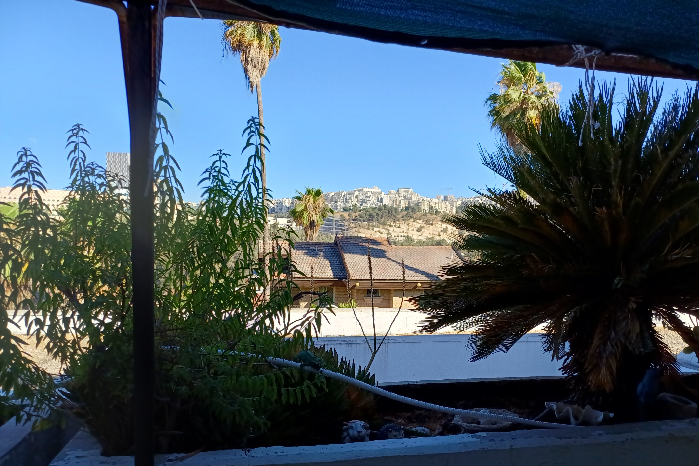

$py(
now = '2025-07-27'
DOT = '&#x2022;'

linkedin = 'https://www.linkedin.com/in/avrahambernstein/'
photo = 'AvrahamAbeBernstein-20250202-Watermarked.20pc.png'
www = 'https://www.avrahambernstein.com'
cv_root = www + '/cv/AvrahamAbeBernstein-CV'
cv_lite_root = www + '/cv/AvrahamAbeBernstein-CV-Lite'

def obfus(text):
	return '' + text + ''
)
<address markdown="1">
__Author:__ Avraham "Abe" Bernstein
 __Email:__ Avraham DOT Bernstein AT gmail$(obfus('bozo@example.com')) DOT com
 __Tel/Whatsapp:__ +$(obfus('bozo@example.com'))972.54.641-0955
 __Video Channels:__
 &nbsp;&nbsp;__$(DOT) primary:__ [whatsapp](https://www.whatsapp.com/), [zoom](https://zoom.us/join)
 &nbsp;&nbsp;__$(DOT) secondary:__ [GOOGL meet](https://workspace.google.com/products/meet/), [MSFT teams](https://www.microsoft.com/en-us/microsoft-teams/log-in)
 __City:__ Jerusalem 9727433 ISRAEL
 __Time Zone:__ [UTC +02:00/+03:00 (winter/summer)](https://www.timeanddate.com/worldclock/israel/jerusalem)
 __[Shabbat Observant](https://www.chabad.org/calendar/candlelighting_cdo/locationId/247/locationType/1/jewish/Candle-Lighting.htm):__ Not accessible electronically nor engaging in any business activities from Fri. evenings (Jm. time) beginning 1 hour before sunset until Sat. night 1 hour after sunset, nor on [Jewish holidays](https://www.hebcal.com/holidays/2025?i=on)
 __Last Update:__ $(now)
</address>

 "Secure photo of the author from 2025")

__Secure[^secure-photo] photo of the author from 2025__

## Directions

* __Geolocation:__ Ramot Bet, Jerusalem 9727433 ISRAEL, [31.808472N, 35.200944E](https://www.google.com/maps/place/31.808472,35.200944). __Call for exact address!__

* __[Public Transit](https://moovitapp.com/index/en/public_transit-Jerusalem-Israel-site_21889814-1):__ 
	1. 3 min. walk via bus lines 61, 62, or 72 at [stop #3483 Yigal Alon (westbound) - Derech HaHoresh](https://www.google.com/maps/place/Yigal+Allon%2FHaHoresh+Road/@31.8083434,35.2003684,17.13z/data=!4m14!1m7!3m6!1s0x1502d611ce627b0d:0x85b254a042ae21b9!2z15nXkteQ15wg15DXnNeV158v16knJ9eZ!8m2!3d31.808916!4d35.200722!16s%2Fg%2F12hrkrhm8!3m5!1s0x1502d60fc8b79bc7:0x3e3a8a7dc9ab930d!8m2!3d31.810358!4d35.201721!16s%2Fg%2F12hm16kmn?hl=en-US&entry=ttu&g_ep=EgoyMDI1MDQwMS4wIKXMDSoASAFQAw%3D%3D), i.e. the 2nd stop on _Yigal Alon St_. At the crosswalk on _Yigal Alon_, cross into _Derech HaHoresh_. Continue walking for about 40 meters, and then turn right into the first side street, and finally continue walking for about 200 meters.
		* In order to return to town, return to _Yigal Alon_ across the street from the stop where you arrived, at [stop #2262 Yigal Alon (eastbound) - Derech HaHoresh](https://www.google.com/maps/place/Yigal+Allon%2FHaHoresh+Road/@31.8091604,35.2014654,18.58z/data=!4m6!3m5!1s0x1502d60fd7cd4491:0x3d6c0f4d8bc96fac!8m2!3d31.80946!4d35.201637!16s%2Fg%2F12hn7ywtg?hl=en-US&entry=ttu&g_ep=EgoyMDI1MDYzMC4wIKXMDSoASAFQAw%3D%3D) take bus lines 62 (to the central bus station), 72 (to mid-town), or 61 (to _Mt. Scopus_), all of which stop at hub [stop #4009 Ramot Junction/Golda (southbound)](https://www.google.com/maps/place/Ramot+Junction%2FGolda/@31.8087551,35.203711,18.29z/data=!4m14!1m7!3m6!1s0x1502d6055edc8dc9:0x9d0c1ea988bd94c2!2sRamot+Junction%2FGolda!8m2!3d31.809649!4d35.204063!16s%2Fg%2F12jw0jcvm!3m5!1s0x1502d61aa9b0c601:0x72811a6d56863e21!8m2!3d31.80825!4d35.203987!16s%2Fg%2F12hp_pynq?hl=en-US&entry=ttu&g_ep=EgoyMDI1MDYzMC4wIKXMDSoASAFQAw%3D%3D).
	2. Or alternatively a 12 min. walk (or wait to transfer to bus lines 61, 62, or 72 mentioned above) via the many north Jerusalem bus lines that go to hub [stop #5130 Ramot Junction/Golda (northbound)](https://www.google.com/maps/place/Ramot+Junction%2FGolda/@31.8088152,35.2036742,18z/data=!4m5!3m4!1s0x1502d6055edc8dc9:0x9d0c1ea988bd94c2!8m2!3d31.8096483!4d35.2040617?hl=en-US). From the stop, walk north on _Golda Meir Blvd._ for about 400 meters until the traffic lights at _Yigal Alon_ (left side) and _Harry Truman_ (right side) streets. Turn left into _Yigal Alon_, and continue to walk (westbound) about 400 meters until the 2nd bus stop (i.e. #3483 mentioned above) at the corner of _Derech HaHoresh_. At the crosswalk, turn left into _Derech HaHoresh_. Continue walking for about 40 meters, and then turn right into the first side street, and finally continue walking for about 200 meters.

* __Driving:__ Long term street parking is available at or near [Derech HaHoresh 18, 20, 22, or 24](https://www.google.com/maps/place/Derech+Hahoresh+8-30,+Jerusalem/@31.8083226,35.1986383,17z/data=!3m1!4b1!4m14!1m7!3m6!1s0x1502d611ce627b0d:0x85b254a042ae21b9!2z15nXkteQ15wg15DXnNeV158v16knJ9eZ!8m2!3d31.808916!4d35.200722!16s%2Fg%2F12hrkrhm8!3m5!1s0x1502d611cab7eed3:0xb28cfd5d57b34ef6!8m2!3d31.8083226!4d35.2012132!16s%2Fg%2F11g62crx2y?hl=en-US&entry=ttu&g_ep=EgoyMDI1MDQwMS4wIKXMDSoASAFQAw%3D%3D). On the north (i.e. even numbered) side of _HaHoresh_, walk __up__ the steps between the cottages until the first street.

## Immediate Family

1. Wife: <i>Judy DOT Bernstein1 AT gmail$(obfus('bozo@example.com')) DOT com</i>, +$(obfus('bozo@example.com'))972.50.751-5111: designer of natural cosmetics

2. Son: _Yirmiyahu_ + 4: astrophysicist and optics

3. Daughter: _Naomi Sarah_ + 4: maternity nurse

4. Daughter: _Carmiella_ + 1: cellist and music teacher

5. Son: _Asher_ + 4: environmental scientist

## Links

* __CV:__ Computer Scientist: [Full HTML]($(cv_root).html),&nbsp;&nbsp;[Full PDF]($(cv_root).pdf),&nbsp;&nbsp;[Lite HTML]($(cv_lite_root).html),&nbsp;&nbsp;[Lite PDF]($(cv_lite_root).pdf)

* __Linkedin:__ [$(linkedin)]($(linkedin))

* __PGP:__ [https://www.avrahambernstein.com/AvrahamBernstein.asc](https://www.avrahambernstein.com/AvrahamBernstein.asc)

* __Github:__ TBD

## Articles & Blog: TBD

### 1. Torah & Yisrael: Politically Correct "Trigger Warning"

1) My _Aliyah_, i.e. immigration to _Eretz Yisrael_ (English: the Land of Israel): "To build and to be built" (Hebrew: _Livnot Ulehibanot_)

* I came on _Aliyah_ in 1983 from the US. I came with my wife and my two oldest then infant children. I had a university degree, a few years experience in hi-tech, and enough money to make a down payment on an apartment. I understood if I were to wait even a few years, and took out a mortgage on a home, then it was unlikely that I would ever leave the [Golden Medina]( https://www.israelnationalnews.com/news/341046 ).

* I have always lived in _Yerushalayim_ (English: Jerusalem). _Har Habayit_ (English: the Temple Mount) is the navel of the world from which the _Shechina_ (English: God's presence) eminates throughout the world. 

* For an observant God-fearing Jew, the ultimate place to live is in _Eretz Yisrael_. For the past 2000 years, every year at the end of the Passover _Seder_, every Jewish family chants the prayer _next year in Jerusalem_. With the advent of the Zionist movement, _Aliyah_ began in earnest about 1880. Until the 1960's it was physically difficult to live in Israel. But by the time I came in 1983, even though at the time the standard of living was much less than in North America, still one could expect to live a long healthy and fulfilling life in the modern State of Israel.

* Now (in 2025) I have no regrets moving to Israel. I truly believe that I was part of the process of building the land, and that I personally grew and was transformed in the process. The transformation is as [if we were in a dream (Psalm 126)](https://mechon-mamre.org/p/pt/pt26c6.htm). The values and life style of my children and grandchildren are so much better than my North American friends and relatives. Israel's standard of living is one of the highest in the world. Professionally I live at the pinnacle of the hi-tech world. It is sad but true, that many progressive people in the West hate the Jewish People, but I am proud to be a member of a righteous and just nation, even if we are forced to "dwell alone". And it is clear to any objective person, that we are living in the footsteps of the _Mashiach_ (English: Messiah). The ancient prophesies are being fulfilled before our eyes, in particular see [Zecharia 8]( https://mechon-mamre.org/p/pt/pt2308.htm ):
	
> 4) Thus saith the LORD of hosts: There shall yet old men and old women sit in the broad places of Jerusalem, every man with his staff in his hand for very age.

> 5) And the broad places of the city shall be full of boys and girls playing in the broad places thereof.

> 6) Thus saith the LORD of hosts: If it be marvellous in the eyes of the remnant of this people in those days, should it also be marvellous in Mine eyes? saith the LORD of hosts.

> 7) Thus saith the LORD of hosts: Behold, I will save My people from the east country, and from the west country;

> 8) And I will bring them, and they shall dwell in the midst of Jerusalem; and they shall be My people, and I will be their God, in truth and in righteousness.

> ... 11) But now I will not be unto the remnant of this people as in the former days, saith the LORD of hosts.

> 12) For as the seed of peace, the vine shall give her fruit, and the ground shall give her increase, and the heavens shall give their dew; and I will cause the remnant of this people to inherit all these things.

> 13) And it shall come to pass that, as ye were a curse among the nations, O house of Judah and house of Israel, so will I save you, and ye shall be a blessing; fear not, but let your hands be strong.

> ... 15) so again do I purpose in these days to do good unto Jerusalem and to the house of Judah; fear ye not.

* Unfortunately since the delusional Olso "peace accords" in 1993 there were many divisions in Israeli society, between religious, secular, left, and right. Most of these divisions are now disappearing since the Oct. 7 Hamas massacres. The process was painful, but Israeli society is now healing and maturing, and most are becoming much more aware that _HaShem_ is the _Ribono Shel Olam_ (English: Master of the Universe).

2) The scientific evidence for Divine creation, according to the [Ramban's (c. 1250 CE)]( https://www.myjewishlearning.com/article/nahmanides-ramban/ ) commentary on the first chapter of the book of [Genesis]( https://en.wikipedia.org/wiki/Book_of_Genesis ), [Gerald Schroeder's book "Genesis and the Big Bang" ](https://www.amazon.com/Genesis-Big-Bang-Discovery-Harmony/dp/0553354132), and [Nathan Aviezer's book "In the Beginning: Biblical Creation and Science"](https://ktav.com/products/in-the-beginning)

* About 800 years ago the _Ramban_ described the ancient Rabbinic tradition that the only thing that [HaShem]( https://www.myjewishlearning.com/article/hashem/ ) actually created _ex nihilo_ were atomic particles (Greek: _Hyla_, Hebrew: _Tohu VeBohu_) which were used to subsequently form all other elements in the universe including stars, planets, plants, animals, and Man, etc. _HaShem_ compressed this chaotic mass of particles into a dark hot object (what modern physicists refer to as a "plasma") smaller than the size of a mustard seed  for an unknown period of time. Creation began when _HaShem_ caused this object to explode, scattering the particles throughout the universe, and then light appeared everywhere. (According to the cosmologist Prof Steven Weinberg, it took about 400K years for the universe to cool down to 3800 degrees Kelvin, at which time stable hydrogen atoms were formed, which formed into hydrogen dust clouds due to gravitational attraction. These dust clouds became luminescent, when the whole universe began to glow with primordial light). This is identical to the description of the "Big Bang" theory that is now accepted by all modern astrophysicist cosmologists for the past 60 years.
* The _Ramban_ refers to each "day" of creation as an _epoch_ (Hebrew: _Tekufa_). On each new day _HaShem_ injected massive changes into the universe. Darwinian "evolutionary" theory cannot account for the explosive changes in life after each new day. Each new day increased the "order" in the universe, i.e. reduced _entropy_. The Hebrew expression [and it was evening and it was morning (Gen. 1:5)]( https://mechon-mamre.org/p/pt/pt0101.htm ) (Hebrew: _Vayehi Erev Vayehi Voker_) that closes each day of creation alludes to this increase in order. The _Ramban_ states that the root meaning of the word "evening" (Hebrew: _Erev_) is derived from the Hebrew _Ta'arovet_ (English: "an unordered mixture"), while the word "morning" (Hebrew: _Boker_) is derived from the Hebrew _Mevukar_ (English: "ordered").
* _HaShem's_ ultimate act of creation was when _He_ "touched" modern Man on the 6th day, on [Rosh Hashanah]( https://en.wikipedia.org/wiki/Rosh_Hashanah ) 5785 years ago, which conforms to the archeological time frame of the beginning of civilization, history, and writing. Since then the passage of time is as we now know it. This transformation happened nearly simultaneously worldwide wherever civilization existed from Mesopotamia, the Nile Delta, the Indus Valley, the Mekong Delta, the Yellow River Valley, etc.  Don't fool yourselves. The psychology of modern Man has not changed since that time.

3) The reason why [HaShem]( https://www.myjewishlearning.com/article/hashem/ ) chose the Jews, along with _His_ primary directive to the Jewish People [to keep the ways of _HaShem_, to execute righteousness and justice (Gen. 18:19)]( https://mechon-mamre.org/p/pt/pt0118.htm )

* In our time (i.e. 2025) the world is witnessing (1) the fulfillment of this directive when the Jewish People who [dwells alone (Num. 23:9)]( https://mechon-mamre.org/p/pt/pt0423.htm ) in this world will [rise up like a lioness (Num. 23:24)]( https://mechon-mamre.org/p/pt/pt0423.htm ) to devour evil, and (2) the moral bankruptcy of the _Abrahamic_ "supercessionist" (aka replacement) theologies.
* The supercessionists have a highly flawed understanding of "ethical monotheism". Islam, while being monotheistic, worships [A God Who Hates]( https://en.wikipedia.org/wiki/A_God_Who_Hates ). The _Quran_ openly states that their god sanctions murder, pillaging, piracy, and slavery. Christians (especially Catholics), with their highly suspect monotheistic credentials, i.e. their belief in the "trinity", [fundamentally cannot accept that ethical behavior requires adherence to God's laws in the _Torah_]( https://biblehub.com/topical/t/the_danger_of_legalism.htm ), and cannot accept that evil often requires force to be eradicated.

4) Summary of the 1961 debate between Israeli Ambassador Rav Yaakov Herzog and Oxford historian Arnold Toynbee whether or not the Jewish People are in a state of [Fossil or Ferment]( https://www.sefaria.org.il/Judaism%3B_Fossil_or_Ferment%2C_Preface.1?lang=en )

5) Wars against Hamas and Iranian Islamofascist barbarians

6) Current massive public desecration of [Hashem's]( https://www.myjewishlearning.com/article/hashem/ ) name:

a. The Oct. 7 ["rave" dancers undulated under a statue of Budda]( https://www.catholicsforisrael.com/images/stories/nova_buddha.webp ) while the majority of believing Jews [danced in front of Torah scrolls on the night of _Simchat Torah_]( https://www.jpost.com/opinion/article-825795 ):

* They were engaged in the cardinal sin of idolatry exactly like those who danced in front of the [Golden Calf]( https://www.jewishvirtuallibrary.org/golden-calf ) about 3400 years ago, who _HaShem_ ordered to be killed on account of their offense. I feel that nearly all of the dancers were aware of the gravity of their offense, but they had a tenuous connection to the "quaint" beliefs of Judaism. Their apologists claim that no reasonable person believes in idols anymore, or in fact any god at all. Anyway, they just wanted to have "fun".
* On the other hand, when the Hamas barbarians murdered hundreds of them in the morning, many were heard screaming _Shema Yisrael_ which is what traditional Jews have screamed since time immemorial when they were being murdered _Al Kiddush HaShem_ (English: for sanctifying God's name).

b. The [Hareidi]( https://www.myjewishlearning.com/article/haredim-charedim/ ) theological advocacy of draft evasion during our existential war against the Hamas Islamofascist barbarians:
 

* Their behavior is indefensible. Their excuses are nonsensical. They argue about the danger of secularization if they were to join the IDF, yet almost half of the IDF's ground forces are religious Zionists, who are on the front lines, and who volunteer for the most dangerous missions in this war because they inherently understand the theological significance for which we are fighting. 
* I am writing this short article during this week's _parsha_, (English: weekly _Torah_ portion, [Numbers 32]( https://mechon-mamre.org/p/pt/pt0432.htm) ), when _Moshe Rabbeinu_ (English: our teacher _Moshe_) _railed_ against the tribes of Gad and Reuven who attempted to evade going out to battle during the initial conquest of _Eretz Yisrael_: "Shall your brethren go to the war, and shall ye sit here?". In 1948 during the existential war of Israel Independence, some members of the then much smaller _hareidi_ community questioned whether or not they were obligated to go out to war. The then unequivocal leader of the _hareidi_ community, _Rav Shlomo Yosef Zevin_, insisted that they join the war effort. See his [famous response]( https://traditiononline.org/r-shelomo-yosef-zevin-on-the-drafting-of-yeshiva-students/ ). Also the Jerusalem Post reporter on religious affairs, David Golinkin. wrote an excellent [analysis](https://www.pressreader.com/israel/jerusalem-post/20240712/281925958234833) of the current situation. And of course Golinkin's mentions one of the most important _halachic_ references during time of war, namely that the   _Rambam_ declares that in the time of existential war even a bride and groom are obligated to go out to battle. 
* The _hareidim_ have not yet fully theologically accepted the establishment of the secular State of Israel, therefore many would prefer to live in the Diaspora which is a fundamental denial of the core belief in Judaism according to [Ramban's]( https://www.myjewishlearning.com/article/nahmanides-ramban/ ) commentary on the first verse of the _Torah_ (Gen. 1:1). However 90 years ago the Nazi fascists, and now the current worldwide support of the Hamas Islamofascists, are forcing most Jews in the Diaspora to seriously consider _Aliyah_. Yet the _hareidim_ continue to fantasize and threaten that they will leave _Eretz Yisrael_.
* The _hareidim_ are incapable of publicly admitting and praising _HaShem's_ miracles that make it possible for us to live and to thrive in _Eretz Yisrael_. They refuse to acknowledge the recent miraculous victory over Iran, nor the miraculous victory over the Arab armies in 1967, nor how land is blooming after 2000 years of desolation. This grave sin is referred to as lack of _HaKaret HaTov_ (English: thanks).
* Unlike my own adult children (and more than 100K like them) who spent more than 1/3 of their lives in the IDF during the existential war that took place here during the past 2 years, who studied in Zionist _yeshivot_, who understand the fundamental obligation of a Jew to live in _Eretz Yisrael_, and who recognize and our thankful for the miracles that make it possible for us to live here in spite of the fact that the IDF chief of staff does not wear a [streimel]( https://www.myjewishlearning.com/article/the-meaning-behind-of-different-jewish-hats/ ), the _hareidim_ would like to have us believe that their _warped_ learning of _Torah_, and their exemption from going to war, is the key to saving the Jewish People! This is complete "hog wash".
* And just this month (July 2025) the _hareidi_ leadership have reached new lows in their betrayal of the Jewish People. The leaders of the _Ashkenazi_ _hareidi_ political parties, [Goldknopf](https://www.jfeed.com/news-israel/goldknopf-idf-controversy) and Gafni, showed their lack of concern for the war casualties. And they are preventing the expulsion of an Arab _MK_ (English: member of _Knesset_), _Ayman Odeh_, who publicly praised the Hamas Islamofascist barbarians who inflicted the largest massacre of Jews since the _Nazi_ Shoeah_ (English: Holocaust). _Odeh_ would stand for trial for treason if he were expelled. I _ASSUME_ that the _hareidim_ are hoping to ignite general elections in the _Knesset_ in the hope that _Bibi's_ government will fall, and be replaced by _Naftali Bennett_. In spite of _Bennett's_ public promises to the contrary, _Bennett_ will align with the traitorous Arab parties (just as he did last time), thus explaining the _hareidi_ support for the Arab traitors. In return _Bennett_ will promise the _hareidim_ that they will be immune from being drafted in spite of the leftists hue and cry to the contrary, because the only true goal of the secular left is to replace the Zionistic government of _Bibi_.  The difference between the _hareidim_ and the lunatic fringe sect [Neturia Karta]( https://en.wikipedia.org/wiki/Neturei_Karta ) of faux-Jews, who publicly support the Iranians who wish to nuclear vaporize the Jewish People living in _Eretz Yisrael_ and who deny the _Sho'ah_, has become microscopic. All of them now deserve to be classified as _reshayim_ (English: wicked). I pray that _HaShem_ will publicly shame the leaders of the _hareidi_ community.

c. So-called "pride" "LGBTQ+" marches in the streets of _Yerushalayim_:
 

* About 3400 years ago, _Hashem_ revealed the _Torah_ to the Jewish People at Mount Sinai 7 weeks after _HaShem_ miraculously liberated them from hundreds of years of Egyptian bondage. The revelation was an extraordinary event. _Hashem_ instructed the Jews to uphold a new ethical legal system that reflected that Man was created in the image of God. It was a radical revolutionary concept for the ancient world that still required thousands of years for Man, at least in the Western world, to subsequently digest. 
* Among other things, the _Torah_ forbids deviant sexual behavior, i.e. adultery, incest, beastiality, and __homosexuality__ - see [Lev. 18:1-30]( https://mechon-mamre.org/p/pt/pt0318.htm ) which is read during the _Yom Kippur_ service in order to emphasize the fundamental depravity of these offenses. People who proudly display such deviancy, even the few who have _bona fide_ psychological or physical urges, are spitting in _HaShem's_ face - regardless of the current fad of political correctness. 
* Unfortunately in the State of Israel, in the name of "freedom of expression", the so-called "legal system" encourages such behavior even though it is reprehensible to the vast majority of the population. These so-called "judges" would never allow anyone to publicly defecate on the Israeli flag on Independence Day, but they have no qualms allowing someone to defecate on the _Torah_.

7) The massive uptick in so-called "progressive" antisemitism in the Western world

I pray that we will soon see the fulfillment of the prophecy [blessed be those who bless _Yisrael_, and cursed be those who  curse _Yisrael_ (Num. 24:9)]( https://mechon-mamre.org/p/pt/pt0424.htm ).

8) The Oslo so-called "peace process" fiasco

* Oslo, which was hatched in 1992, was not a "noble experiment" that "just happened" to fail. The primary perpetrators, then Foreign Minister and Deputy PM _Shimon Peres_ and then Deputy FM _Yossi Beilin_, __intentionally designed it to fail!__ It must never be forgotten that Oslo enabled the so-called Gaza "Disengagement" (2005) which paved the way for the _Hamas_ barbarians to rule Gaza. See reserve _Major General Gershon Hacohen's_ recent [mea culpa]( https://www.israelnationalnews.com/news/411926 ), who had major responsibility for implementing the "Disengagement".

* _Arafat_ regularly responded in Arabic to those who called him a traitor for making a treaty with the Jews that he was just following in the footsteps of _Muhammad_ who made the fake 10 year [treaty of Hudaibiyah (c. 628 CE)]( https://en.wikipedia.org/wiki/Treaty_of_al-Hudaybiya ) with the tribe of Quraysh who he subsequently slaughtered 2 years later. _Beilin_, with a Phd in political science, was aware that _Arafat_ had no intention of keeping his Oslo treaty obligations, but that the nations of the world, in particular the United States, would never allow the Jewish State to declare that Arafat's egregious fundamental breaches would allow Israel to declare the treaty null and void. Even 20 years later, in 2012, Beilin publicly admitted that it would be diplomatically impossible for any Israeli political leader to cancel the treaty, during a [televised debate with Naftali Bennett](  https://www.timesofisrael.com/oslo-architect-jewish-home-leader-spar/ ) when Bennett was just starting his political career. (See the full video [here]( https://www.youtube.com/watch?v=e1XrXXyQX0A )). During the debate, Beilin completely lost his composure when Bennett justifiably accused him of being responsible for the thousands of Jews who were murdered, maimed, widowed, and orphaned as a result of the so-called Oslo "peace" process. And never forget Peres' brash salesmanship of the big lie of a _New Middle East_ to the _Knesset_ and to Israeli public, which was just in fact his vehicle for graft to become a billionare along with his _Peres Center For "Peace" And Innovation_.

* Unfortunately many _hareidim_ conveniently like to forget that their current _wickedness_ since Oct. 7 2023, goes back to roots of Oslo. The so-called "spiritual" leader of the Sephardic _hareidim_, _Rav Ovadiah Yosef_, was a critical supporter of the Oslo legislation in the _Knesset_. Without his support, the law would never have been passed. _Ovadiah_ naively believed the military advisers of the wicked _Peres_ who argued that Oslo was an opportunity for the Jewish People, instead of listening to the millions of religious Jews who pleaded that Oslo was a death trap. Note that _Ovadiah_ was a native Arabic speaker. He was a aware of _Arafat's_ true intentions. Even a few months after the treaty was signed, when buses began to regularly blow up in the cities of Israel (especially in Jerusalem), _Ovadiah_ never withdrew his _Knesset_ support while he still had the chance. On Oct. 7, we saw the final fruits of Olso. His true justification for joining _Peres'_ government was the huge amount of money that _Peres_ funneled into their _Torah_ educational network, _El HaMayan_, in spite of the clear and immediate danger that Oslo posed to the Jewish People. _Ovadiah's_ right-hand man, _Aryeh De'eri_, was convicted of embezzling some of these funds, for which he spent 2 years in jail, and subsequently restricted from re-entering politics for 7 years. Yet shameless _De'eri_ returned to politics to again become the leader of the _Shas_ party. And to this day, most Sephardic _hareidim_ like to opine that _Ovadiah_ was a _Torah gadol_ (English: a great learned leader of _Torah_). At best they are _lunatics_!

9) 1995-96: My __successful__ challenge of the IDF's illegal rules of engagement at the Supreme Court during the height of the Oslo lunacy

* An IDF general (i.e. Ilan Biran, the then _Aluf Pikud HaMerkaz_), personally ordered me in front of other soldiers, to refrain from preemptively defending myself when a Palestinian terrorist aimed his rifle at me (or at other soldiers or at civilians) until __AFTER__ the bullet left the terrorist's rifle! Also Biran predicted how the new era of "peace" would eliminate the need for an IDF presence in the Jordan Valley even while Arafat was blowing up buses in _Yerushalayim_ while he was speaking!
* For his fealty to the so-called "peace process", and concomitant lack of concern for the lives of his soldiers, the Oslo government subsequently rewarded Biran by appointing him as Director General of the Ministry of Defense, and later as chairman of government controlled corporations, i.e. _Israel Oil Refineries_, _Bezeq_, and _Yes_. 
* Unfortunately after 30 years of the fake peace rigidly enforced by a fake legal system that ignored the associated massive corruption required to make it work, _HaShem_ overwhelmed the Jewish People with the Oct. 7 massacres, which immediately woke up the vast majority of Israeli Jews from their stupor. I call this "baseball bat to the head" therapy. According to ancient Jewish tradition already stemming from the time of the Egyptian bondage, nothing happens to the Jewish People, whether good or bad, that is not dictated by _HaShem_ - see  [Gen. 15:13]( https://mechon-mamre.org/p/pt/pt0115.htm ).

10) 1993-95: My experience as an anti-Oslo spy

11) Israel's "deep state"  [juristocracy]( https://valdaiclub.com/a/highlights/juristocracy-from-the-rule-of-law/ )

12) The "Startup Nation"

### 2. Community Service

2023 Jerusalem: Hosted a Russian refugee family in my home for 3 months that fled to prevent the father from becoming a cannon fodder conscript in the Ukranian war

Because the Russian government halted all Jewish Agency activities in order to prevent conscripts from fleeing, Jews who did manage to escape simply showed up at Ben Gurion airport, and declared themselves as refugee new immigrants. Normally it would take the Ministry of Absorption 3-4 months to prepare the paperwork to receive a new immigrant family. Until the paperwork is approved the immigrants have no financial benefits, and due to the war Russian currency was not easily convertible to hard currencies. The family stayed in two spare rooms in my home which had an adjacent bathroom. I arranged to receive the family via the Russian Olim group _Machanayim_. In a previous job, I worked with one of their senior people.

2022-23 Jerusalem: Rescued an extremely bright autistic teen from being declared truant and forcibly sent to an institution for emotional retards due to malicious negligence by the Ministry of Education

The boy had been learning successfully in a top school (i.e. _Machon Lev_ highschool), but started having problems during _Covid_ when he was forced to be schooled at home. We achieved victory by sending the boy to be evaluated by the world renowned [Feuerstein Institute]( https://feuerstein-institute.org/ ) who specialize in the treatment of people, especially of children, who don't act normally. Their evaluation confirmed that he was extremely bright. The ministry was simply too lazy to provide him with an assistant which they were legally obligated to do. Finally when they did provide him with an assistant, the ministry maliciously instructed the assistant to attempt to convince the boy to drop out of school.

2016-19 Jerusalem: Rescued 3 young children at family court from foster care when the Ministry of Social Services maliciously and falsely accused the father (my wife's relative) of being a pedophile when in fact I showed that his young daughter was serially molested in locked-down institutions run by Social Services

Even though we eventually won our case which is highly unusual when social services declares the father to be a pedophile, the most depressing element was that the judge presiding over this trial became aware that the senior social services youth officer was committing perjury, and that the court appointed legal guardian of the children was aware of this perjury yet remained silent, yet the judge never criminally sanctioned his "colleagues" with whom he worked for many years in the family court system. The deputy legal advisor for the ministry refused to get involved in our case. And our expensive attorney who initially promised that he would advocate that they be charged with contempt and perjury, eventually backed down by saying that we should just be extremely grateful for the outcome.

1977 Toronto: While a student in an MBA program, I led the battle for [marginal cost pricing for electricity]( https://neon.energy/marginal-pricing ) in the Province of Ontario Canada

The corporate opposition was led by huge electricity consumers who smelted metal. They advocated hidden subsidies with surreptitious government backing. I lost my case, but still the [Ontario Energy Board]( https://oeb.ca ), where the hearing took place, awarded me costs. I published an op-ed in Canada's then newspaper of record [The Globe and Mail]( https://www.theglobeandmail.com/ ). As I got older, I came to the realization that this hearing was a God-given life changing experience that taught me how a single individual could successfully stand up to corporate and government corruption, as can be seen by my subsequent experience throughout my life. 

### 3. Computer Science

1. [obfuscation](https://en.wikipedia.org/wiki/Obfuscation_(software)) anti-reverse engineering
2. cybersecurity
3. [AST](https://en.wikipedia.org/wiki/AST) [source code refactoring](https://en.wikipedia.org/wiki/Code_refactoring) using Python [Beautiful Soup](https://beautiful-soup-4.readthedocs.io/en/latest/) and XML
4. [domain specific languages (DSL)](https://en.wikipedia.org/wiki/Domain-specific_language)
5. modern [C11](https://en.wikipedia.org/wiki/C11_(C_standard_revision)) programming
6. [Misra C](https://en.wikipedia.org/wiki/MISRA_C)
7. [Jinja2](https://jinja.palletsprojects.com/en/stable/)
8. [PyExpander](https://pyexpander.sourceforge.io/)
9. [Bash](https://en.wikipedia.org/wiki/Bash_(Unix_shell))
10. [Ubuntu](https://en.wikipedia.org/wiki/Ubuntu)
11. virtual machines and [light weight containers (lxc)](https://dev.to/damilola_oladele/get-started-with-lxc-explained-with-installation-guide-4efj)
12. [Xfce](https://en.wikipedia.org/wiki/Xfce)
13. [Markdown](https://en.wikipedia.org/wiki/Markdown)
14. [Mkdocs](https://www.mkdocs.org/)
15. a curriculum for a new computer science student
16. my [algorithmic](https://en.wikipedia.org/wiki/Algorithm) inventions:
	
	a. an extremely efficient `2^N` sized [hash table](https://en.wikipedia.org/wiki/Hash_table) that can grow without rehashing or moving the data associated with the hash key that is stored in the table
	b. novel and efficient [Hamming Weight](https://en.wikipedia.org/wiki/Hamming_weight)-__like__ calculation, i.e. that maps a number in the range \[`0,(2^N)-1`\] to the range \[`0,N`\], via the use of a [DFT](https://en.wikipedia.org/wiki/Discrete_Fourier_transform) that generates a nearly uniform probability distribution that makes it useful as a cryptographic primitive
	c. highly efficient (i.e. via register operations) _invertible_ pseudo-random key wrapper primitive that maps a `2^N` bit number to a `2^(2N)` bit number
	d. bioinformatics [PCR](https://en.wikipedia.org/wiki/Polymerase_chain_reaction) trivial and accurate "systematic" noise reduction calculation
	e. bioinformatics [PCR](https://en.wikipedia.org/wiki/Polymerase_chain_reaction) highly accurate [Ct](https://torontech.com/what-is-ct-value-in-real-time-pcr/) calculation using AI techniques (i.e. without the use of functional analysis) that generally works even when encountering [inhibition](https://en.wikipedia.org/wiki/Polymerase_chain_reaction_inhibitors)

###	4. Accessibility & Special Education

1. My invention enabling the blind to sonically "see"/understand maps and mathematical functions by using a standard web browser and a consumer grade graphics tablet.

2. My invention of a generic [dyslexic]( https://en.wikipedia.org/wiki/Dyslexia) friendly font, by mimicking the concept that computer vision algorithms use to correctly identify a [QR code]( https://en.wikipedia.org/wiki/QR_code), regardless of its physical orientation.

3. How I taught kinesiological multiplication to my grandson using floor tiles and masking tape.

4. How I taught a second grader advanced mathematics in 30 min., i.e. exponents and binary arithmetic.

5. Teaching [rational trigonometry]( https://en.wikipedia.org/wiki/Divine_Proportions:_Rational_Trigonometry_to_Universal_Geometry) based upon the system that the ancient [Akkadians]( https://en.wikipedia.org/wiki/Akkadian_Empire) invented about 4000 years ago.

6. The history of the discovery of the number "zero" in the ancient world.

### 5. Music Composition Software

### 6. Health & Exercise

1) My 3 min. course to teach deep meditation just by using a clock with a second hand

Bottom line, a meditative state is achieved when your brain wave frequency is about 5 Hz, i.e. 5 beats per second or 300 beats per minute. If you can count to 5 in your mind every second of a clock for at least 15 consecutive seconds, or follow a metronome app that is set to 300 bpm, then you are in a deep meditative state. The better metronome apps usually provide both sound and visual feedback. Here is an excellent free Android [metronome app]( https://stonekick.com/metronome.html ). The best learning technique is to __synchronize__ the sound and visual feedback. Initially most people can handle 180-240 bpm. With practice you can achieve 300.

Another, but indirect meditation technique, is via your phone's pulse app, typically measured by monitoring the blood flow through your finger or thumb by shining the camera's light into it. A pulse of 54 or less is indicative of deep meditation. You will need to control your breathing in order to achieve this low pulse rate.

2) How to prevent the natural course of cognitive decline among the elderly

1. vigorous exercise, both aerobic and muscular

	* _intensive_ aerobic exercise for at least 20 minutes 3x per week which [floods the hippocampus with blood which _GENERATES_ new brain cells]( https://www.ted.com/talks/wendy_suzuki_the_brain_changing_benefits_of_exercise ); where intensive means 75-90% of your theoretical maximum heart rate, i.e 220-YourAge; for example if you are 70 then your theoretical maximum is 150=220-70 bpm; I personally engage in 30 minutes of intensive aerobics 5x per week at 85% of my theoretical maximum heart rate
	
	* daily walks for 15-30 minutes, ideally 2x per day
	
	* daily stretching or yoga

	* lift weights that exercise various muscle groups that are _heavy for you_, 2x per week which increases bone density and can [reverse osteoporosis]( https://melioguide.com/osteoporosis-exercises/osteoporosis-reversed/ ); do 2 sets of 6-10, where the _second last_ lift in the set has achieved muscle exhaustion, so the _last_ lift relies upon tendon assist; __requires rest/recovery of 3 days in order to prevent tendon injury__
		* consuming calcium rich foods or medication, which are stored in your liver, __cannot be absorbed__ by your bones unless your bones first send a hormonal signal to your liver that it needs to repair a break
		* microscopic tears of tendons on the bone surface generate such a signal
		* lifting a weight with tendon assist after muscle exhaustion causes such a microscopic tear
		* [see how the reversal process works]( https://www.livestrong.com/article/140765-what-happens-muscles-after-lifting-weights/ )

2. proper diet

	* monitor glucose and cholesterol levels with regular blood tests, i.e. every 3-6 months
	
	* regularly drink lots of unsweetened water; I prefer to add a few drops of natural lemon juice; lack of proper hydration substantially reduces cognition
	
	* eat fish with omega-3 fatty acids (the elixir of the brain), and limit meat consumption

	* eat raw fruits and raw (or lightly steamed) vegetables, especially those with [anti-carcinogenic properties]( https://www.healwithfood.org/cancer/foods.php ); also see [Angiogenesis inhibitor]( https://en.wikipedia.org/wiki/Angiogenesis_inhibitor ) 
	
	* eliminate consumption of sugar and artificial sweeteners; most people find cinnamon to be a good sweetener substitute while at the same time it reduces your glycemic index
	 
	* limit alcohol and caffeine consumption
	
	* limit milk consumption, except for a daily portion of non-sweetened probiotic cultured yogurt
	
	* don't smoke
	
	* control your weight which helps to regulate blood pressure and limits joint pains
	
	* limit salt consumption which causes most people's blood pressure to increase; instead try using new spices such as turmeric, ginger, or garlic powder, etc.
	
3. proper sleep habits

	* at least 7 hours of night time sleep
	
	* take an occasional nap

4. cognitively challenging activities

	* play a musical instrument
	
	* juggle
	
	* skip rope like a boxer, or learn ballet
	
	* play chess, or bridge, etc.
	
	* learn a new topic
	
	* read an intellectually challenging book
	
	* keep a journal or blog

5. meditation

6. prevent loneliness; connect with family and friends

### 7. My Bookmarks

## View From My North Jerusalem Porch With Southern Exposure Overlooking The Navel Of The World: The True Place From Which To Declare "Urbi Et Orbi" 

## Footnotes
