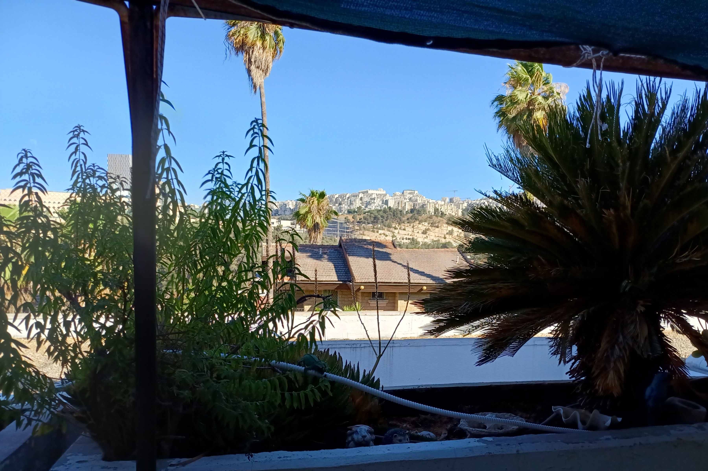

$py(
now = '2026-08-30'
DOT = '&#x2022;'

halftone_qrcode_photo = 'AvrahamAbeBernstein.2026-08-28.photo-email.halftone-qrcode.799x799.png'
watermarked_blurred_photo = 'AvrahamAbeBernstein.2026-08-28.photo-email.watermarked-blurred.600x750.jpg'

cv_pdf = 'AvrahamAbeBernstein-CV.pdf'

linkedin_url = 'https://www.linkedin.com/in/avrahambernstein/'
www_url = 'https://www.avrahambernstein.com/'

def obfus(text):
	return '' + text + ''
)
<address markdown="1">
__Author:__ Avraham "Abe" Bernstein
 __Email:__ Avraham DOT Bernstein AT gmail$(obfus('bozo@example.com')) DOT com
 __Tel/Whatsapp:__ +$(obfus('bozo@example.com'))972.54.641-0955
 __WWW:__ [$(www_url)]($(www_url))
 __Video Channels:__
 &nbsp;&nbsp;__$(DOT) primary:__ [whatsapp](https://www.whatsapp.com/), [zoom](https://zoom.us/join)
 &nbsp;&nbsp;__$(DOT) secondary:__ [GOOGL meet](https://workspace.google.com/products/meet/), [MSFT teams](https://www.microsoft.com/en-us/microsoft-teams/log-in)
 __City:__ Jerusalem 9727433 ISRAEL
 __Time Zone:__ [UTC +02:00/+03:00 (winter/summer)](https://www.timeanddate.com/worldclock/israel/jerusalem)
 __[Shabbat Observant](https://www.chabad.org/library/article_cdo/aid/633659/jewish/What-Is-Shabbat.htm):__ Not accessible electronically nor engaging in any business activities from Fri. evening ([Jerusalem time](https://www.chabad.org/calendar/candlelighting_cdo/locationId/247/locationType/1/jewish/Candle-Lighting.htm)) beginning 1 hour before sunset until Sat. night 1 hour after sunset, nor on [Jewish holidays](https://www.hebcal.com/holidays/2026?i=on)
 __Last Update:__ $(now)
</address>

<table markdown="1">
<caption>Secure Photos And Email Address[^secure-photos]</caption>
<tr>
<th>Blurring Filter & Watermark
<th>QR Code Mailto Halftone
</tr>
<tr>
<td></td>
<td></td>
</tr>
</table>

## Directions

* __Geolocation:__ Ramot Bet, Jerusalem 9727433 ISRAEL, [31.808472N, 35.200944E](https://www.google.com/maps/place/31.808472,35.200944). __Call for exact address!__

* __[Public Transit](https://moovitapp.com/index/en/public_transit-Jerusalem-Israel-site_21889814-1):__ 
	1. 3 min. walk via __bus lines 61, 62, or 72 at [stop #3483 Yigal Alon (westbound) - Derech HaHoresh](https://www.google.com/maps/place/Yigal+Allon%2FHaHoresh+Road/@31.8083434,35.2003684,17.13z/data=!4m14!1m7!3m6!1s0x1502d611ce627b0d:0x85b254a042ae21b9!2z15nXkteQ15wg15DXnNeV158v16knJ9eZ!8m2!3d31.808916!4d35.200722!16s%2Fg%2F12hrkrhm8!3m5!1s0x1502d60fc8b79bc7:0x3e3a8a7dc9ab930d!8m2!3d31.810358!4d35.201721!16s%2Fg%2F12hm16kmn?hl=en-US&entry=ttu&g_ep=EgoyMDI1MDQwMS4wIKXMDSoASAFQAw%3D%3D)__, i.e. the 2nd stop on _Yigal Alon St_. At the crosswalk on _Yigal Alon_, cross into _Derech HaHoresh_. Continue walking for about 40 meters, and then turn right into the first side street, and finally continue walking for about 200 meters.
		* In order to return to town, return to _Yigal Alon_ across the street from the stop where you arrived, at [stop #2262 Yigal Alon (eastbound) - Derech HaHoresh](https://www.google.com/maps/place/Yigal+Allon%2FHaHoresh+Road/@31.8091604,35.2014654,18.58z/data=!4m6!3m5!1s0x1502d60fd7cd4491:0x3d6c0f4d8bc96fac!8m2!3d31.80946!4d35.201637!16s%2Fg%2F12hn7ywtg?hl=en-US&entry=ttu&g_ep=EgoyMDI1MDYzMC4wIKXMDSoASAFQAw%3D%3D) take bus lines 62 (to the central bus station), 72 (to mid-town), or 61 (to _Mt. Scopus_), all of which stop at hub [stop #4009 Ramot Junction/Golda (southbound)](https://www.google.com/maps/place/Ramot+Junction%2FGolda/@31.8087551,35.203711,18.29z/data=!4m14!1m7!3m6!1s0x1502d6055edc8dc9:0x9d0c1ea988bd94c2!2sRamot+Junction%2FGolda!8m2!3d31.809649!4d35.204063!16s%2Fg%2F12jw0jcvm!3m5!1s0x1502d61aa9b0c601:0x72811a6d56863e21!8m2!3d31.80825!4d35.203987!16s%2Fg%2F12hp_pynq?hl=en-US&entry=ttu&g_ep=EgoyMDI1MDYzMC4wIKXMDSoASAFQAw%3D%3D).
	2. Or alternatively a 14 min. walk (or wait to transfer to bus lines 61, 62, or 72 mentioned above) via the many north Jerusalem bus lines that go to hub [stop #5130 Ramot Junction/Golda (northbound)](https://www.google.com/maps/place/Ramot+Junction%2FGolda/@31.8088152,35.2036742,18z/data=!4m5!3m4!1s0x1502d6055edc8dc9:0x9d0c1ea988bd94c2!8m2!3d31.8096483!4d35.2040617?hl=en-US). From the stop, walk north on _Golda Meir Blvd._ for about 400 meters until the traffic lights at _Yigal Alon_ (left side) and _Harry Truman_ (right side) streets. Turn left into _Yigal Alon_, and continue to walk (westbound) about 400 meters until the 2nd bus stop (i.e. #3483 mentioned above) at the corner of _Derech HaHoresh_. At the crosswalk, turn left into _Derech HaHoresh_. Continue walking for about 40 meters, and then turn right into the first side street, and finally continue walking for about 200 meters.

* __Driving:__ Long term street parking is available at or near __[Derech HaHoresh 18, 20, 22, or 24](https://www.google.com/maps/place/Derech+Hahoresh+8-30,+Jerusalem/@31.8083226,35.1986383,17z/data=!3m1!4b1!4m14!1m7!3m6!1s0x1502d611ce627b0d:0x85b254a042ae21b9!2z15nXkteQ15wg15DXnNeV158v16knJ9eZ!8m2!3d31.808916!4d35.200722!16s%2Fg%2F12hrkrhm8!3m5!1s0x1502d611cab7eed3:0xb28cfd5d57b34ef6!8m2!3d31.8083226!4d35.2012132!16s%2Fg%2F11g62crx2y?hl=en-US&entry=ttu&g_ep=EgoyMDI1MDQwMS4wIKXMDSoASAFQAw%3D%3D)__. On the north (i.e. even numbered) side of _HaHoresh_, walk __up__ the steps between the cottages until the first street.

## Immediate Family

1. Wife: <i>Judy DOT Bernstein1 AT gmail$(obfus('bozo@example.com')) DOT com</i>, +$(obfus('bozo@example.com'))972.50.751-5111: designer of Judaica and natural cosmetics

2. Son: _Yirmiyahu_ + 4: astrophysicist and optics

3. Daughter: _Naomi Sarah_ + 4: maternity nurse

4. Daughter: _Carmiella_ + 1: cellist and music teacher

5. Son: _Asher_ + 4: environmental scientist

## Links

* __CV:__ Computer Scientist: [$(cv_pdf)]($(cv_pdf))

* __Linkedin:__ [$(linkedin_url)]($(linkedin_url))

* __PGP:__ [$(www_url)AvrahamBernstein.asc]($(www_url)AvrahamBernstein.asc)

* __Github:__ TBD

* __Articles:__

	* __Professional:__ TBD
		* / CV
		* / Computer Science
		* / Accessibility
		* / Education
		* / Health
		* / Music Composition
		* / Blog
		
	* __Yisrael & Torah:__ TBD
		* / Torah
		* / Politics
		* / Community Service
		* / Daily Life In Yerushalayim
		* / Blog
		
* __Bookmarks:__ TBD

* __Book Reviews:__ TBD

## View From My North Jerusalem Porch With Southern Exposure Overlooking The "Navel Of The World" 

## Footnotes

[^secure-photos]: __Secure Photos:__ The above techniques camouflage my image from comparison with CCTV surveillance photos yet cannot stop my young granchildren from easily identifying me. Similarly anyone can easily read my distorted email watermark while almost no automated tool can "harvest" it. Admittedly there are advanced viewers who could automatically extract my email address from the QR code, but they also could have more easily extracted it by simply parsing the second line in my home page which uses the trivial textual description of my email address using the "AT" notation hack. I simply camouflaged my photo using the _FOSS_ [GIMP](https://www.gimp.org/) blurring filters (i.e. "oilify" and "clothify") while overlaying the result with my "rippled" email address watermark. The camouflaged photo provides a "kind of" [two factor authentication (2FA)](https://en.wikipedia.org/wiki/Multi-factor_authentication) because if any rogue site were to post it then any skeptic could easily test it by sending me an email. BTW there are commercial [de-identification (D-ID)](https://en.wikipedia.org/wiki/De-identification) applications which obscure photos with nearly unobservable distortion but the obscured photo would intentionally fail to pass high quality photo ID techniques such as a passport scanner. An interesting _FOSS_ D-ID technique would be to inject an [Eurion currency watermark]( https://en.wikipedia.org/wiki/EURion_constellation) into a photograph, because an Eurion currency watermark would render the photograph uncopyable by all commercial imaging software for fear that currency is being counterfeit. 
